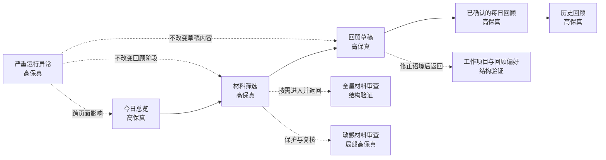

# daily_report UX Prototype Specification

_最终规格 · 2026-07-19 · Prototype → Review → Iterate 已通过 UX Review_

> 本文汇总 Prototype → Review → Iterate 全过程的已确认结论。Sections 1–10 保留验证依据与设计演进，Section 11 是最终 UX 决策基线，Appendix A 保留逐轮确认记录。产品所有者已经确认本规格通过 UX Review。

建议阅读顺序：

1. 直接使用本规格时，先阅读 [Section 11 · Final UX Prototype Specification](#11-final-ux-prototype-specification)。
2. 需要理解某项决策的真实样本与取舍时，回看 Sections 1–10。
3. 需要追溯每轮确认问题与结论时，查看 Appendix A。

## 1. Prototype Objective

本轮只验证一件事：能否用同一组接近真实的内容，覆盖 daily_report 最关键的真实性、隐私与低负担风险，并成为后续所有页面和状态走查的共同基准。

样本必须能够检验：

- 多个项目共用同一批应用、网页与关键词时，事项是否会被错误归属。
- 浏览、搜索和提问只能证明行为发生过时，草稿是否会把“调研中”误写成“已经解决”。
- 用户能否在不逐条阅读全部原始记录的情况下控制材料边界。
- 敏感内容是否默认受到保护，并且不会通过 Evidence 再次暴露。
- 没有活动线索的时段是否会被诚实留白，而不是解释成空闲或无效时间。
- 用户记得但没有数字材料的真实事项，是否能够以“由用户确认”的身份进入回顾。
- 工作、学习、娱乐与个人活动能否被中性呈现，不形成效率评价。
- 最终回顾是否允许真实但不完整，并在解释主要时间后自然结束。

## 2. Realistic Day Scenario

### 2.1 当天背景

| 项目 | 样本设定 |
| --- | --- |
| 日期 | 2026-07-16，星期四 |
| 样本性质 | 合成但接近真实的普通碎片化工作日，不代表用户实际日志 |
| 工作节奏 | APS 为当天主线，WES 历史问题穿插处理，RCS 出现一次无数字线索的线下讨论 |
| 工作环境 | 文档、开发工具、浏览器、即时沟通和会议频繁切换 |
| 回顾时刻 | 19:15 左右，主要工作已经结束，用户希望在 8 至 20 分钟内弄清今天 |
| 预期覆盖 | 解释约 70% 至 80% 的主要时间，不强行填满午间和其他缺失时段 |

### 2.2 活动事实：原型走查使用的真值

以下内容代表这一天实际发生的事情。后续原型必须检验产品能否通过线索与用户确认逐步接近这些事实，而不是默认产品已经知道全部真值。

| 时间 | 实际发生的事情 | 归属 | 结果状态 |
| --- | --- | --- | --- |
| 08:55–10:05 | 阅读 APS 昨日记录，继续整理“每日异常摘要”方案并修改评审文档 | APS | 文档形成较完整的评审版本 |
| 10:10–10:50 | 参加一次 APS / WES 协调会议，讨论报表边界与 WES 导出超时 | APS / WES | 明确各自下一步，但问题尚未解决 |
| 10:55–12:05 | 复现 WES 历史导出超时，查看日志并查找重试与超时相关资料 | WES | 已复现并缩小触发范围，仍待验证 |
| 12:05–13:15 | 午餐和短暂步行，电脑端没有可靠活动线索 | 个人 | 不需要强行写入正式回顾 |
| 13:15–15:25 | 继续整理 APS 方案、核对示例数据并完成一轮文档修订 | APS | 形成可供下一轮评审的版本 |
| 15:25–16:00 | 搜索队列重试与幂等资料，并向 AI 询问导出任务超时的排查思路 | WES | 属于调查过程，不能写成已解决 |
| 16:05–16:30 | 与同事在白板前讨论 RCS 数据边界，没有会议或电脑记录 | RCS | 用户记得讨论结论，但没有数字 Evidence |
| 16:30–17:35 | 整理 WES 排查记录并发出进展说明 | WES | 记录“已复现、待验证”，没有宣称修复完成 |
| 17:40–18:10 | 阅读一篇复杂桌面工具信息密度的文章并记下两点启发 | 学习 | 与当前项目无直接归属 |
| 18:35–19:05 | 在 Bilibili 观看娱乐内容 | 个人 / 娱乐 | 中性记录，不评价是否值得 |

### 2.3 原始活动线索：产品在确认前能够看到的内容

原型不展示理想化的三五条材料，而是以约 50 条原始记录归并成下列线索组。核心流程默认只要求用户处理其中少量高风险与不确定项。

| 线索组 | 可见线索摘要 | 可以支持的判断 | 不能自动推出的结论 |
| --- | --- | --- | --- |
| APS 文档 | 多次打开同一评审文档、示例表格和 APS 相关页面，集中出现在上午与下午 | 用户长时间围绕 APS 方案工作 | 文档已经通过评审或方案已经完成 |
| 跨项目会议 | 会议标题同时包含 APS 与 WES，随后出现两组相关材料 | 发生过一次跨项目协调 | 每个会议结论分别属于哪个项目 |
| WES 排查 | 日志窗口、导出记录、重试文档和多次相近搜索在两个时段出现 | 用户在调查导出超时 | 问题已定位、已修复或已验证 |
| AI 提问 | “导出任务超时如何区分队列阻塞与下游响应慢”等提问 | 用户探索过排查思路 | 用户采纳了回答，或问题已经解决 |
| RCS 时段 | 16:05–16:30 没有可靠电脑活动 | 只能说明该时段缺少数字线索 | 用户空闲、没有工作或没有发生重要事项 |
| 学习内容 | 信息密度相关文章、两条短笔记 | 用户阅读并记录过相关内容 | 已经形成成熟方法或应用到某个项目 |
| 娱乐内容 | Bilibili 页面标题与约半小时连续播放 | 发生过个人娱乐活动 | 这段时间有价值、浪费或需要被纠正 |

### 2.4 敏感、不确定与缺失材料

#### 疑似敏感材料

11:32 的剪贴板记录疑似包含内部连接信息和访问凭据。原型中只显示：

- 时间：11:32
- 来源：剪贴板
- 判断原因：疑似包含账号、令牌或连接信息
- 当前状态：内容已隐藏，暂不用于本次回顾

内容本身默认不展示。即使后续查看 WES 事项的 Evidence，这条材料也不能重新暴露。用户可以选择“标记为敏感”或确认它不敏感，但不需要阅读它才能继续形成草稿。

#### 项目归属不确定

15:25–16:00 的搜索和 AI 提问同时出现“报表”“导出”“重试”等 APS 与 WES 都可能使用的词。它们实际属于 WES，但草稿存在被归入 APS 的风险。

#### 事实状态不确定

WES 的线索足以说明用户进行了复现和排查，不足以证明问题已经修复。任何“完成修复”“解决超时”的草稿表达都必须降为“完成复现并缩小范围，仍待验证”。

#### 缺失时段

12:05–13:15 没有可靠活动线索。原型应表达“暂无活动线索”，不推断为空闲，也不要求用户解释这段时间。

#### 用户记忆补充

16:05–16:30 的 RCS 白板讨论没有数字材料。用户明确记得它发生过，因此可以添加为“由我确认”的事项；Evidence 区域应诚实显示“无数字线索，由用户本人确认”。

### 2.5 预期回顾草稿：未经用户修正

第一版草稿应接近真实，但故意保留能够检验交互的合理错误：

#### 今日概述

今天主要整理了 APS 每日异常摘要方案，并围绕报表导出问题进行了会议、资料查找和排查；晚间阅读了桌面工具设计文章，并有一段个人娱乐时间。

#### 主要事项

1. **整理 APS 每日异常摘要方案** · APS · 约 3 至 4 小时
   - 完成两轮文档修改并整理示例数据，形成可继续评审的版本。

2. **排查报表导出超时并完成修复** · APS · 约 2 至 3 小时
   - 复现问题、查看日志并搜索重试方案，随后整理了进展说明。

3. **参加 APS / WES 协调会议** · APS / WES · 约 45 分钟
   - 讨论报表边界和导出超时，明确后续分工。

4. **阅读复杂桌面工具的信息密度文章** · 未归属 · 约 30 分钟
   - 记录了两点与信息层级有关的启发。

5. **个人娱乐** · 未归属 · 约 30 分钟
   - 在 Bilibili 观看娱乐内容。

这版草稿用于暴露三个问题：第二项项目归属错误、把“排查中”写成“完成修复”、遗漏了没有数字线索的 RCS 讨论。

### 2.6 用户最终希望确认的每日回顾

#### 2026 年 7 月 16 日 · 星期四

今天主要在 APS 方案文档与 WES 历史问题之间切换。APS 文档形成了可继续评审的版本；WES 导出超时已经复现并缩小触发范围，但仍需后续验证。还参加了一次跨项目协调，并补充记录了一段没有数字线索的 RCS 线下讨论。晚间有短时学习和个人娱乐活动。

**整理每日异常摘要方案** · APS · 约 3 至 4 小时

继续核对示例数据并修改评审文档，形成了可供下一轮讨论的版本。

**排查历史导出超时** · WES · 约 2 至 3 小时

完成问题复现、日志对照和资料查找，缩小了可能的触发范围并发出进展说明；问题尚未验证解决。

**参加 APS / WES 协调会议** · APS / WES · 约 45 分钟

讨论报表边界和导出超时，明确了后续分工。

**讨论 RCS 数据边界** · RCS · 约 30 分钟

与同事进行线下白板讨论。此事项没有数字线索，由用户本人确认。

**阅读桌面工具信息密度文章** · 未归属 · 约 30 分钟

记录了两点有关信息层级与审阅密度的启发。

**个人娱乐** · 未归属 · 约 30 分钟

在 Bilibili 观看娱乐内容。

午间及其他缺失时段不强行补齐。疑似包含访问凭据的材料不进入回顾，也不出现在任何事项的 Evidence 中。

## 3. Prototype Scope

### 3.1 范围原则

Prototype 不为所有现有页面制作同等精度的完整方案。原型范围只围绕两类风险分配：

1. 是否直接影响用户完成“材料筛选 → 回顾草稿 → 正式确认”。
2. 一旦表达错误，是否会破坏真实性、隐私或运行安全。

采用三级验证精度：

| 精度 | 本阶段产出 | 用途 |
| --- | --- | --- |
| **高保真** | 使用真实长度内容，明确首屏层级、状态、文案、主操作和关键局部交互 | 验证核心流程与高风险状态是否真的自然、可信、低负担 |
| **结构验证** | 明确页面分区、信息顺序、进入与返回关系，不完成全部视觉细节 | 验证支撑能力是否放在正确层级，不反向增加核心流程复杂度 |
| **行为标注** | 依附于已有原型说明状态变化、撤回、返回或恢复结果，不单独增加页面 | 避免为短暂反馈和简单变体重复制作完整画面 |

### 3.2 核心流程边界

支撑路径不插入核心流程：

- 全量材料审查从材料筛选按需进入，返回后仍停留在材料筛选阶段。
- 工作项目与回顾偏好只在需要修正语境时进入，返回后保持草稿位置。
- 数据中心、应用配置和正常运行详情不会成为形成草稿前的必经步骤。
- 严重运行异常可以跨页面提示，但不会替用户推进、取消或重置今日回顾。

### 3.3 页面范围与验证精度

| 页面或状态 | 为什么存在 | 用户第一判断 | 本阶段精度 |
| --- | --- | --- | --- |
| **今日总览** | 被动理解今天，并决定继续工作、离开或主动开始回顾 | 今天大致发生了什么，记录是否可信，现在是否需要开始或继续回顾 | 高保真 |
| **今日回顾：材料筛选** | 让用户接受本次回顾的材料边界 | 哪些少量材料需要我判断，敏感内容是否受到保护 | 高保真 |
| **今日回顾：回顾草稿** | 核对“做了什么”是否真实 | 事项、项目归属和结果状态是否正确 | 高保真 |
| **已确认的每日回顾** | 呈现可信、可离开的当日事实记录 | 最终保存了什么，是否足以解释今天 | 高保真 |
| **历史回顾** | 按日恢复最近上下文 | 最近哪一天做了哪些主要事情 | 高保真 |
| **全量材料审查** | 在默认少量判断之外保留完整检查能力 | 是否还有遗漏、误用或需要保护的材料 | 结构验证 |
| **Data Center 中的敏感材料** | 允许后续审查，同时保证默认隐藏 | 内容是否仍受保护，临时查看的边界是什么 | 局部高保真 |
| **工作项目与回顾偏好** | 修正稳定语境，不进入项目管理 | 当前项目名称、别名或表达偏好是否足够 | 结构验证 |
| **应用配置列表** | 保留单个应用的低频管理能力 | 哪个应用需要调整，当前记录规则是什么 | 结构验证 |
| **运行中心：正常状态** | 用极低成本建立记录信任 | 是否正常记录，最近一次可靠线索是什么时候 | 结构验证 |
| **严重运行异常** | 在可能影响电脑使用或隐私时快速止损 | 发生了什么、是否影响回顾、能否立即停止 | 高保真 |

### 3.4 高保真原型清单

高保真范围收敛为七个代表画面，不为每个状态复制整套页面：

| 编号 | 代表画面 | 使用的真实样本 | 主要验证假设 |
| --- | --- | --- | --- |
| HF-01 | 今日总览：记录正常、今日回顾未开始 | APS / WES / RCS 样本日的原始活动、时间分布与应用分类 | 用户能否在不依赖项目语义推断的情况下理解记录覆盖，再主动决定是否回顾 |
| HF-02 | 材料筛选：内容较多、存在待判断与疑似敏感材料 | WES 搜索、AI 提问和隐藏的剪贴板记录 | 用户是否只需处理少量风险材料，不必逐条阅读全部线索 |
| HF-03 | 回顾草稿：项目归属错误、结果表达过度、无线索事项待补充 | WES 被归入 APS、误写“完成修复”、遗漏 RCS 讨论 | 错误是否能被局部发现和修正，不需要重写整份草稿 |
| HF-04 | 已确认的每日回顾 | 修正后的六个主要事项 | 正式记录是否适合阅读，并允许用户自然离开 |
| HF-05 | 历史回顾：默认打开最近确认日期 | 样本日与相邻两天的简短日期摘要 | 用户能否快速恢复近期上下文，而不是进入统计后台 |
| HF-06 | 敏感材料审查：内容默认隐藏、用户主动临时查看 | 11:32 疑似访问凭据的剪贴板材料 | 敏感内容是否在任何入口都保持保护语义 |
| HF-07 | 严重运行异常：跨页面提示与紧急停止 | 样本日记录状态突然变为“可能影响电脑使用” | 用户是否立即理解影响并完成止损 |

深色主题先完成七个代表画面。浅色主题不复制七套独立方案，而是选取三种密度进行同层级验证：

- 工作密度：HF-01 今日总览
- 审阅密度：HF-02 材料筛选
- 阅读密度：HF-04 已确认的每日回顾

HF-06 与 HF-07 的保护、警告和危险含义需要额外检查，确保浅色与深色中都不只依赖颜色表达。

### 3.5 不进入高保真的内容

- 全量重画数据中心、设置、应用配置和正常运行详情。
- 为每一种材料来源制作独立页面。
- 为内容数量的每个档位复制完整视觉稿。
- 周报、趋势、热力图、项目统计和生产力评价。
- 项目任务、进度、截止日期、优先级或里程碑。
- 完整导航重构或所有页面统一换成一种新布局。
- 技术状态、形成过程和内部信息的完整展示。

## 4. Page and State Matrix

### 4.1 覆盖标记

- **H**：独立高保真代表画面
- **S**：独立结构验证画面或结构变体
- **A**：依附于代表画面的行为标注
- **—**：该页面不承担此状态

### 4.2 页面 × 状态矩阵

| 页面或路径 | 默认 | 内容较多 / 较少 | 空状态 | 待判断 | 敏感保护 | 草稿 / 已确认 | 跨天未完成 | 状态未知 | 严重异常 |
| --- | --- | --- | --- | --- | --- | --- | --- | --- | --- |
| 今日总览 | H | S | S | A | A | A | S | S | A |
| 材料筛选 | H | H / S | S | H | H | — | A | — | A |
| 回顾草稿 | H | S | S | H | A | H / — | S | — | A |
| 已确认的每日回顾 | H | S | S | — | — | — / H | — | — | A |
| 历史回顾 | H | S | S | — | — | — / H | — | — | A |
| 全量材料审查 | S | S | S | S | S | — | — | — | A |
| 敏感材料审查 | H | S | S | A | H | — | — | — | A |
| 工作项目与回顾偏好 | S | S | S | A | — | — | — | — | A |
| 应用配置列表 | S | S | S | A | A | — | — | S | A |
| 运行中心 | S | S | S | A | A | — | — | S | H |

### 4.3 必须覆盖的状态

| 状态 | 代表情境 | 主要承载页面 | 精度 | 通过标准 |
| --- | --- | --- | --- | --- |
| **默认状态** | 正常碎片化工作日，记录可信，回顾未开始 | 今日总览 | H | 第一眼理解记录集中时段与应用类别，不被项目推断或应用排行误导 |
| **内容较多** | 约 50 条原始记录，只有少量材料需要判断 | 材料筛选 | H | 用户无需逐条阅读，仍能理解还要做多少判断 |
| **内容较少** | 只有一项主要活动和少量线索 | 今日总览、回顾草稿 | S | 页面允许自然留白，不用低价值 Card 填满 |
| **空状态** | 没有可用线索、没有待判断材料或没有历史回顾 | 今日总览、材料筛选、历史回顾 | S | 不暗示用户没有活动，并给出真实可行的下一步 |
| **待判断状态** | WES 线索可能属于 APS，事实结果也不确定 | 材料筛选、回顾草稿 | H | 不确定内容默认不进入正式事实，并能局部修正 |
| **敏感保护状态** | 剪贴板疑似包含访问凭据 | 材料筛选、敏感材料审查 | H | 默认隐藏；标记后不会从 Evidence 或其他入口重新出现 |
| **草稿状态** | 草稿包含一处错误归属、一处过度结论和一项遗漏 | 回顾草稿 | H | 用户明确知道内容尚未确认，修改不需要重建整份文档 |
| **已确认状态** | 六个事项经过用户核对并正式保存 | 已确认的每日回顾、历史回顾 | H | 文档身份稳定、适合阅读，用户可以直接离开 |
| **跨天未完成** | 第二天打开时，昨日草稿仍未确认 | 今日总览、回顾草稿 | S | 默认仍进入今天；可继续、忽略或明确不创建昨天的回顾 |
| **状态未知** | 最近没有足够信息判断是否仍在记录 | 今日总览、运行中心 | S | 清楚说明未知原因和对今日回顾的影响，不伪装为正常或错误 |
| **严重异常** | 记录进程可能影响电脑使用或隐私 | 全局提示、运行中心 | H | 立即回答发生了什么、影响什么、如何停止；紧急停止是唯一主操作 |

### 4.4 补充异常与边界状态

以下状态不增加新的核心页面，只作为后续安全走查的结构变体：

| 状态 | 承载方式 | 验证重点 |
| --- | --- | --- |
| 只有一个事项 | 已确认回顾的结构变体 | 一句话或一个事项也能成为完整、可信的记录 |
| 用户选择不创建某一天的回顾 | 今日总览中的低压力分支 | 不产生逾期、失败、红点或连续记录压力 |
| 无法确认草稿事项 | HF-03 的行为标注 | 没有线索且用户也无法确认时，事项必须修正或移除 |
| 项目归属错误 | HF-03 的核心交互状态 | 修改默认只影响当前事项，不自动改写项目规则 |
| 无数字线索但用户确认 | HF-03 的核心内容状态 | 明确显示“由用户本人确认”，不伪造 Evidence |
| 敏感误判与撤回 | HF-06 的行为标注 | 标记敏感后允许短暂撤回，离开后重新隐藏 |
| 紧急停止后的恢复 | HF-07 的结构后续状态 | 显示实际停止结果；只有出现可信新线索后才恢复正常 |

### 4.5 现有页面处置

| 现有页面 | 处置 | 保留什么 | 最小调整 | 对已有习惯的影响 |
| --- | --- | --- | --- | --- |
| 今日总览 | 保留并局部调整 | 四项来源摘要、时间分布、应用分类、最近活动、记录状态和回顾入口 | 删除主要应用与重复时长 Card，明确被动查看身份和非语义推断边界 | 入口不变，首屏阅读顺序改变 |
| 数据中心 | 保留并局部调整 | 全量线索、筛选与来源查看 | 最近记录优先、详细来源默认折叠、强化敏感语义 | 完整能力仍可达，默认更安静 |
| 今日回顾 / 原日报工作台 | **结构性调整候选** | 材料选择、草稿形成、内容核对和结果查看能力 | 先通过命名、顺序和默认折叠减少生成工具心智 | 若最小调整仍不足，才验证三阶段结构；需要单独确认 |
| 历史回顾 | 保留并局部调整 | 左侧日期、右侧正文和按日查看 | 正文优先，版本与形成信息降级 | 导航方式不变，内部信息变弱 |
| 应用配置 | 保留并局部调整 | 单应用图标、分类与记录规则 | 从不稳定卡片关系调整为稳定列表关系 | 单项配置习惯保留，扫描方式改变 |
| 运行中心 | 保留并局部调整 | 状态、停止、恢复与详情能力 | 正常状态压缩，异常只展开受影响部分 | 所有管理能力保留，默认信息更少 |
| 设置 | 保留并局部调整 | 现有入口与低频全局职责 | 重组工作项目、回顾偏好与隐私规则的层级 | 入口不变，分组名称和顺序调整 |

### 4.6 今日回顾的结构性调整候选

今日回顾是本轮唯一可能超过“局部调整”的页面。对比如下：

| 层级 | 流程 | 保留内容 | 仍然存在的问题 |
| --- | --- | --- | --- |
| **当前体验** | 素材选择 → Prompt 配置 → 内容确认 → 结果预览 | 已有材料、配置、形成与查看能力 | 以内容生成过程组织页面，用户需要理解产品如何形成内容 |
| **最小调整** | 素材选择 → 折叠的回顾偏好 → 草稿 → 结果 | 保留原页面结构，主要修改名称、顺序和默认展开状态 | Prompt / 生成心智仍夹在每日任务中，草稿核对与正式确认仍不够清晰 |
| **结构性调整候选** | 材料筛选 → 回顾草稿 → 正式确认 | 所有有用户价值的能力继续存在，回顾偏好移出每日必经步骤 | 会改变原日报工作台的阶段心智，需要通过原型对比后明确确认 |

推荐将三阶段结构作为高保真验证对象，但此处只确认“进入原型比较”，不自动确认替换现有体验。只有后续真实样本走查证明最小调整仍持续增加判断成本，结构性调整才可能成为目标体验。

## 5. Core Flow Prototype

### 5.1 Round 3 验证范围

本轮只验证核心流程的第一个连接：

> 今日总览 → 材料筛选

不进入回顾草稿，不讨论最终视觉风格，也不同时展开其他页面。两张中保真首屏使用已经确认的 2026-07-16 样本日内容。

### 5.2 进入、返回与离开关系

| 时刻 | 用户看到什么 | 用户可以做什么 | 状态结果 |
| --- | --- | --- | --- |
| 打开应用 | 默认进入今日总览，先看到四项摘要、时间分布、应用分类与安静的记录状态 | 临时查看最近活动后离开，或选择“开始今日回顾” | 被动查看不会形成草稿，也不改变回顾状态 |
| 开始回顾 | 直接进入当天的材料筛选，不确认日期，不先进入回顾偏好 | 判断少量高风险与不确定材料 | 今日回顾进入“材料筛选”阶段 |
| 筛选中离开 | 当前材料决定自动保留 | 关闭应用或返回今日总览 | 今日总览的主操作变为“继续今日回顾” |
| 返回今日总览 | 回到当天原始记录概览，回顾状态仍显示进行中 | 继续回顾或再次离开 | 不丢失已经完成的材料判断 |
| 接受材料边界 | 未判断材料保持不使用状态 | 选择“形成回顾草稿” | 才进入下一阶段；本轮不继续展开该页面 |

### 5.3 今日总览首屏结构

| 项目 | 结构决定 |
| --- | --- |
| 页面目标 | 在 30 秒至 2 分钟内理解今天留下了多少记录、集中在哪些时段，并区分被动查看与主动回顾 |
| 第一视觉焦点 | 时间分布与应用分类分析；两者都来自直接统计或已有配置，不依赖项目语义推断 |
| 第二视觉焦点 | 最近活动与并列的今日回顾状态，形成“查看记录 → 主动回顾”的关系 |
| 信息顺序 | 日期与安静状态 → 四项紧凑统计 → 时间分布与应用分类 → 最近活动与今日回顾入口 |
| 唯一主操作 | 未开始时为“开始今日回顾”；进行中为“继续今日回顾”；已确认时不再表现为主按钮 |
| 次要操作 | 展开最近活动、查看完整记录、管理应用分类 |
| 进入方式 | 应用默认页；从其他模块返回今天时进入 |
| 离开方式 | 直接关闭或切换模块，不产生未完成压力 |
| 当前状态 | 记录正常、今日回顾未开始、存在 4 组待判断材料，其中 1 组已保护 |
| 内容较多 | 最近活动只显示固定数量的最新记录；完整记录进入数据中心 |
| 内容较少 | 保留真实留白和低柱高，不用推测的项目分组填充页面 |

今日总览不显示“可能属于 WES”等项目措辞。最近活动只呈现时间、应用、窗口或页面标题与来源类型；项目归属留到回顾草稿核对。

### 5.4 材料筛选首屏结构

| 项目 | 结构决定 |
| --- | --- |
| 页面目标 | 在同一页理解本次回顾会使用哪些原始材料，并完成少量本地规则无法直接处理的决定 |
| 第一视觉焦点 | 材料总数、已用于本次回顾、规则标记为可能敏感、待确认四项紧凑统计；不显示预计生成字数 |
| 信息顺序 | 三阶段位置 → 四项统计 → 规则标记的可能敏感与待确认材料 → 全部材料的筛选和搜索 → 回顾操作 |
| 唯一主操作 | “形成回顾草稿”；至少已有一条用于本次回顾的材料，或一项由用户本人确认的补充事项时可用 |
| 每条材料操作 | 用于本次回顾、不用于本次回顾、稍后判断、标记为敏感 |
| 次要操作 | 补充我记得的事项、今天不创建回顾、返回今日总览 |
| 进入方式 | 从今日总览主动开始或继续当天回顾 |
| 离开方式 | 返回总览或关闭应用，决定自动保留 |
| 当前状态 | 48 条材料中，40 条已用于本次回顾，2 条被本地规则标记为可能敏感，1 条因来源或字段问题待确认 |
| 内容较多 | 风险项保持在上方短列表；全部材料按时间加载，并保留来源、记录类型、决定状态和关键词筛选 |
| 内容不足 | 继续显示客观数量与原始材料；不评价线索是否足以形成“可信草稿” |

敏感剪贴板材料默认只显示时间、来源、规则命中原因和保护状态。内容无需展开即可选择“标记为敏感”，并且不能在后续 Evidence 中重新出现。“可能敏感”是透明的规则标记，不是系统已经理解并确认内容语义。

材料筛选阶段只使用本地可以确定的信息：直接统计、显式配置、固定规则、原始记录字段和用户已经保存的决定。项目归属、事项合并、结果是否完成以及“能否形成可信草稿”等语义判断都不在此阶段出现。

### 5.5 真实样本在两张首屏中的映射

| 样本内容 | 今日总览如何出现 | 材料筛选如何出现 |
| --- | --- | --- |
| APS 文档工作 | 仅以文档工具的时间、窗口标题和应用类别出现，不标注 APS | 按原始应用、时间、窗口标题和已保存用途决定出现，不提前合并为事项 |
| APS / WES 会议 | 仅显示即时沟通或会议应用留下的原始标题 | 保留原始会议标题；不拆分项目，也不推断各自结论 |
| WES 导出超时排查 | 日志、搜索和 AI 提问分别作为最近活动出现，不在总览中归并为 WES | 日志、搜索和提问继续是独立原始材料；项目与结果留到草稿核对 |
| 16:05–16:30 无数字线索 | 时间分布中自然形成较低或空白时段，不解释为空闲 | 不制造一条虚假材料；记忆补充留到草稿核对阶段 |
| 疑似敏感剪贴板 | 顶部剪贴板摘要只显示数量与保护状态 | 由令牌形态等透明本地规则标记为可能敏感，内容默认隐藏 |
| 学习和娱乐 | 以应用或页面标题中性呈现，不评价是否有效 | 娱乐活动是否进入正式回顾由用户决定 |

### 5.6 现有体验保留与最小调整

| 页面 | 保留 | 当前问题 | 本轮最小调整 | 为什么暂不需要更大调整 |
| --- | --- | --- | --- | --- |
| 今日总览 | 四项摘要、时间分布、应用分类、最近活动、记录状态、回顾入口 | 多个统计与 Card 容易拥有同等权重，项目语义归并还会制造错误确定性 | 使用紧凑摘要带，删除主要应用与重复时长 Card，最近活动只显示原始信息 | 页面职责没有改变，不需要重做导航或新增模块 |
| 材料筛选 | 材料选择、统计、条件筛选、搜索和全部材料列表 | 与 Prompt、形成过程和结果管理混在同一工作台时，材料边界不够独立 | 保留现有浏览能力，把规则标记的风险项置于全部材料之前，并把预计字数移除 | 页面仍是第一阶段；回顾偏好不再是必经步骤，内容理解只在主动形成草稿后发生 |

### 5.7 本轮结构验收

- 用户第一眼能快速扫描四项来源摘要，并把注意力落到时间分布与应用分类，而不是应用排行榜。
- 正常记录状态可见但安静，不表现为主要操作。
- 开始回顾只需一次主动点击，不经过日期或回顾偏好。
- 进入材料筛选后，用户先看到材料总数、已选数量、规则标记数量与待确认数量。
- 未判断材料默认不使用，但不阻塞形成草稿。
- 规则标记项位于全部材料之前；全部材料可直接筛选、搜索并修改用途决定。
- 敏感材料默认隐藏，不需要查看内容即可保护。
- “预计生成字数”不出现；材料筛选不展示任何需要语义理解才能成立的质量判断。
- 从材料筛选返回总览不会丢失判断，也不会把被动查看变成待办压力。
- 当前结构没有新增统计、项目管理、数据源管理或内容生成配置。
- 新增活动记录可以直接进入最近活动，不需要先获得项目或事项结论。

### 5.8 Round 4 验证范围

本轮只验证“回顾草稿”的第一屏与三种真实性修正：

1. WES 事项被错误归入 APS。
2. “完成修复”超过现有线索能够支持的结论。
3. RCS 线下讨论真实发生，但没有任何数字线索且未出现在草稿中。

本轮不进入正式确认页面，不讨论最终视觉风格，也不展开所有编辑能力。

### 5.9 回顾草稿首屏结构

| 项目 | 结构决定 |
| --- | --- |
| 页面目标 | 核对今天主要做了什么，用局部修正把草稿变成可以确认的事实 |
| 第一视觉焦点 | “今天主要做了什么”的概述与按解释性权重排序的主要事项 |
| 信息顺序 | 草稿身份与阶段 → 今日概述 → 主要事项 → 其他事项 → 可选遗漏补充 → 折叠的应用与时间校准 → 正式确认 |
| 唯一主操作 | “确认每日回顾”；当草稿中仍存在无法确认的内容时暂不可用 |
| 次要操作 | 编辑事项、修改项目、查看 Evidence、补充遗漏事项、返回材料筛选 |
| 进入方式 | 用户接受材料边界并主动选择“形成回顾草稿” |
| 离开方式 | 返回材料筛选、关闭应用或在核对完成后正式确认 |
| 当前状态 | 草稿包含 5 个事项，其中 1 个事项有项目与事实表述两处待核对，另有 1 个无线索事项被遗漏 |
| 内容较多 | 主要事项完整展开，低解释性事项采用紧凑行；Evidence 默认折叠 |
| 内容较少 | 只有一个事项时仍保持文档结构，不增加统计或空 Card 填充 |

草稿首先表现为一份可阅读的文档，而不是由多个编辑 Card 组成的表单。修正操作只在具体事项附近出现。

### 5.10 三种真实性修正

| 风险 | 原草稿 | 局部修正 | 修正后的身份 |
| --- | --- | --- | --- |
| 项目归属错误 | “排查报表导出超时”归入 APS | 在当前事项内把工作项目改为 WES | 只影响当前事项；不会自动增加项目别名或改写其他记录 |
| 结果表达过度 | 标题与正文写成“完成修复” | 使用 Evidence 将表述降为“完成复现并缩小范围，仍待验证” | 保留已发生的排查，不虚构解决结果 |
| 无线索事项遗漏 | RCS 白板讨论没有出现在草稿中 | 在一次轻量询问中补充事项名称、项目和可选粗略时间 | 显示“由用户本人确认”，Evidence 诚实说明没有数字线索 |

草稿中已经出现但仍无法确认的内容会暂缓正式确认。尚未出现在草稿中的遗漏事项属于可选补充，用户可以跳过，不会阻止完成回顾。

### 5.11 Evidence 与用户记忆的关系

- Evidence 默认折叠，只在用户对事项真实性、归属或时间产生疑问时展开。
- WES Evidence 展示日志、搜索、AI 提问和进展说明，但明确指出它们不能证明问题已经解决。
- 敏感材料不会因为展开 Evidence 而重新出现。
- RCS 事项没有数字线索，但用户明确记得它发生过，因此可以作为“由用户本人确认”的事实保留。
- 如果没有线索且用户也无法确认，事项必须修正或移除，不能通过“由我确认”绕过真实性判断。

### 5.12 现有能力保留与局部调整

| 保留能力 | 当前问题 | 本轮调整 | 对已有习惯的影响 |
| --- | --- | --- | --- |
| 草稿内容查看 | 结果预览容易更像生成输出，事实身份不清楚 | 明确标记“草稿 · 尚未确认”，事项按事实权重排列 | 仍然能够查看完整结果，但需要经过确认才成为正式记录 |
| 内容修改 | 全文编辑会迫使用户寻找错误并承担重写成本 | 高频错误在事项内局部修改，完整编辑保持为次要入口 | 原有编辑能力保留，常见修正更靠近问题本身 |
| 项目归属 | 修改入口可能与其他配置混在一起 | 点击当前事项的项目即可修改，默认只影响当前事项 | 不进入项目管理，也不意外改变其他事项 |
| 相关材料查看 | 原始材料容易占据主页面 | Evidence 默认折叠并保持阅读位置 | 完整线索仍可达，但不打断正文阅读 |
| 人工补充 | 容易发展为强制填写表单 | 确认前只轻量询问一次，可只填事项名称或跳过 | 补充能力保留，但不成为完成门槛 |

### 5.13 本轮结构验收

- 第一眼先读到“做了什么”，而不是材料数量、应用排名或形成过程。
- 草稿、Evidence 与正式事实拥有清楚不同的身份。
- 项目错误可以在当前事项内一次修正，不进入设置或项目管理。
- 结果表述的修正基于 Evidence 能支持到什么程度，不把搜索和提问写成已经解决。
- 待核对状态只附着在有问题的事项，不让整份草稿看起来全部不可信。
- 用户记忆可以补充没有数字线索的真实事项，并明确标记事实来源。
- 遗漏事项补充是可选行为，不阻止确认。
- 已写入草稿但用户无法确认的内容必须先处理，不能悄悄进入正式记录。
- 应用与时间分布保持折叠，只用于辅助校准。
- 页面仍然只有一个主操作：“确认每日回顾”。

### 5.14 Round 5 验证范围

本轮只验证核心流程的最后一个状态转换：

> 回顾草稿 → 正式确认 → 已确认的每日回顾

草稿已经完成项目修正、事实降级和 RCS 事项补充。本轮不再验证内容修正，也不进入历史回顾。

### 5.15 正式确认状态转换

| 时刻 | 页面身份 | 页面发生的变化 | 不发生什么 |
| --- | --- | --- | --- |
| 确认前 | 回顾草稿 · 可以确认 | 显示三阶段位置、局部编辑入口和唯一主操作“确认每日回顾” | 不把草稿表现为已经保存的事实 |
| 点击确认 | 原页面原位置 | 直接切换文档身份，保存确认时间，移除草稿编辑控件 | 不弹出第二个确认窗口，不跳转成功页，不播放庆祝动画 |
| 确认后 | 已确认的每日回顾 | 标题变为“每日回顾”，显示小型已确认标识，正文进入宽松阅读状态 | 不显示材料数量、形成过程、应用排行榜、分数或明日计划 |
| 再次编辑 | 回顾草稿 · 需要重新确认 | 编辑入口让文档恢复草稿身份，并重新显示确认操作 | 不悄悄修改已经确认的长期记录 |

确认动作本身不会删除材料或设置，因此不需要二次确认。状态转换必须清楚但克制，只解释文档身份发生了变化。

### 5.16 已确认每日回顾的阅读结构

| 顺序 | 内容 | 视觉与交互身份 |
| --- | --- | --- |
| 1 | 日期、星期与小型“已确认”状态 | 稳定文档元信息，不表现为按钮 |
| 2 | 今日概述 | 一段事实性摘要，先帮助用户重新理解全天 |
| 3 | APS 与 WES 两个主要事项 | 完整标题、项目、粗略时间和事实摘要 |
| 4 | 跨项目会议与 RCS 线下讨论 | 保留必要语境；RCS 明确由用户本人确认 |
| 5 | 学习与个人娱乐 | 以较紧凑结构中性呈现，不评价时间价值 |
| 6 | 按需查看活动线索 | 仍可追溯，但默认折叠且不显示敏感材料 |

正式正文不包含应用排行榜、活动比例、原始搜索词、材料总数或形成过程。应用与时间校准信息只属于草稿阶段，不进入最终正文。

### 5.17 自然离开方式

确认后不再设置新的主操作。用户可以：

- 停留阅读已确认内容。
- 返回今日总览。
- 使用低优先级的复制或导出。
- 直接关闭 daily_report。
- 选择编辑回顾，使文档恢复草稿身份并在修改后重新确认。

页面不引导用户创建明日计划、查看效率分数、分享成果或维持连续记录。产品在用户获得清楚感后主动结束任务关系。

### 5.18 现有能力保留与局部调整

| 保留能力 | 当前问题 | 本轮调整 | 对已有习惯的影响 |
| --- | --- | --- | --- |
| 结果预览 | “生成结果”容易被理解为一次性输出，而不是需要确认的记录 | 在同一页面完成草稿到已确认文档的身份转换 | 用户仍在熟悉的内容位置查看结果，不新增成功页 |
| 保存或确认 | 额外确认窗口会重复用户刚刚完成的判断 | “确认每日回顾”直接执行，并显示明确保存结果 | 少一次阻断操作，确认结果更直接 |
| 复制与导出 | 容易与确认操作竞争 | 只在确认后作为低优先级动作出现 | 能力保留，但不影响核心完成动作 |
| 后续编辑 | 直接改写正式记录会破坏可信身份 | 编辑先恢复草稿，再要求重新确认 | 编辑仍然可用，但文档身份更诚实 |

### 5.19 本轮结构验收

- 确认前清楚知道当前仍是草稿。
- “确认每日回顾”是当前范围唯一主操作。
- 点击后不出现第二次确认，也不跳转到独立成功页。
- 页面原位切换为已确认文档，正文内容与阅读位置保持连续。
- 已确认状态通过文字与图标表达，不只依赖颜色。
- 最终文档不显示形成过程、应用排行榜、材料数量或生产力评价。
- 确认后主操作消失，不制造新的待办或停留理由。
- 复制、导出和编辑保持低优先级。
- 编辑已确认记录会明确恢复草稿身份，并要求重新确认。
- 没有庆祝、分数、连续记录或自动明日计划。

## 6. Core Flow High-Fidelity Prototype

### 6.1 Round 6 验证范围

核心流程中保真结构已经完成。本轮只将以下两个代表画面推进为深色主题高保真方向：

1. HF-01 今日总览：记录正常、今日回顾未开始。
2. HF-02 材料筛选：内容较多、存在待判断和疑似敏感材料。

继续使用 2026-07-16 的真实一天样本，不增加新页面、新统计或新流程。

### 6.2 应用的视觉系统

| 维度 | 高保真决定 |
| --- | --- |
| Typography | 页面标题克制；活动与材料标题使用中等字重；正文保持常规字重；时间、来源和状态作为更弱但可读的元信息 |
| Spacing | 同组信息使用 8 至 16 的紧密关系；任务分区使用 24 至 32；页面主要区块使用更明显留白，不用容器填满空白 |
| Density | 今日总览采用适中的工作密度；材料筛选采用紧凑审阅密度；两者不提供用户可切换的全局密度设置 |
| Surface | 今日总览只有“今日回顾”使用独立 Card；四项摘要、时间分布、应用分类和最近活动依靠留白与分隔线组织；材料记录不逐条套 Card |
| Button | 每个页面只有一个主操作；局部材料决定使用低强调按钮，选中状态依靠单一明确机制 |
| Color | 中性色承担绝大多数界面；蓝色只用于当前导航、当前阶段和主操作；保护与状态同时使用文字和图标，不只依赖颜色 |
| Radius / Border / Shadow | 按钮与输入保持小圆角；唯一独立 Card 使用中等圆角；普通内容只使用细分隔线，不增加明显阴影或发光边框 |
| Motion | 页面状态变化控制在约 200ms；材料决定先在原位置显示结果；不使用弹跳、悬浮放大、脉冲或装饰动画 |

本文后续出现的“736px 至 320px”均指**聊天嵌入原型自身的可用内容宽度**，用于主动暴露多列重叠、长文字裁切和控件换行问题。它不是正式桌面应用的窗口宽度、最小窗口尺寸或固定响应式断点，也不要求后续产品只支持这两个宽度。正式产品仍需在真实应用壳层、系统缩放与实际允许的窗口范围内重新完成视觉验收；具体何时重排由内容是否还能保持可读决定，而不是直接照抄本原型数字。

### 6.3 HF-01 今日总览

高保真画面保持以下层级：

1. 日期与安静的“正常记录中”状态。
2. 活跃时间、应用记录、剪贴板、浏览器组成无独立 Card 的紧凑摘要带。
3. 时间分布与应用分类分析作为最大内容区域；应用分类明确来自既有配置。
4. 最近活动使用无 Card 列表，只显示记录本身已有的时间、应用、标题和来源。
5. “今日回顾”作为唯一独立 Card，放在最近活动右侧，说明当前判断负担并提供主操作。
6. 不展示活动轮廓、主要应用排行或底部重复的活跃时长指标。

项目与事项语义不在总览中出现。需要语义归并的结论只进入可局部纠正的回顾草稿。

### 6.4 HF-02 材料筛选

高保真画面保持以下层级：

1. 三阶段位置与本阶段目标。
2. 材料总数、已用于本次回顾、规则标记为可能敏感、待确认组成四项紧凑统计；删除预计生成字数。
3. 本地规则标记的“可能敏感”和“无法自动处理”材料位于全部材料之前，并逐条显示可检查的规则原因。
4. 全部材料在同一页面按紧凑审阅行排列，时间与来源形成稳定左列，并提供来源、记录类型、决定状态与关键词筛选。
5. 四种决定始终使用完整人类语义，不缩写成图标或模糊的包含／排除。
6. 可能敏感材料默认隐藏内容，并同时显示规则原因和保护状态。
7. “补充我记得的事项”“今天不创建回顾”“返回今日总览”保持次要；“形成回顾草稿”是唯一主操作。

用户决定材料后，状态先在原位置更新并允许修改。未判断内容继续默认不使用，因此不会为了清空待办而强迫用户逐条决定。此页面的统计、筛选、规则标记和用途决定全部可以在本机完成；只有用户主动点击“形成回顾草稿”后，已选择且未受保护的材料才进入内容理解阶段。

### 6.5 深色主题方向

- 使用中性炭黑与深灰明度差建立层级，不使用纯黑或深蓝大底。
- 正文使用柔和灰白，不使用发光白字。
- 分隔线保持低对比，只帮助扫描，不形成表格网格感。
- 蓝色面积严格限制在导航选择、当前阶段和主操作。
- 正常状态保持安静；敏感状态通过盾牌图标、明确文字和隐藏内容共同表达。
- 页面不使用渐变、玻璃拟态、装饰光晕或大面积品牌色。

浅色主题暂不在本轮制作。后续只在同一结构上验证明亮办公环境中的对比度与层级一致性，不重新设计页面。

### 6.6 本轮高保真验收

- 今日总览先读时间分布与应用分类，四项统计保持紧凑，主操作不抢占首焦点。
- 只有一个独立 Card，且它对应明确的“开始今日回顾”任务边界。
- 导航分组可见但不与正文竞争。
- 正常记录状态小而清楚，不伪装成按钮。
- 材料筛选在内容较多时仍能稳定扫描，不出现 Card 墙。
- 四项紧凑统计可快速说明材料边界，且没有预计字数等低价值估计。
- 规则标记项与全部材料形成清楚的上下层级，筛选和搜索无需离开本阶段。
- 四种材料决定可读、可点击、可修改，选中状态不过度叠加视觉效果。
- 敏感材料默认隐藏，保护状态不只依赖颜色。
- 形成草稿之前不出现项目、事项、完成状态或草稿可信度等语义结论。
- 蓝色集中在当前导航、当前阶段与主操作，没有装饰性泛滥。
- 四项来源统计保持易扫描但容器较轻，不形成四张竞争注意力的大型 Card。
- 深色页面没有纯黑大底、发光边框、明显阴影或生产力仪表盘感。

### 6.7 Round 6 Review 发现

第一版 HF-01 未通过 Review。“今天的活动轮廓”把原始活动提前归并成带项目和事项语义的线索组，存在两个根本问题：

1. 总览会依赖持续的语义识别才能在新增记录后保持更新。
2. 尚未经过用户确认的项目归属会以过于确定的形式出现在首页。

这与“活动线索不是正式事实”“项目归属在草稿阶段局部核对”的基线冲突。因此删除 HF-01 中的语义活动轮廓，不通过降低措辞强度继续保留。

### 6.8 今日总览的信息来源边界

今日总览必须在没有语义归纳结果时仍然完整可用。页面只使用以下信息身份：

| 区域 | 信息身份 | 允许的分类 | 不允许的推断 |
| --- | --- | --- | --- |
| 活跃时间 | 已记录活动时段的直接汇总 | 按小时分布 | 这段时间是否有效、属于哪个事项 |
| 应用记录 | 应用活动记录数量 | 按应用名称 | 应用中的每条记录属于哪个项目 |
| 剪贴板 | 剪贴板记录数量与保护状态 | 已保护、待判断等已有状态 | 剪贴内容对应哪个工作事项 |
| 浏览器 | 网页、搜索与 AI 提问记录数量 | 按记录类型 | 用户是否理解、采纳或解决了问题 |
| 最近活动 | 时间、应用、窗口或页面标题、来源类型 | 只显示记录本身已有信息 | 自动补充项目、事项或结果结论 |
| 应用分类分析 | 用户已经为应用配置的类别 | 开发编程、文档撰写、资料调研等应用类别 | 把应用类别当成工作项目或事实事项 |
| 今日回顾状态 | 当前回顾阶段与待判断材料数量 | 未开始、材料筛选中、草稿、已确认 | 在总览中提前生成回顾事项 |

如果一条最近活动没有可靠项目信息，就只显示应用、时间和记录标题。项目归属只在回顾草稿已经形成后，由用户结合上下文核对。

### 6.9 Round 8 修订后的今日总览

修订后的层级为：

1. 日期、记录状态与低优先级日期查询。
2. 活跃时间、应用记录、剪贴板、浏览器四项紧凑统计。
3. 时间分布作为主要图表，帮助理解一天的活跃时段与缺失区间。
4. 应用分类分析保留，明确其来自应用配置，不是工作项目识别。
5. 下方左侧的最近活动只显示原始记录信息，不附加推测的项目标签。
6. 下方右侧放置今日回顾状态与“开始今日回顾”，替代原来的主要应用列表。

四项统计不再分别使用四张大型 Card，而是组成一条紧凑摘要带。这样既保留用户已有扫描习惯，又避免来源数量成为页面最强视觉焦点。

### 6.10 保留、降级与删除

| 当前内容 | 处置 | 理由 |
| --- | --- | --- |
| 活跃时间、应用记录、剪贴板、浏览器 | 保留，降低容器重量 | 能快速说明今天是否有足够记录及来源覆盖情况 |
| 时间分布柱状图 | 保留为主要图表 | 能直接展示活跃时段和记录缺口，不需要项目推断 |
| 分类分析 | 保留并改名为“应用分类分析” | 用户喜欢其内容；类别来自应用配置，需要避免与项目归属混淆 |
| 最近活动 | 保留原始记录语义 | 支持临时找回上下文，但不保证项目归属准确 |
| Top 应用 | 删除 | 与应用分类分析及顶部应用记录存在信息重叠，不值得长期占据半列空间 |
| 活跃时长、空闲时长、活跃比例三张底部 Card | 删除 | 活跃时间已经在顶部出现；空闲与比例容易制造精确和生产力评价幻觉 |
| 需要语义归并的“活动轮廓” | 删除 | 会提前引入不可靠的项目与事项判断，并让总览依赖持续归纳 |
| 今日回顾 Card 与主操作 | 保留并迁至原主要应用区域 | 让顶部更轻，同时在最近活动旁形成自然的“查看记录 → 开始回顾”路径 |

### 6.11 修订后的验收标准

- 今日总览在没有任何语义归纳结果时仍能完整展示。
- 新增活动记录不需要先获得项目或事项结论才能出现在最近活动中。
- 最近活动只承担“发生过什么记录”的责任，不承担“为了什么项目”的责任。
- 应用分类与工作项目在名称、说明和视觉上保持不同身份。
- 四项顶部统计全部保留，但不形成四张同等强调的大型 Card。
- 时间分布与应用分类仍是主要可视内容。
- 活跃时间不在页面底部重复；空闲时间与活跃比例不作为价值判断依据。
- 主要应用列表不再占据独立半列。
- 今日回顾入口位于最近活动右侧，清楚可见但不会把总览变成必须完成的任务页。

### 6.12 Round 8 Review 结论

修订后的 HF-01 通过 Review，作为今日总览的高保真基线：

- 顶部保留四项紧凑统计，不放置今日回顾 Card。
- 中部保留时间分布与应用分类分析。
- 下方左侧显示原始最近活动，右侧显示今日回顾 Card 与主操作。
- 活动轮廓、主要应用排行和三张重复时长 Card 不再进入今日总览。

### 6.13 Round 9 验证范围

本轮将已经确认的状态规则推进为同一张高保真交互：

> HF-03 回顾草稿（已完成局部修正、可以确认） → HF-04 已确认的每日回顾

本轮不重复验证项目修正、事实降级和遗漏补充的操作细节，也不进入历史回顾。重点只验证草稿与正式记录是否拥有清楚、克制且连续的文档身份。

### 6.14 HF-03 可以确认的回顾草稿

1. 三阶段位置保持可见，正式确认是当前阶段。
2. 页面先显示“草稿 · 可以确认”和今日概述，再按解释性权重排列主要事项。
3. APS、WES、跨项目会议和 RCS 使用完整事项结构；学习与个人娱乐保持紧凑。
4. 项目、粗略时间和事实来源是弱元信息；RCS 明确标记“由用户本人确认”。
5. Evidence 默认折叠，局部编辑入口只在草稿态出现。
6. 页面底部说明所有事项已经核对，“确认每日回顾”是唯一主操作。

### 6.15 HF-04 已确认的每日回顾

点击确认后，页面在原位置完成以下变化：

- 三阶段位置、局部编辑按钮和确认主操作消失。
- 标题从“回顾草稿”变为“每日回顾”，状态显示“已确认”图标、文字和确认时间。
- 正文内容与阅读位置保持连续，事项间距略微放宽。
- 活动线索仍可按需展开，但敏感材料不会重新出现。
- 复制、导出和编辑回顾作为低优先级操作出现。
- 页面不产生新的主操作；用户可以返回今日总览或直接离开。

选择“编辑回顾”会明确恢复草稿身份、三阶段位置和确认操作。任何修改都需要重新确认，不会静默改写已确认记录。

### 6.16 Round 9 验收标准

- 确认前后使用同一正文与阅读位置，不出现第二个确认窗口或成功页。
- 草稿态的阶段、局部编辑和主操作清楚，但页面仍首先像一份可阅读文档。
- 已确认态通过图标与文字表达稳定身份，不依赖颜色。
- 确认后主操作消失，复制、导出与编辑不会制造新的完成任务。
- 用户能直接离开，不出现庆祝、评分、连续记录或明日计划。
- 再次编辑会明确恢复草稿，并要求重新确认。

### 6.17 Round 9 Review 结论

HF-03 到 HF-04 的高保真身份切换通过 Review：

- 确认前保持可阅读草稿身份，并显示阶段、局部编辑和唯一主操作。
- 点击确认后不跳页、不二次确认，原位切换为已确认文档。
- 已确认状态移除主操作与形成过程；编辑会明确恢复草稿。

### 6.18 Round 10 验证范围

本轮只验证 HF-05 历史回顾的默认阅读结构：

> 默认打开最近一次已确认日期 → 选择相邻已确认日期 → 在同一位置阅读对应正文

使用 2026-07-16 的已确认回顾作为默认内容，并补充 7 月 15 日和 7 月 14 日两条简短确认记录来检验日期扫描。本轮不处理跨日未完成、空历史、月份跨度或大量日期的导航策略。

### 6.19 HF-05 历史回顾结构

1. 页面标题只说明“选择日期，回看已经确认的当日记录”，不加入趋势或统计目标。
2. 左侧日期索引只显示日期与星期，默认选中最近确认日；不在窄列内塞入内容摘要。
3. 右侧保持与 HF-04 一致的已确认文档结构：日期、确认状态、今日概述、主要事项与其他事项。
4. 项目、粗略时间和确认来源作为弱元信息；正文仍是第一视觉焦点。
5. 复制、导出和编辑回顾保持低优先级；编辑仍会恢复草稿身份。
6. 确认时间和版本身份放在文档底部，不与正文竞争。
7. 不显示应用排行、时间比例、项目趋势、连续记录或形成过程。

### 6.20 日期选择行为

- 打开历史回顾时默认选中最近一次已确认日期，而不是今天的空白模板。
- 点击相邻日期只替换右侧文档，页面导航与日期索引保持稳定。
- 选中状态通过背景、文字和 `aria-pressed` 共同表达，不只依赖颜色。
- 日期索引只承担选择作用，内容回忆由右侧已确认正文承担。
- 当前没有确认记录的日期不在本轮混入同一列表，避免把“未创建”误解为失败或缺失。

### 6.21 Round 10 验收标准

- 第一眼先看到最近确认记录的正文，不需要先设置筛选条件。
- 日期索引足够轻量，不形成日历、统计看板或第二套导航系统。
- 切换日期后仍然知道当前正在阅读哪一天，且正文身份稳定。
- 历史页复用已确认文档结构，不为历史记录增加项目总结或效率评价。
- 版本与确认时间可查但明显低于正文。
- 页面允许用户阅读后直接离开，不制造补齐过去日期的压力。

### 6.22 Round 10 Review 发现

历史回顾的信息结构获得确认，但第一版高保真没有通过视觉 QA。聊天窗口宽度降低后，应用导航、日期索引和正文仍保持多层并排，日期按钮中的摘要又产生较大的最小内容宽度，导致日期索引与正文发生重叠；更窄时，导航和文档操作也可能被截断。

这不是设计意图，也不能归因于“聊天窗口本来就太窄”。窗口宽度只是暴露了响应式断点和内容收缩规则不足的问题。

### 6.23 Round 11 响应式修订

修订后的布局直接根据原型自身的可用宽度重排，而不是只依赖外部窗口宽度：

1. 使用容器宽度驱动响应式规则，避免聊天侧栏或嵌入区域改变宽度后断点失效。
2. 宽度不足时保留左侧应用主导航，先压缩页面内部间距，再重排“日期索引 + 正文”。
3. 继续变窄时，日期索引移到正文上方，三个最近日期横向排列。
4. 日期按钮删除内容摘要，只保留日期和星期，避免窄列产生不可收缩宽度。
5. 极窄宽度下，左侧主导航压缩成带可访问名称的图标栏，星期文字隐藏。
6. 页面元信息、标题操作、确认状态和文档操作改为按行换行，不允许互相覆盖。

修订版必须在 736px 到 320px 的支持范围内满足：

- 日期索引与正文不重叠。
- 导航、确认状态与复制／导出／编辑操作不被裁切。
- 正文自然换行，不出现横向滚动或缩小到不可读。
- 日期切换行为与已确认的信息结构保持不变。

### 6.24 Round 11 Review 结论

历史回顾响应式修订通过 Review。产品所有者确认当前聊天宽度下已经没有内容重叠，因此 HF-05 进入高保真基线：

- 宽屏保留轻量日期索引与完整正文并列。
- 窄屏保留并压缩左侧应用导航，只将日期索引移到正文上方。
- 日期按钮只承担日期选择，不再承载内容摘要。

### 6.25 Round 12 验证范围

本轮只验证 HF-06 敏感材料审查的保护状态，使用 11:32 的疑似敏感剪贴板材料：

> 默认隐藏 → 用户按需临时查看 → 标记为敏感并立即重新隐藏 → 短暂撤回

同时保留“确认不敏感”分支，但不扩展为完整数据中心筛选、搜索或隐私规则管理页面。

### 6.26 HF-06 默认保护结构

1. 页面位于数据中心上下文，材料仍保留在原来的 11:32 时间位置。
2. 左侧只显示时间、来源、判断原因、本次回顾状态、Evidence 与默认导出状态。
3. 右侧内容区域默认隐藏标题、地址和内容片段，并显示盾牌图标与明确保护文案。
4. 用户不查看内容也可以直接选择“标记为敏感”。
5. “临时查看内容”是次要操作；删除原始材料不进入本次高保真画面。

### 6.27 临时查看与敏感决定

| 用户动作 | 页面结果 | 隐私边界 |
| --- | --- | --- |
| 临时查看内容 | 当前页面显示内容，并明确标记“临时显示中” | 不改变本次回顾用途；离开后自动恢复隐藏 |
| 重新隐藏 | 立即回到默认保护状态 | 不改变材料决定 |
| 标记为敏感 | 不二次确认，内容立即重新隐藏 | 从当前回顾、所有 Evidence 和默认导出中排除 |
| 撤回 | 在短暂可逆窗口内恢复到默认隐藏状态 | 不自动显示内容，也不自动用于回顾 |
| 确认不敏感 | 内容重新隐藏，返回普通材料审查 | 仍需单独决定是否用于本次回顾 |

标记敏感后，可以非阻塞建议“以后遇到相似连接信息时，先让我确认”。该建议默认不建立稳定敏感规则，也不自动扩大保护范围。

### 6.28 Round 12 验收标准

- 初始画面不暴露标题、地址、内容片段或任何疑似凭据。
- 保护状态通过图标、文字和隐藏内容共同表达，不只依赖颜色。
- 不查看内容也能完成保护；临时查看不是标记敏感的前置步骤。
- 标记敏感直接执行、立即重新隐藏，并提供短暂撤回。
- 撤回后仍保持隐藏，不因为撤回而意外暴露内容。
- 确认不敏感不会自动把材料用于回顾。
- 搜索结果仍隐藏片段，Evidence 与默认导出永远不重新暴露已标记材料。
- 相似规则只提出“下次先确认”的可选建议，不默认建立永久规则。

### 6.29 Round 12 Review 结论与布局问题

产品所有者确认 HF-06 的敏感材料保护边界。默认隐藏、临时查看、直接保护、立即重新隐藏、Evidence／默认导出排除与短暂撤回均进入高保真基线。

但首版响应式实现把整套应用导航搬到了页面上方。该处理虽然避免了内容重叠，却破坏了既有产品位置感，也让页面顶部形成过大的导航区。这不是目标布局，只是过度提前触发的降级方案，不能进入基线。

### 6.30 Round 13 全局侧栏规则

后续所有高保真页面统一遵循以下布局边界：

1. 桌面与聊天嵌入区的常规宽度保留完整左侧应用栏，不把整套导航搬到页面上方。
2. 页面空间不足时，优先压缩间距并让页面内部结构上下重排；例如 HF-06 将“材料信息”移到“审查内容”上方。
3. 更窄时，左侧应用栏压缩成固定位置的图标栏，导航仍在左侧，正文获得更多宽度。
4. 图标栏中的每个入口必须具有可访问名称，并继续明确表达当前位置。
5. 页面正文不得为了保留多列而发生重叠、横向滚动或不可读缩放。

这条规则覆盖 Round 11 中“将主导航提前移到顶部”的旧响应式处理。Round 11 对日期索引与正文的重排结论继续有效，只有应用导航的降级方式被修正。

### 6.31 Round 13 验收标准

- 常规宽度下，完整应用导航稳定出现在左侧，页面顶部不再出现整块导航区。
- 宽度不足时，仅页面内部的材料信息与审查内容改为上下排列。
- 更窄时，导航压缩成左侧图标栏，不遮挡正文，也不与正文争抢最小宽度。
- 从 736px 到 320px 的支持范围内，导航、状态、保护卡片与操作按钮均不重叠。
- 敏感材料的状态切换和保护边界不因布局修订而改变。

### 6.32 Round 13 Review 结论

产品所有者同意将“常规宽度保留完整左侧栏，空间不足时只压缩为左侧图标栏，并优先重排页面内部内容”作为全局布局规则。HF-06 的保护语义与修订后布局共同进入高保真基线。

### 6.33 Round 14 验证范围

本轮只验证 HF-07 严重运行异常与紧急停止。继续使用 2026-07-16 的样本日，并增加同日 14:18 的异常情境：

> 桌面记录服务在 3 分钟内反复重启，可能持续占用系统资源，也可能让 14:15 之后的新活动记录重复或缺失。

该状态可以在任意页面提示，但本轮在运行中心展开完整信息。它不得取消、推进或重置当前回顾，也不得删除异常发生前已经写入的材料。

### 6.34 HF-07 严重异常结构

1. 运行中心继续使用已确认的左侧栏规则，异常不改变全局导航方向。
2. 首屏直接显示“记录服务需要立即处理”，并用警告图标、严重状态文字和明确说明共同表达，不只依赖颜色。
3. 唯一异常 Card 按顺序回答“发生了什么”“对今日回顾有什么影响”“现在可以做什么”。
4. “紧急停止全部记录”是严重状态中的唯一主操作，不与忽略、稍后提醒或普通管理操作竞争。
5. 技术详情保持折叠且低优先级，理解异常和完成止损都不要求阅读日志。
6. 页面明确区分已经保留的内容与 14:15 后可能不完整的记录，不能把不确定范围扩大到整天。

### 6.35 紧急停止与恢复状态

| 状态 | 页面反馈 | 数据与回顾边界 |
| --- | --- | --- |
| 严重异常 | 显示异常原因、时间范围与唯一主操作 | 14:15 前材料和当前回顾进度保留；之后记录可能不完整 |
| 正在停止 | 主操作禁用并显示正在停止 | 不重复执行，不改变当前回顾阶段 |
| 已停止 | 以中性状态确认应用、剪贴板与浏览器记录均已停止 | 不再产生新记录；既有材料、草稿和历史回顾不删除 |
| 重新启动并检查 | 明确处于“等待可靠记录线索”状态 | 不能仅凭进程启动就宣称恢复正常 |
| 已恢复 | 显示新的可靠线索时间，再恢复安静的正常状态 | 异常期间的缺失仍保持未知，不自动补写或推断 |

### 6.36 Round 14 验收标准

- 第一眼能同时理解发生了什么、影响哪段记录以及如何立即止损。
- “紧急停止全部记录”是严重状态中唯一高强调操作，且不需要先展开技术详情。
- 停止动作直接执行，并在原位给出正在停止与实际停止结果。
- 已停止使用中性文字与停止图标，不继续伪装成严重异常。
- 停止不会删除既有材料，也不会取消、推进或重置当前回顾。
- 重新启动后只有收到新的可靠记录线索，才恢复为正常状态。
- 从 736px 到 320px 的支持范围内，左侧栏、异常说明与操作均不重叠或裁切。

### 6.37 Round 14 Review 发现

严重异常状态流尚未最终确认。产品所有者指出首版 HF-07 只展示异常说明、当前来源状态和已保留内容，没有明确保留现有运行中心中两项重要能力：

1. Daily Report 相关业务进程与按需加载的开发工具进程管理。
2. 所有采集器组件的启用、状态、最近成功、记录数与错误信息列表。

这两项不是异常原型中的临时诊断信息，而是运行中心的常驻职责，不能因为突出紧急停止而被删除。“异常只展开受影响部分”表示调整层级，不表示替换完整管理页面。

### 6.38 Round 15 运行中心能力保留

修订后的 HF-07 采用以下稳定层级：

1. 严重异常说明置顶，继续承担发生原因、影响范围与紧急停止。
2. “运行进程”完整保留在其下方，默认显示业务进程，开发工具进程继续按需显示。
3. 每条进程继续提供 PID、运行状态、资源占用、风险与可用管理操作；当前 API 等不可安全管理的进程明确禁用操作。
4. “采集器组件”完整保留，显示所有组件的当前状态、最近成功时间与记录数；错误详情按需查看。
5. 紧急停止、重新启动与可靠线索恢复必须同步更新进程和采集器两份列表，不能只改变顶部状态文案。
6. 诊断、安全修复、孤儿进程清理等既有能力继续保留，但严重异常期间放在低优先级的“其他管理操作”中，不与紧急停止竞争。

### 6.39 Round 15 验收标准

- 用户进入运行中心后仍能找到完整的进程管理和采集器组件列表。
- 严重异常首先回答止损问题，但不会遮蔽或移除常驻管理能力。
- 进程管理默认聚焦业务进程，开发工具进程仍可按需展开。
- 个别进程操作保持次要；“紧急停止全部记录”仍是严重状态中唯一主操作。
- 停止、检查恢复与恢复正常时，两份列表的状态和 PID 信息同步变化。
- 窄宽度下进程行和组件行改为纵向排列，不依靠内容重叠或整页横向滚动维持表格。

### 6.40 Round 15 Review 结论

产品所有者同意运行中心采用“异常说明置顶，运行进程与采集器组件完整保留在下方”的层级。HF-07 的异常说明、紧急停止、中性停止、可靠线索恢复、进程管理与组件状态同步共同进入高保真基线。

至此，HF-01 至 HF-07 的核心高保真代表画面全部完成 Review。原型进入 Step 5 次要路径验证；已经在前序高保真中确认的工作中临时查看、历史回看与敏感材料后续查看不重复制作，继续验证全量材料审查、单个应用配置以及工作项目与回顾偏好。

## 7. Secondary Paths Prototype

### 7.1 Round 16 验证范围

本轮只验证“材料筛选 → 全量材料审查 → 原位返回材料筛选”的次要路径。继续使用 2026-07-16 约 50 条原始记录的同一天样本，不增加新的分类推断、项目归并或生成步骤。

验证目标不是要求用户检查全部材料，而是确认：默认只处理少量高风险项目的核心流程之外，仍然存在完整、可信且可返回的全量检查能力。

### 7.2 全量材料审查的入口与身份

1. 入口位于材料筛选中的次要操作“查看全部材料”，不成为形成草稿前的必经步骤。
2. 进入后使用数据中心上下文与既有完整记录能力，但页面标题明确为“全量材料审查”，避免用户误以为离开了本次回顾。
3. 顶部始终显示来源路径、日期、全天约 50 条记录以及已经保存的材料决定。
4. “返回材料筛选”保持清楚可见；返回后恢复原阶段、原滚动位置与此前决定。
5. 用户无需处理完全部记录即可返回，不出现完成率、未完成警告或清空待办压力。

### 7.3 默认列表与筛选边界

- 记录默认按时间倒序，只显示原始时间、来源、应用／页面标题、已有片段和当前材料决定。
- 保留数据来源、浏览器记录类型、敏感状态、既有应用分类与关键词筛选。
- 应用分类只来自用户已有配置，不在此处推断项目或事项归属。
- 浏览器访问、搜索与 AI 提问保持各自原始类型，不自动合并成“完成了某项工作”。
- 打开记录详情不会自动将其用于回顾；改变材料决定后在原行反馈并允许再次修改。
- 疑似敏感材料继续隐藏标题、地址和片段，并从这里进入专用敏感审查，而不是在列表中直接暴露。

### 7.4 返回行为

全量材料审查与核心流程共享同一份本次回顾材料决定，但不共享页面位置：

| 动作 | 结果 |
| --- | --- |
| 修改某条材料决定 | 决定立即保存，并在返回材料筛选后保持一致 |
| 只筛选或搜索 | 只影响当前全量审查视图，不改变材料用途 |
| 查看记录详情 | 只展开原始信息，不自动用于回顾 |
| 返回材料筛选 | 恢复进入前的位置、待判断数量与已保存决定 |
| 再次进入全量审查 | 恢复已保存的材料决定；筛选条件保留在当前回顾会话中 |

### 7.5 Round 16 验收标准

- 用户能明确知道自己仍在 2026-07-16 的今日回顾上下文中。
- 全量审查提供完整筛选和记录查看能力，但不要求逐条完成决定。
- 列表不展示自动项目归属或活动总结，只呈现记录本身已有信息。
- 敏感记录在列表、筛选结果与详情入口中保持保护。
- 返回材料筛选后阶段、决定与阅读位置不丢失。
- 再次进入后，当前会话中的筛选与材料决定仍然存在。
- 常规宽度保留完整左侧栏，窄宽度压缩为左侧图标栏；列表在 736px 至 320px 内不重叠。

### 7.6 Round 16 Review 结论

产品所有者同意将全量材料审查作为从材料筛选按需进入的数据中心视图：保留完整筛选与记录查看能力，返回时恢复原阶段、位置和决定，但不要求处理完约 50 条记录。该次要路径进入结构基线。

### 7.7 Round 17 验证范围

本轮只验证“应用配置列表 → 单个应用配置 → 保存／取消／返回列表”的次要路径。使用样本日反复出现的 Visual Studio Code 作为代表应用，不展开完整应用分类管理，也不修改今日回顾流程。

验证重点是：用户能否理解一项应用配置影响哪些未来记录，同时不会把“应用分类”误解成项目归属。

### 7.8 应用配置列表

1. 应用配置默认使用稳定列表，不使用高度与内容不稳定的 Card 网格。
2. 每行只显示应用身份、进程名、已有应用分类、两项采集规则、最近出现时间和低优先级“配置”入口。
3. 搜索、全部／已分类／未分类筛选与应用分类筛选继续保留，但不与单项配置同时占据主要注意力。
4. 列表中的应用分类只用于今日总览的“应用分类分析”和数据中心筛选，不代表工作项目、事项归属或完成结果。

### 7.9 单个应用配置

| 配置 | 作用范围 | 不会发生什么 |
| --- | --- | --- |
| 显示名称 | 后续界面中的应用名称 | 不改进程名，不改历史记录来源身份 |
| 应用分类 | 后续应用分类分析与筛选 | 不自动归入 APS、WES 或任何工作项目 |
| 统计活跃时间 | 是否继续形成该应用的活跃时长统计 | 关闭后不删除已有记录或历史时长 |
| 记录窗口标题 | 是否在未来记录中保存窗口标题 | 关闭后仍保留应用名与时间，不回溯删除既有标题 |

进程名保持只读，用于确认规则作用对象。图标与分类颜色仍可从低频管理入口维护，但不与核心采集开关竞争。

### 7.10 保存、取消与离开

- 修改任何字段后明确显示“有未保存更改”。
- “保存更改”是详情页唯一主操作，并在原位确认已保存。
- “取消修改”恢复到最近一次保存状态，不恢复到产品默认值。
- 存在未保存修改时返回列表，先提供“继续编辑”或“放弃并返回”，不能静默丢失。
- “恢复默认配置”和“移除该应用历史记录”保留在低优先级区域；删除历史必须单独确认，不能与关闭未来采集混为一谈。

### 7.11 Round 17 验收标准

- 从稳定应用列表进入单项配置，不需要先理解批量编辑或分类管理。
- 用户能区分应用分类、工作项目与本次回顾材料用途。
- 两项采集规则都明确说明只影响未来记录，并分别说明保留什么。
- 修改、保存、取消与返回反馈完整，不出现静默丢失。
- 恢复默认和历史删除不会与日常保存操作竞争。
- 返回列表后，已保存的显示名称、分类和规则摘要立即更新。
- 常规宽度保留完整左侧栏，窄宽度压缩为左侧图标栏；表单与列表在 736px 至 320px 内不重叠。

### 7.12 Round 17 Review 结论

产品所有者同意应用配置采用“稳定列表进入单应用详情”的结构，并确认应用分类不承担项目归属，采集开关只影响未来记录、已有记录保持不变。单应用配置进入次要路径基线。

### 7.13 Round 18 验证范围

本轮只验证“回顾草稿 → 设置中的回顾相关区域 → 工作项目／回顾偏好 → 返回原草稿位置”的次要路径。继续使用已经在草稿中就地改为 WES 的“排查历史导出超时”事项，不重新验证事项本身的局部修正。

验证重点是：稳定语境设置是否容易找到，但又不会变成每日必经步骤、项目管理工具或 Prompt 配置页面。

### 7.14 入口与页面身份

1. 草稿中的项目修正继续只影响当前事项；一次修正不会自动打开设置，也不会自动增加项目别名。
2. “调整工作项目与回顾偏好”作为草稿页的低优先级快捷入口，只在用户主动希望维护稳定语境时进入。
3. 入口落到既有“设置”页面的“回顾相关”区域，完整全局侧栏保持不变；采集设置、隐私规则与模型设置仍在页面内部索引中可达。
4. 从草稿进入时，顶部明确显示来源日期与“返回回顾草稿”；从全局设置进入时则使用普通返回关系。
5. 设置页不显示“修正当前事项”的主操作，避免把稳定规则和本次草稿编辑混为一谈。

### 7.15 工作项目

工作项目使用稳定列表与单项目详情，不扩展为项目后台：

| 字段或操作 | 作用 | 明确排除 |
| --- | --- | --- |
| 项目名称 | 在草稿与正式回顾中提供可选归属名称 | 不创建任务或工作空间 |
| 简短说明 | 帮助区分 APS、WES、RCS 等相邻语境 | 不承载长篇项目文档 |
| 常见别名 | 为未来的项目归属建议提供用户确认过的语境 | 不自动改写当前草稿或历史回顾 |
| 活跃／归档 | 控制项目是否继续出现在常用选择中 | 不表示完成度、进度或健康状态 |
| 添加项目 | 创建新的稳定语境 | 不增加截止日期、优先级、负责人、里程碑、看板或统计 |

WES 样本详情显示名称、简短说明、三个常见别名和活跃状态。保存别名只影响未来建议；当前草稿已经完成的项目修正与历史记录均不回溯改变。

### 7.16 回顾偏好

回顾偏好保留现有日报工作台中已经顺手的细粒度控制，但拆分为两个清楚的作用范围：

| 范围 | 入口 | 保留内容 | 影响 |
| --- | --- | --- | --- |
| 默认回顾偏好 | 设置 → 回顾相关 | 默认模板、输出重点、内容选项、表达要求与简洁程度 | 作为之后新回顾的初始值 |
| 本次回顾设置 | 回顾草稿中的次要入口 | 当天模板、补充要求、输出重点、内容选项、Prompt 预览与手动构建 | 只影响当前日期的草稿 |

细粒度能力继续保留：

- 日报模板选择与模板管理。
- 最多 500 字的补充要求。
- 完成事项、问题排查、技术调研、AI 辅助、未完成与后续事项、风险与阻塞等多选输出重点。
- 包含素材摘要、包含已确认的后续事项、按工作项目组织等内容选项。
- 预计字数、聚焦材料数量、当前模型与 Prompt 是否需要重新构建的紧凑状态摘要。
- Prompt 预览与手动构建入口，供已经依赖这项透明控制的用户继续使用。

“本次回顾设置”不出现在“开始今日回顾”之前，也不成为材料筛选到草稿之间的必经步骤。用户不调整时直接使用默认偏好形成草稿；主动进入后才看到完整细粒度控制。

### 7.17 保存、离开与返回

| 动作 | 结果 |
| --- | --- |
| 保存项目或默认回顾偏好 | 在当前区域原位确认已保存，并说明只影响之后的新建议或新回顾 |
| 应用本次回顾设置 | 只重新形成当前日期的草稿，不自动改写默认偏好 |
| 另存为默认偏好 | 明确保存为之后新回顾的初始值，不自动应用到其他既有草稿 |
| 预览或手动构建 Prompt | 作为高级透明控制保留，不改变当前回顾所处阶段 |
| 切换项目与回顾偏好 | 已保存状态直接切换；有未保存修改时先提示继续编辑或放弃修改 |
| 返回回顾草稿 | 恢复进入前的事项、滚动位置与已完成的局部修正 |
| 带未保存修改返回 | 明确选择继续编辑或放弃并返回，不静默丢失 |
| 再次进入 | 显示最近一次已保存的稳定语境，不把本次草稿修正自动转成别名 |

### 7.18 Round 18 验收标准

- 用户能理解自己进入的是低频“设置”，不是当前草稿的第四个阶段。
- 工作项目与回顾偏好位于“回顾相关”区域，其他现有设置职责仍然可达。
- 项目只包含名称、说明、别名与活跃／归档状态，不出现项目管理字段。
- 一次事项修正不会自动形成项目别名；保存别名也不回溯改写当前草稿或历史回顾。
- 现有模板、补充要求、输出重点、内容选项、状态摘要、Prompt 预览与手动构建能力都保持可达。
- 默认偏好与本次设置的作用范围始终可见，用户不会意外把单日调整保存为长期默认。
- Prompt 工具属于可选的透明控制，不重新成为每日回顾的固定阶段。
- “明日计划”调整为“未完成与后续事项”，只整理用户已经确认的事实，不自动生成建议。
- 保存、区域切换与返回草稿的未保存边界清楚，返回后恢复原事项与阅读位置。
- 常规宽度保留完整左侧栏，窄宽度压缩为左侧图标栏；页面内部索引与编辑区域在 736px 至 320px 内自然重排。

### 7.19 Round 18 Review 发现

产品所有者认可工作项目的结构，但指出简化后的回顾偏好明显低于现有日报工作台的控制粒度。现有模板、补充要求、输出重点、内容选项以及 Prompt 预览／构建功能已经形成顺手的个人使用习惯，不应仅为了弱化生成工具心智而删除。

本轮修正保留“回顾偏好不成为每日必经步骤”的核心流程边界，同时撤回“只保留少量结构化偏好”的过度简化。

### 7.20 Round 19 验证范围

本轮只验证“回顾草稿 → 本次回顾设置 → 细粒度调整／Prompt 透明控制 → 更新当前草稿”的路径。工作项目结构不再修改；默认回顾偏好设置页只标注作用范围，不在本轮重复绘制。

### 7.21 能力保留与层级

1. 模板管理、补充要求、输出重点、内容选项、Prompt 预览与手动构建全部保留。
2. 细粒度控制从固定流程步骤改为草稿中的次要入口“本次回顾设置”，首次形成草稿不要求经过这里。
3. 默认回顾偏好提供初始值；进入本次设置后，顶部持续显示“只影响 2026-07-16”。
4. “应用到本次草稿”是普通使用的唯一主操作；“另存为默认偏好”是明确分离的次要操作。
5. Prompt 预览和手动构建作为高级透明工具保留，打开或构建都不增加新的回顾阶段。

### 7.22 细粒度选项边界

- “完成事项”允许保留，但草稿仍需以实际结果为准，不能把进行中自动写成完成。
- “明日计划”改为“未完成与后续事项”；“包含明日计划建议”改为“包含已确认的后续事项”。
- 后续事项只来自用户已经确认的未完成事实，不自动建议新的任务或计划。
- “按分类组织”明确为“按工作项目组织”，不使用应用分类替代项目归属。
- “包含素材摘要”只生成简短来源概述，不把原始搜索词、剪贴板内容或敏感材料写入正文。
- AI 辅助、技术调研等重点只影响表达权重，不自动形成不存在的事项。

### 7.23 状态与返回

- 任一选项变化后，状态摘要显示“配置已修改，需要重新构建 Prompt”。
- 预览 Prompt 展示当前配置对应的可检查文本；手动构建后原位显示已构建状态。
- 直接应用时可以在不先预览 Prompt 的情况下更新本次草稿。
- 应用后返回离开前的草稿事项与滚动位置，并明确默认偏好没有改变。
- 带未应用修改返回时，提供继续编辑或放弃并返回，不静默丢失。

### 7.24 Round 19 验收标准

- 熟悉现有日报工作台的用户仍能找到并使用原有细粒度控制。
- 不进入本次回顾设置时，三阶段核心流程不增加操作。
- 用户始终能区分默认回顾偏好、本次回顾设置和当前草稿内容。
- Prompt 预览与构建保持可用，但不会抢占“应用到本次草稿”的普通主路径。
- 与既有产品边界冲突的明日计划与分类措辞完成修正，不生成新任务，不混用应用分类。
- 设置摘要在窄宽度下改为紧凑文本，不恢复成低价值 Card 阵列。
- 常规宽度保留完整左侧栏，窄宽度压缩为左侧图标栏；细粒度选项在 736px 至 320px 内无重叠或横向滚动。

### 7.25 Round 19 Review 结论

产品所有者同意保留现有细粒度 Prompt 配置能力，并接受“默认回顾偏好提供初始值、本次回顾设置按需覆盖、Prompt 预览与构建作为可选透明工具”的分层；明日计划相关选项收敛为用户已经确认的未完成与后续事项。工作项目与回顾偏好共同进入次要路径基线，Step 5 完成。

## 8. Exception and Safety States

### 8.1 Round 20 验证范围与 Review 发现

本轮只验证“数字材料不足，但用户仍想留下真实回顾”的安全路径。使用样本中的 RCS 线下讨论作为用户记忆事实，构造一个相邻日期的材料稀少结构变体：系统只记录到活动中断与恢复，无法推断中间发生了什么；用户明确记得自己参加了一次约 30 分钟的白板讨论。

该变体只验证异常结构，不替换 2026-07-16 样本日真值。它同时检查：只有一个由用户本人确认的事项时，是否仍能形成完整而克制的每日回顾。

Review 发现，首版“现有线索不足以形成可信的回顾草稿”本身已经是语义质量判断。它会暗示材料筛选阶段需要提前运行内容理解能力，与“最终创建回顾时才处理所选内容”的产品边界冲突，因此撤回该表述与对应的自动判断状态。

### 8.2 材料稀少的本地可确定状态

1. 页面只显示“材料总数 2、已用于本次回顾 0、规则标记为可能敏感 0、待确认 0”等客观数量，不评价能否形成可信草稿。
2. 两条活动中断／恢复记录继续出现在全部材料中，只显示原始时间、来源和字段，不自动解释为会议、休息或离开电脑。
3. 当没有已选材料或用户补充事项时，“形成回顾草稿”不可用，并使用确定性说明“至少选择一条材料，或补充一项本人确认的事项”。
4. “补充我记得的事项”和“今天不创建回顾”继续提供两条低压力路径。
5. “返回今日总览”保持可逆且不使用警告色。

### 8.3 由用户本人确认的事项

手动补充只要求形成可信事实所需的最少字段：

| 字段 | 要求 | 边界 |
| --- | --- | --- |
| 事项名称 | 必填 | 不从活动缺口自动生成 |
| 工作项目 | 可选 | 可以保持未归属 |
| 粗略时间 | 可选 | 可以填写“约 30 分钟”，不追求精确起止时间 |
| 事实摘要 | 建议填写 | 只写用户能确认的内容，不要求结果或完成状态 |

保存后明确标记“由我确认 · 无数字线索”。这个身份不是低置信警告，也不会因为缺少 Evidence 阻止用户继续；它只是诚实说明事实来源。

### 8.4 单一事项草稿与正式回顾

- 一项真实事项已经足以形成草稿，不要求补齐第二项、概述、学习或其他板块。
- 草稿正文只展示“讨论 RCS 数据边界”、可选项目、约 30 分钟和用户填写的事实摘要。
- Evidence 区域显示“无数字线索，由用户本人确认”，不伪造应用、文件、会议或网页来源。
- 正式确认后形成只有一个事项的完整每日回顾，不用统计、空 Card 或提示语填满页面。
- 用户确认后可以直接返回今日总览，不出现庆祝、连续记录或完成度反馈。

### 8.5 选择不创建回顾

“今天不创建回顾”不是删除材料或危险操作，因此不增加二次确认。选择后原位显示中性结果：

- 该日期不会形成每日回顾，也不会进入历史回顾列表。
- 不产生逾期、失败、红点、连续记录中断或补做压力。
- 原始材料继续遵循既有保存与隐私规则，不因跳过回顾被删除。
- 用户仍可在当天改变决定并重新开始回顾。

### 8.6 离开与返回

| 动作 | 结果 |
| --- | --- |
| 补充事项后返回 | 回到材料不足状态，已输入内容在当前回顾会话内保留 |
| 保存并形成草稿 | 进入一项事项的回顾草稿，回顾阶段变为第 2 / 3 阶段 |
| 返回修改 | 回到手动事项表单并保留内容 |
| 确认回顾 | 形成一项事项的正式回顾，随后可自然返回今日总览 |
| 今天不创建回顾 | 进入中性跳过状态；可返回总览或重新开始 |
| 返回今日总览 | 不要求先处理材料不足，也不产生待办压力 |

### 8.7 Round 20 验收标准

- 材料稀少不会被错误表达为用户没有活动，也不会提前形成草稿质量判断。
- 2 条低信息量线索不被自动解释成事项、会议或休息。
- 用户能用最少字段补充一项本人确认的事实，并明确看到“无数字线索”。
- 只有一个事项时，草稿与正式回顾仍然完整、可信且允许自然留白。
- 用户可以直接选择不创建当天回顾，且不会出现失败、逾期或惩罚性反馈。
- 补充、返回修改、正式确认、跳过和重新开始的状态变化完整。
- 常规宽度保留完整左侧栏，窄宽度压缩为左侧图标栏；材料状态、表单和单项正文在 736px 至 320px 内无重叠。

### 8.8 Round 21 验证范围

本轮回到常规材料筛选首屏，只验证两件事：现有工作台式浏览能力能否与少量风险判断共存，以及形成草稿之前是否完全不需要语义推理。手动补充与跳过路径继续保留，但不重复验证单一事项正文。

### 8.9 本地规则与内容理解边界

| 阶段 | 允许使用的信息与操作 | 不允许提前出现的结论 |
| --- | --- | --- |
| 材料统计 | 记录数量、已保存用途决定、保护状态、字段是否存在 | 预计字数、草稿质量、事项数量 |
| 规则标记 | 明确的字符串形态、来源类型、字段完整性、允许／阻止配置、规则冲突 | 项目归属、工作意图、问题是否解决 |
| 全部材料 | 原始时间、应用、窗口／页面标题、来源类型、已有片段和用户决定 | 自动归并的事项摘要、推测的项目标签 |
| 形成草稿 | 用户主动提交已选择且未受保护的材料，以及本人确认的补充事项 | 未经用户点击便提前执行内容理解 |
| 草稿核对 | 对已提交材料进行事项合并、项目建议和结果表述，并允许局部纠正 | 把生成建议当成已确认事实 |

材料筛选不需要本地模型。固定规则只负责产生可解释的标记与默认决定；它们不能被包装成“系统已经理解内容”。是否使用远端或本地内容理解能力属于实现选择，不改变交互边界：都只能在用户主动形成草稿之后开始。

### 8.10 Round 21 页面层级

1. 顶部四项紧凑统计只回答有多少材料、多少已选、多少被规则标记为可能敏感、多少待确认。
2. “需要你确认”分为可能敏感和规则无法自动处理两组，显示透明规则原因与完整用途决定。
3. “全部材料”保留数据来源、记录类型、决定状态与关键词筛选；材料只呈现原始信息。
4. 页面底部依次提供返回今日总览、今天不创建回顾、补充我记得的事项和形成回顾草稿。
5. 主操作旁明确说明“点击后才开始内容理解”，但不把技术实现或模型状态带入日常页面。

### 8.11 Round 21 验收标准

- 页面中不存在“现有线索不足以形成可信草稿”等提前语义判断。
- 四项统计不包含预计生成字数，且会随用户决定更新。
- 可能敏感与待确认都能解释具体的本地规则原因，不伪装成语义识别结果。
- 全部材料可筛选、搜索和原位修改用途，仍不显示推测的项目或事项结论。
- 没有可提交内容时只使用确定性禁用条件；补充本人确认事项后可以继续。
- 只有“形成回顾草稿”明确越过内容理解边界；之前的所有操作均可由本地数据与固定规则完成。
- 常规宽度保留完整左侧栏，窄宽度压缩为左侧图标栏；统计、风险项、筛选和材料行在 736px 至 320px 内无重叠。

### 8.12 Round 21 Review 结论

产品所有者确认材料筛选可以限定为本地统计、固定规则标记、用户决定与原始材料。预计生成字数和草稿可信度等提前语义判断从筛选阶段移除；项目归属、事项合并与结果状态只在用户主动形成回顾草稿后出现。Round 20 的低压力补充与跳过路径在这一边界下继续保留。

### 8.13 Round 22 验证范围

本轮只验证“第二天打开应用时，昨日草稿仍未确认”的跨天状态。用户在 2026-07-17 早晨打开应用；2026-07-16 的材料筛选已经完成，草稿中已有部分核对，但尚未正式确认。

本轮不重新验证草稿事项的全部编辑能力，只检查昨日草稿如何被发现、继续、暂时忽略或明确不创建，以及它是否会阻塞今天的查看与回顾。

### 8.14 第二天的默认入口

1. 应用仍默认进入 2026-07-17 的今日总览，不自动跳回昨日草稿。
2. 今日日期、记录状态、统计与最近活动保持今天的身份，不把两天材料混在一起。
3. 昨日草稿作为今日回顾区域中的低压力提示出现，显示日期、草稿身份、上次保存时间和“继续核对”。
4. 提示明确说明“不影响今天记录”，不使用逾期、失败、红点、倒计时或连续记录中断语义。
5. 用户直接查看今天、切换模块或离开应用，就等于暂时忽略；不要求额外点击“稍后处理”。

### 8.15 继续昨日与开始今天

| 操作 | 进入结果 | 两天状态关系 |
| --- | --- | --- |
| 继续核对昨日草稿 | 打开 2026-07-16 的第 2 / 3 阶段，并恢复上次草稿位置和已保存修正 | 2026-07-17 的记录继续保留，不进入昨日草稿 |
| 返回今日总览 | 回到 2026-07-17 的原位置 | 昨日草稿继续保持未确认，不丢失本次修改 |
| 开始今日回顾 | 进入 2026-07-17 的材料筛选 | 昨日草稿仍单独保留，不阻塞今天，也不与今天材料合并 |
| 确认昨日回顾 | 只把 2026-07-16 写入历史回顾 | 不改变 2026-07-17 的回顾阶段 |

“继续昨日草稿”保持普通次要操作；今日总览仍以今天为主。这样既能找回未完成内容，又不会把每天打开应用变成补交任务。

### 8.16 明确不创建昨日回顾

昨日草稿可能包含用户已经完成的局部核对，因此“不创建昨日回顾”先使用原位确认，而不是立即结束：

- 明确写出将停止保留昨日草稿及其中的核对进度。
- 同时说明 2026-07-16 的原始材料不会删除。
- 确认后回到今日总览，并以中性文字显示“已选择不创建 7 月 16 日回顾”。
- 不进入历史回顾，不产生逾期、失败或补做压力。
- 在当前会话中仍可“重新开始昨日回顾”，但不会伪装成恢复已经结束的旧草稿。

### 8.17 Round 22 验收标准

- 第二天打开应用时第一眼仍是今天，而不是昨日未完成任务。
- 昨日草稿在今日回顾区域中可发现，但视觉权重低于今天的内容和主操作。
- 暂时忽略不需要操作，也不会产生红点、逾期或连续记录压力。
- 继续昨日草稿时恢复正确日期、阶段、位置和已保存修正。
- 开始今天的回顾不会被昨日草稿阻塞，两天材料与阶段始终分离。
- 明确不创建昨日回顾前说明草稿进度会结束、原始材料会保留。
- 常规宽度保留完整左侧栏，窄宽度压缩为左侧图标栏；跨天提示、今日回顾和草稿正文在 736px 至 320px 内无重叠。

### 8.18 Round 22 Review 结论与视觉修订

产品所有者接受第二天仍默认进入今日总览、昨日草稿低压力提示、两天回顾互不阻塞以及明确不创建时结束昨日草稿状态的行为边界。

首版跨天画面未作为最终今日总览视觉基线。产品所有者更偏好 Round 8 已确认的完整结构：四项统计、时间分布、应用分类分析、最近活动和更充实的今日回顾 Card。下一轮只把跨天提示嵌入该结构，并重新设计今日回顾 Card 的信息内容。

### 8.19 Round 23 验证范围

本轮只验证“完整今日总览中的今日回顾 Card”。页面恢复已确认的信息密度与比例，不重新讨论时间图、应用分类和最近活动本身；跨天提示继续保持 Round 22 的行为，只调整它与今日回顾 Card 的空间关系。

为检验内容较多时的实际密度，本轮使用第二天傍晚的结构变体：今天已经积累 48 条可供筛选的原始材料，昨日草稿仍未确认。该变体不替换 2026-07-16 的共同样本真值。

### 8.20 完整今日总览恢复

1. 顶部继续显示活跃时间、应用记录、剪贴板和浏览器四项紧凑统计。
2. 中部保留时间分布与应用分类分析，维持 Round 8 已确认的主要视觉关系。
3. 下部左侧继续展示只包含原始信息的最近活动。
4. 下部右侧使用同一回顾列：昨日草稿采用无独立 Card 的轻量提示；今日回顾继续使用唯一独立 Card。
5. 窄宽度时，回顾列整体移动到最近活动之前，但全局导航仍保持左侧图标栏。

### 8.21 今日回顾 Card 内容

今日回顾 Card 保留原来的标题、解释与主操作，并补充三条可以直接计算的材料信息：

| 内容 | 推荐文案 | 作用 |
| --- | --- | --- |
| 回顾目标 | 用少量判断确认今天 | 维持以事实核对为中心的心智 |
| 解释 | 项目归属和事项结论会在回顾过程中由你核对 | 不在总览提前给出语义结论 |
| 材料基础 | 48 条材料可作为筛选基础 | 回答今天已经积累多少可用原始信息，不表示 48 条都会进入草稿 |
| 判断负担 | 3 条规则标记项需要确认 | 说明实际需要关注的数量，而不是要求逐条审查 48 条 |
| 敏感保护 | 2 条可能敏感，内容已隐藏 | 说明保护状态；“可能”保持规则标记身份 |
| 主操作 | 开始今日回顾 | 进入材料筛选，不经过 Prompt 配置 |

不显示预计生成字数、预计事项数、草稿可信度或项目数量。总材料数是材料筛选的基础数据，不是内容质量或工作量评分。

### 8.22 Round 23 验收标准

- 页面整体密度、图表关系和最近活动恢复 Round 8 已确认的视觉基线。
- 昨日草稿提示保持可发现，但不新增第二张竞争注意力的 Card。
- 今日回顾 Card 同时回答“为什么回顾”“有多少材料”“需要判断多少”“敏感内容是否受保护”。
- 48 条材料、3 条待确认和 2 条可能敏感的包含关系可以理解，不会被误认为三组互斥统计。
- 总览中的三条材料信息全部来自本地统计与固定规则，不提前执行内容理解。
- “开始今日回顾”仍是回顾列中的唯一主操作。
- 常规宽度保留完整左侧栏，窄宽度压缩为左侧图标栏；图表、最近活动、跨天提示和今日回顾 Card 在 736px 至 320px 内无重叠。

### 8.23 Round 23 Review 结论

产品所有者确认恢复 Round 8 的完整今日总览，并接受今日回顾 Card 使用“48 条材料可作为筛选基础、3 条规则标记项需要确认、2 条可能敏感内容已隐藏”分别表达材料覆盖、判断负担与保护状态。昨日草稿继续使用回顾列中的轻量提示，不增加第二张 Card。

### 8.24 Round 24 验证范围

本轮只验证“敏感材料被误判后的安全修正”。它复用 Round 12 已确认的敏感审查页面与 11:32 剪贴板样本，不重新设计数据中心或敏感规则管理。

需要区分两种误判：固定规则把普通内容标记为“可能敏感”，以及用户刚刚选择“标记为敏感”后发现决定有误。两种修正都不能顺便把材料加入回顾或暴露内容。

### 8.25 规则标记与用户决定

| 状态 | 信息身份 | 默认保护 | 对当前回顾的影响 |
| --- | --- | --- | --- |
| 规则标记为可能敏感 | 固定规则产生的待确认标记，不是语义结论 | 标题、地址与片段隐藏 | 默认不使用，等待用户决定 |
| 用户标记为敏感 | 用户已经做出的保护决定 | 内容立即隐藏 | 从当前回顾、Evidence 与默认导出排除 |
| 撤回刚才的敏感决定 | 只撤销用户决定，回到此前的规则标记状态 | 继续隐藏 | 仍然默认不使用，不恢复任何输出 |
| 用户确认不敏感 | 用户明确解除敏感保护 | 当前审查内容重新隐藏后回到普通材料 | 用途仍为“尚未决定”，需要另行选择 |

“撤回”不能被理解为“确认不敏感”。前者只是回到默认保护的待确认状态；后者才解除敏感身份，但仍不会自动用于本次回顾。

### 8.26 临时查看与离开

1. 临时查看只在当前审查页面显示内容，不改变材料身份或用途。
2. 从临时显示状态返回材料筛选、切换模块或关闭页面时，内容自动恢复隐藏。
3. 临时显示时可以标记为敏感或确认不敏感；两种决定执行后都先重新隐藏内容。
4. 标记为敏感后在当前结果位置提供“撤回刚才的标记”，不使用倒计时制造压力。
5. 离开结果状态后，材料仍可在以后通过专用敏感审查修改，但不会在普通列表中直接解除保护。

### 8.27 确认不敏感后的用途决定

确认不敏感只完成保护判断。页面随后显示普通材料身份和四种用途决定：用于本次回顾、不用于本次回顾、稍后判断、标记为敏感。

- 默认选择保持“稍后判断”或尚未决定，不继承临时查看行为。
- 只有再次明确选择“用于本次回顾”后，材料才进入当前回顾。
- 选择用于本次回顾不会建立稳定白名单，也不会自动放行其他相似内容。
- 如果再次标记为敏感，立即恢复完整保护与排除状态。

### 8.28 Round 24 验收标准

- 规则标记“可能敏感”和用户决定“标记为敏感”拥有不同、可理解的状态身份。
- 撤回敏感决定后仍保持内容隐藏、用途未决定、当前回顾不使用。
- 确认不敏感后不会自动显示内容，也不会自动用于回顾、Evidence 或导出。
- 解除保护与选择回顾用途是两个连续但独立的明确动作。
- 临时查看后离开任何相关页面，内容都会自动重新隐藏。
- 即时撤回不使用倒计时；以后仍可通过专用审查修正，不形成不可恢复状态。
- 常规宽度保留完整左侧栏，窄宽度压缩为左侧图标栏；材料信息、隐藏内容和决定操作在 736px 至 320px 内无重叠。

### 8.29 Round 24 Review 结论

产品所有者同意将敏感误判修正拆成两个明确动作：先确认不敏感，再单独决定是否用于本次回顾。撤回用户刚才的敏感标记只恢复到规则标记的默认隐藏状态，不自动显示、使用或导出材料。该边界进入安全与异常基线。

### 8.30 Round 25 验证范围

本轮只验证“草稿中已经出现一项内容，但现有线索与用户记忆都不足以确认”的处理方式。它复用 15:25–16:00 的 WES 搜索与 AI 提问材料，构造一个安全变体：草稿将“查找队列重试与幂等资料”扩大成“完成队列重试方案评估并决定采用”，但 Evidence 只能证明用户进行过搜索和询问。

本轮不重新讨论项目归属、敏感材料或整份草稿布局，只确认一项待判断内容如何被修正、移除、撤回，以及它为什么不能直接进入正式回顾。

### 8.31 待判断事项的页面身份

1. 待判断状态只附着在问题事项上，其他草稿内容继续保持普通可读身份。
2. 草稿顶部使用一条紧凑说明提示“1 个事项需要处理，确认每日回顾暂不可用”，不把整份草稿表现为生成失败。
3. “确认每日回顾”在待判断事项处理前不可用；页面直接说明原因，不让点击后才报错。
4. 用户可以返回材料筛选、切换页面或关闭应用，当前待判断状态与其他修正会保留，不强迫当场作答。
5. 不自动排除待判断事项。自动排除会把真实性问题变成静默遗漏，用户必须看见并主动决定。

### 8.32 原位处理选择

| 用户判断 | 原位操作 | 处理结果 | 不发生什么 |
| --- | --- | --- | --- |
| 能确认 Evidence 支持到哪里 | 改为可确认的事实 | 将内容降为“查找队列重试与幂等资料，并整理排查思路；是否采用尚未决定” | 不把搜索、阅读或提问写成已经完成决策 |
| 后来明确记起确实发生过 | 这件事确实发生，由我确认 | 保留经用户修正的事实，并标记“由用户本人确认” | 不伪造新的数字 Evidence，不把用户确认扩展到其他事项 |
| 仍然无法确认或确定没有发生 | 从草稿移除 | 只移除这项草稿内容，解除正式确认阻塞 | 不删除原始材料，不改变材料用途决定，不建立排除规则 |
| 现在不想处理 | 稍后处理或直接离开 | 保留待判断身份与草稿进度 | 不自动确认，也不产生逾期或失败提示 |

“由我确认”只表示用户对事实负责，不表示数字线索能够证明该结论。用户仍无法确认时，不能使用这一身份绕过真实性判断。

### 8.33 移除与撤回

- “从草稿移除”是可逆的草稿修正，不是删除原始材料，因此不出现二次确认。
- 移除后在当前文档位置显示“已从草稿移除，相关材料仍保留”，并提供“撤回移除”；不使用倒计时。
- 撤回后恢复原事项与待判断状态，正式确认再次暂不可用。
- 离开页面后，移除结果继续保留；用户仍可在草稿的修正记录中恢复，而不需要重新筛选原始材料。
- 原始搜索与 AI 提问仍保留在数据中心和当前回顾材料中，但不会因为事项被移除而自动形成另一项草稿事实。

### 8.34 Round 25 验收标准

- 第一眼能够定位唯一待判断事项，同时继续阅读其余草稿内容。
- 页面明确区分“数字线索支持到哪里”和“草稿多推断了什么”。
- 事实降级、用户本人确认和从草稿移除拥有不同且诚实的结果身份。
- 待判断事项不会进入正式回顾，也不会被系统静默排除。
- 从草稿移除不删除材料，并可在无倒计时压力下撤回。
- 用户可以带着未处理状态离开，返回后继续原位置与原决定。
- 常规宽度保留完整左侧栏，窄宽度压缩为左侧图标栏；草稿说明、Evidence 边界和局部操作在 736px 至 320px 内无重叠。

### 8.35 Round 25 Review 结论

产品所有者同意让无法确认的草稿事项暂缓正式确认，并在事项原位提供事实降级、用户本人确认和从草稿移除三种处理。移除只改变草稿、不删除原始材料，并可在没有倒计时压力的情况下撤回。该真实性边界进入安全与异常基线。

### 8.36 Round 26 验证范围

本轮只验证“记录状态未知”，不重新设计严重异常、紧急停止或运行中心常驻管理能力。继续使用 2026-07-16 样本日，并增加 19:15 的状态变体：最后一条可靠活动线索出现在 19:02，但随后没有收到能够证明采集仍然正常的状态信号。

“状态未知”必须来自明确的状态信息缺失，不能仅凭一段时间没有新增活动记录得出。用户可能只是在阅读、离开电脑或没有产生新事件；没有活动与无法确认采集状态是两件不同的事。

### 8.37 四种运行身份

| 状态 | 含义 | 对今日回顾的影响 | 当前操作层级 |
| --- | --- | --- | --- |
| 正常记录中 | 最近状态信号与可靠活动线索共同支持正常 | 按普通覆盖理解 | 状态安静，不提供主操作 |
| 已停止 | 用户已经主动停止，结果明确 | 停止时刻之后不会继续记录 | 中性显示，可尝试恢复或保持停止 |
| 状态未知 | 暂时无法证明仍在正常记录，也没有严重异常证据 | 最后可靠时刻之后可能不完整，但既有材料仍可用 | 可重新检查或查看运行中心，不提供紧急停止 |
| 可能影响电脑使用 | 已有严重风险信号 | 记录可能不完整且需要先止损 | “紧急停止全部记录”是唯一主操作 |

状态未知不使用红色、故障、失败或需要立即处理的措辞，也不因为进程仍在运行就伪装为正常。

### 8.38 今日总览中的表达

1. 页首状态变为“记录状态暂时未知 · 最近可靠线索 19:02”，仍保持小型状态身份。
2. 状态下方只增加一处轻量说明，按顺序回答：19:02 后缺少可靠状态信号；19:02 前材料仍可使用；用户可以继续回顾或查看运行中心。
3. 活跃时间、应用记录、剪贴板和浏览器统计继续显示已经记录到的事实，并统一注明统计截止到最后可靠时刻；不把未知时段计入活跃或空闲。
4. 时间分布保留原柱状图，并在图下注明“19:02–现在记录状态未知”；这一段不补零、不延长活跃柱，也不解释为离开电脑。
5. 最近活动仍只显示实际记录；不会为了证明系统正常而制造心跳活动或推断事项。
6. 今日回顾 Card 保持“开始今日回顾”为主操作，同时说明现有 48 条材料可继续筛选、19:02 之后可能不完整。

### 8.39 重新检查与运行中心

- “重新检查状态”会刷新进程、状态文件和最近活动线索；检查动作本身不能把状态改成正常。
- 如果仍然没有新的可靠线索，页面明确显示“状态仍未知”和本次检查时间，不循环弹错或升级为严重异常。
- 只有重新出现可靠活动线索或其他足以证明采集正常的信号，状态才恢复为“正常记录中”。恢复后，19:02 至恢复时刻之间仍保持未知，不自动补写活动。
- 从总览进入运行中心时，完整运行进程列表和全部采集器组件列表继续保留；进程“运行中”和采集器“记录正常”保持不同字段。
- 状态未知时不把“紧急停止全部记录”提升为主操作。用户仍可在运行中心使用既有进程管理能力，但页面不会暗示必须止损。

### 8.40 对回顾与正式记录的影响

- 状态未知不阻塞材料筛选、形成草稿或确认回顾。
- 材料筛选只使用已经存在的材料，并保留一条“19:02 后记录可能不完整”的覆盖说明。
- 草稿不推断未知时段发生了什么；用户可以补充本人记得的事项，也可以诚实留白。
- 如果用户在状态仍未知时确认每日回顾，正式记录保留一条低优先级覆盖注记“数字记录在 19:02 后状态未确认”，不把技术详情写入正文事项。
- 后续恢复记录不会自动改写已经确认的每日回顾；如需补充，必须由用户主动恢复草稿身份并重新确认。

### 8.41 Round 26 验收标准

- 用户能够区分普通无活动、状态未知、主动停止和严重异常。
- 第一眼知道已经保留到哪里、可能缺少哪一段，以及现在仍然可以继续回顾。
- 未知时段不进入活跃、空闲或事项推断，既有统计明确截止范围。
- 重新检查不会仅凭进程存在就宣称恢复正常。
- 运行中心继续保留完整进程管理与采集器状态列表。
- 状态未知不会抢走“开始今日回顾”的主操作，也不会制造失败或补做压力。
- 在未知状态下确认的正式记录保留克制的覆盖注记，且后续恢复不静默改写历史。
- 常规宽度保留完整左侧栏，窄宽度压缩为左侧图标栏；状态说明、统计、图表、最近活动与回顾 Card 在 736px 至 320px 内无重叠。

### 8.42 Round 26 Review 结论

产品所有者同意将记录状态未知处理为不阻塞回顾的覆盖风险：统计只计算到最后可靠时刻，未知区间不计入活跃或空闲；重新检查不能仅凭进程存在恢复正常；在状态仍未知时确认的正式记录保留低优先级覆盖注记。该状态进入安全与异常基线。

### 8.43 Step 6 覆盖结论

| Step 6 必须验证的状态 | 已覆盖轮次 | 当前结论 |
| --- | --- | --- |
| 材料不足但仍想回顾 | Round 20–21 | 可补充本人记得的事项或诚实留白，不提前运行语义判断 |
| 只有一个事项 | Round 20–21 | 一项事实也能形成完整回顾，不用低价值模块填充 |
| 用户选择不创建某一天回顾 | Round 20–22 | 不产生失败、逾期、红点或跨天阻塞 |
| 昨日草稿未确认 | Round 22–23 | 默认进入今天；昨日草稿可继续、忽略或明确不创建 |
| 敏感误判与撤回 | Round 24 | 解除保护与选择用途独立，撤回后继续默认隐藏 |
| 无法确认的草稿事项 | Round 25 | 暂缓正式确认，可事实降级、本人确认或只从草稿移除 |
| 项目归属错误 | Round 4、18–19 | 当前事项原位修正，默认不修改项目别名或其他记录 |
| 记录状态未知 | Round 26 | 不阻塞回顾，未知区间不计活跃或空闲，恢复需要可靠信号 |
| 严重异常与紧急停止 | Round 14–15 | 异常说明置顶，紧急停止唯一主操作，常驻管理能力保留 |
| 恢复后的状态确认 | Round 14–15、26 | 只有新可靠线索后恢复正常，缺失区间不自动补写 |

Step 6 所有要求均已有对应状态、行为与验收标准，结束安全与异常原型阶段。下一步进入跨页面 Scenario Review；不再为单个异常继续扩张页面结构。

## 9. Scenario Review

### 9.1 Review 方法边界

Scenario Review 先使用已经确认的原型完成专家桌面走查，再进入连续真实试用。桌面走查可以验证目标、顺序、状态与离开方式，但不能产生真实完成时间、犹豫次数或长期使用意愿。

因此本节严格区分：

- **结构观察**：基于当前原型可以直接判断的页面目标、信息顺序、操作结果和状态连续性。
- **走查估算**：根据当前步骤与内容量估计的时间范围，不作为真实测量结果。
- **真实试用项**：必须在产品所有者连续使用时记录，不能由原型推断。

### 9.2 Round 27 场景：普通碎片化工作日

使用 2026-07-16 的完整样本日：APS 文档工作为主线，WES 历史问题穿插，包含跨项目会议、资料查找、AI 提问、RCS 线下讨论、学习和个人娱乐；同时包含 2 条可能敏感材料、1 处项目归属错误、1 处结果表述过度和 1 项无线索遗漏。

用户目标仍是：下班前在十几分钟内理解主要时间去了哪里，形成一份真实但不强求完整的每日回顾，然后自然离开。

### 9.3 端到端桌面走查

| 阶段 | 用户第一眼与主要判断 | 自然下一步 | 走查估算 | 结构观察 |
| --- | --- | --- | --- | --- |
| 今日总览 | 记录正常；时间集中区、应用分类、最近活动与今日回顾入口同时可见 | 主动开始今日回顾 | 约 30–60 秒 | 目标与主操作清楚，不需要先理解项目归属 |
| 材料筛选 | 48 条材料是筛选基础；只需处理 3 条规则标记项，2 条可能敏感内容已隐藏 | 完成少量判断后形成草稿 | 约 2–4 分钟 | 全量审查保持可选，未判断材料默认不使用但不阻塞 |
| 形成草稿 | 用户主动触发内容理解边界 | 等待草稿完成并进入核对 | 约 30–90 秒 | 不在筛选阶段提前出现项目、事项或结果判断 |
| 回顾草稿 | 首先阅读做了什么；原位修正 WES 归属、结果表述并补充 RCS 讨论 | 确认每日回顾 | 约 5–8 分钟 | 约 3 处局部修正，不需要全文重写或逐条核对全部 Evidence |
| 正式确认 | 页面原位切换为已确认文档，移除主操作与形成过程 | 阅读、复制、导出或直接离开 | 少于 30 秒 | 无二次确认、成功页、庆祝、明日计划或继续停留压力 |

默认路径合计约 9–15 分钟，处于 8–20 分钟目标范围内。该数字是桌面走查估算，不是实际使用数据；主动进入全量材料审查的时间不计入普通默认路径。

### 9.4 Round 27 Review 发现

| Review 问题 | 当前观察 |
| --- | --- |
| 用户目标是否清楚 | 清楚；总览与今日回顾 Card 都指向“理解今天并主动开始回顾” |
| 第一眼是否看到正确内容 | 是；先看到时间覆盖、原始活动与回顾入口，不先看到项目推断或 Prompt 配置 |
| 下一步是否自然 | 是；总览只有“开始今日回顾”，筛选只有“形成回顾草稿”，草稿只有“确认每日回顾”三个阶段主操作 |
| 是否存在多余操作 | 默认路径没有要求全量审查、设置偏好、处理所有未判断材料或二次确认 |
| 是否出现无法解释的状态 | 当前没有；材料、草稿、待判断、已确认和敏感保护身份连续 |
| 是否需要逐条阅读过多材料 | 不需要；默认只处理 3 条规则标记项，Evidence 只在对具体事项有疑问时展开 |
| 是否能够顺利离开 | 可以；确认后主操作消失，产品不继续推荐任务、统计或明日计划 |
| 哪些内容应删除或降级 | 本轮没有发现新的结构性删除项；应用与时间校准继续折叠，完整材料继续保持可选 |

### 9.5 真实试用必须验证的风险

1. **实际完成时间**：普通碎片化工作日是否真的能在 8–20 分钟内完成，而不是只在桌面走查中成立。
2. **修正负担**：典型日期是否通常只需约 3 处以内局部修正；如果经常需要更多，优先视为草稿质量问题，而不是继续增加编辑控件。
3. **Evidence 打开频率**：用户是否只在不确定事项上展开 Evidence，还是仍需要反复翻看原始线索。
4. **材料筛选停顿**：3 条规则标记项的判断是否直接，还是状态与用途名称仍会造成犹豫。
5. **结束清楚感**：确认后用户是否真的能够回答主要时间去了哪里，并愿意自然关闭产品。

### 9.6 Round 27 验收标准

- 端到端路径只出现三个阶段主操作，且每一步的结果身份连续。
- 普通默认路径不进入全量材料审查、设置、运行中心或项目管理。
- 敏感保护、项目修正、事实降级与无线索补充都在需要的位置出现，不成为所有日期的固定负担。
- 当前没有为了 Scenario Review 新增页面、统计、确认窗口或结束后的推荐动作。
- 估算时间明确标记为非实测，不提前宣称达到成功标准。
- 下一轮可以在不改动基线的前提下走查“单一事项的简单一天”。

### 9.7 Round 27 Review 结论

产品所有者同意普通碎片化工作日暂不调整核心结构。约 9–15 分钟的桌面走查估算、普通日期是否通常只需约 3 处以内局部修正、Evidence 打开频率和确认后的清楚感全部保留为连续真实试用项。该场景进入 Scenario Review 基线。

### 9.8 Round 28 场景：单一事项的简单一天

使用不替换主样本真值的结构变体：2026-07-15，用户从 09:18 至 16:48 基本只围绕 APS 的“每日异常摘要评审稿”工作，中间有午间无数字线索时段，没有跨项目切换、敏感材料、项目归属错误或无线索遗漏。

当日客观内容为：

- 18 条材料全部来自已经允许的应用与浏览器来源。
- 0 条规则标记为可能敏感，0 条需要用户判断。
- 时间分布集中在上午与下午两个连续区间，应用分类明显集中于文档撰写和开发工具。
- 草稿只形成 1 个事项：“整理每日异常摘要评审稿” · APS · 约 5 至 6 小时。
- 用户也可以直接选择今天不创建回顾，不承担遗漏、失败或连续记录压力。

### 9.9 单一事项端到端走查

| 阶段 | 页面如何收缩 | 自然下一步 | 走查估算 | 结构观察 |
| --- | --- | --- | --- | --- |
| 今日总览 | 保留四项摘要、时间分布、应用分类、最近活动和今日回顾 Card；数据自然集中，不增加主要应用或洞察 Card | 开始今日回顾，或直接离开 | 约 20–40 秒 | 信息仍可扫描；低变化不等于需要补满页面 |
| 材料筛选 | 显示 18 条材料全部可用、0 条可能敏感、0 条待判断；风险列表改为一行“没有需要判断的材料” | 直接形成回顾草稿 | 约 30–60 秒 | 不要求展开全部材料，但仍保留材料边界与主动生成动作 |
| 形成草稿 | 与普通日期使用相同的主动内容理解边界 | 等待进入草稿 | 约 30–90 秒 | 不从总览直接跳过隐私边界，也不自动生成正式记录 |
| 回顾草稿 | 只显示日期、简短概述和 1 个完整事项；不显示空的“其他事项”、统计或建议区 | 确认每日回顾 | 约 1–2 分钟 | 一个事项本身就是完整文档，不用空 Card 解释简单 |
| 正式确认 | 原位成为一段概述与一个事项的正式记录 | 阅读或直接离开 | 少于 30 秒 | 不因内容少增加祝贺、摘要统计或下一步推荐 |

默认路径合计约 2–5 分钟。该数字仍是桌面走查估算，不代表真实使用已经达到目标。

### 9.10 为什么不增加“直接形成草稿”快捷方式

单一事项日确实使三阶段看起来更轻，但本轮不建议从今日总览直接跳到草稿：

1. 材料筛选仍承担“哪些内容可以离开本地规则层并进入内容理解”的明确边界。
2. 是否没有敏感或待判断材料是当天状态，不是可以永久绕过隐私检查的用户偏好。
3. 直接形成草稿会让“开始今日回顾”和“开始内容理解”再次混成一个动作，削弱 Round 21 已确认的本地处理边界。
4. 简单日的负担应通过零待判断状态、无需展开材料和单事项草稿降低，而不是增加第二条主流程。
5. 如果真实使用证明即使 2–5 分钟仍然明显繁琐，再依据连续证据讨论结构变化；桌面走查不提前新增快捷入口。

### 9.11 Round 28 Review 发现

| Review 问题 | 当前观察 |
| --- | --- |
| 用户目标是否清楚 | 清楚；总览能够快速确认今天几乎只做了一件主要事情 |
| 第一眼是否看到正确内容 | 是；集中时间段与单一分类占比呈现真实低变化，不增加解释性洞察 |
| 下一步是否自然 | 基本自然；零待判断筛选页只需确认材料边界后形成草稿 |
| 是否存在多余操作 | 三阶段仍有固定的两次进入动作和一次最终确认，但每一步承担不同责任，不是重复确认 |
| 是否出现无法解释的状态 | 没有；0 条风险项使用完成状态，不渲染空列表或错误提示 |
| 是否需要逐条阅读材料 | 不需要；全部材料保持可查看，但默认不展开 |
| 是否能够顺利离开 | 可以；一项正式记录成立后直接结束，不要求补充更多内容 |
| 哪些内容应删除或降级 | 草稿与正式正文中的空章节、应用统计、材料数量和形成过程全部不出现 |

### 9.12 真实试用必须验证的风险

1. **三阶段体感**：只有一个事项且没有风险材料时，材料筛选是否仍被理解为必要边界，而不是无意义过场。
2. **完成时间**：默认路径是否实际保持在约 2–5 分钟，而不是等待或阅读成本显著放大。
3. **简单记录价值**：确认后的一项事实是否仍然值得长期保留，还是用户更自然地选择不创建当天回顾。
4. **自然留白**：单事项草稿和正式文档是否显得克制完整，而不是视觉上像缺少内容。
5. **快捷方式门槛**：只有连续多个简单日期都出现同一流程负担，才重新讨论是否需要缩短结构。

### 9.13 Round 28 验收标准

- 单一事项日仍保持材料筛选、回顾草稿和正式确认三种清楚身份。
- 零待判断状态不显示空风险列表，不要求用户逐条阅读 18 条材料。
- 草稿与正式记录只包含真实存在的一项内容，不增加空章节或填充 Card。
- 不新增从今日总览直达草稿、自动确认或跳过隐私边界的快捷路径。
- 用户可以在任何时候选择不创建当日回顾，且没有失败或连续记录压力。
- 桌面走查估算明确标记为非实测；三阶段体感保留给真实使用验证。
- 下一轮可以继续走查“同时包含工作、学习和娱乐的一天”。

### 9.14 Round 28 Review 结论

产品所有者同意单一事项的简单一天继续保留三阶段，不增加从总览直达草稿的快捷方式。零待判断状态、无需展开全部材料、单事项文档和自然留白共同承担轻量化；约 2–5 分钟的完成时间与三阶段体感继续留给真实使用验证。

### 9.15 Round 29 场景：同时包含工作、学习和娱乐的一天

本轮回到 2026-07-16 的完整样本，但只观察内容身份与非评判性：当天包含 APS、WES、跨项目会议和 RCS 线下讨论四项工作内容，一项桌面工具信息密度学习内容，以及约 30 分钟 Bilibili 个人娱乐。

本轮不重新验证流程耗时，也不把学习和娱乐设计成新的分类系统。核心问题是：这些内容进入同一份个人每日回顾后，是否仍然被当作事实，而不是生产力、价值高低或工作纪律信号。

### 9.16 各阶段的内容身份

| 阶段 | 工作内容 | 学习内容 | 娱乐与个人内容 | 必须避免 |
| --- | --- | --- | --- | --- |
| 今日总览 | 应用与时间记录保持原始身份，不提前合并 APS / WES 事项 | 浏览器、笔记或视频记录按实际来源出现 | Bilibili 只作为应用记录与页面标题出现 | 从应用名称推断“工作”“学习”或“浪费时间” |
| 应用分类分析 | 开发、文档、沟通等只是应用配置分类 | 浏览器可能仍属于资料调研或其他应用分类 | 视频应用可以属于其他或用户配置分类 | 把应用分类当作项目、事项或生产力分类 |
| 材料筛选 | 用户决定哪些工作材料用于本次回顾 | 与其他普通材料使用相同决定 | 不因娱乐身份自动排除，也不因个人身份自动敏感 | 默认只保留工作、要求解释娱乐或附加道德提示 |
| 回顾草稿 | APS、WES、会议和 RCS 按解释主要时间的权重完整呈现 | “阅读桌面工具信息密度文章”作为独立事实 | “个人娱乐”作为独立事实，可由用户修改表述或排除 | 将学习与娱乐合并为模糊“其他”，或置于负面区域 |
| 正式回顾 | 主要工作事项保留完整摘要 | 学习内容使用较紧凑的一至两句 | 个人娱乐使用同样中性的紧凑事实表述 | 写入应用排名、工作占比、活跃比例或效率评价 |

内容紧凑程度只由解释全天主要时间所需的信息量决定，不表示内容价值高低。工作事项占用时间更多、事实关系更复杂，因此正文更完整；约 30 分钟的学习和娱乐使用较短表述，但仍拥有自己的名称、时间和事实身份。

### 9.17 正式回顾中的排序与措辞

1. 事项按解释主要时间投入的权重排序，不按“工作优先、娱乐最低”建立固定价值顺序。
2. APS 与 WES 占用时间最长且事实较复杂，先完整呈现；跨项目会议和 RCS 讨论随后出现。
3. 学习与个人娱乐各自成为独立事项，不折叠进“其他活动”。
4. “未归属”只表示没有工作项目，不表示事项不重要、不是工作或价值较低。
5. 今日概述可以事实性提到“晚间阅读了桌面工具设计文章，并有一段个人娱乐时间”，不道歉、不评价，也不建议减少。
6. 用户在材料筛选中排除娱乐材料后，草稿不再包含它；产品不会显示遗漏提醒、完成度下降或生产力变化。

### 9.18 Round 29 Review 发现

| Review 问题 | 当前观察 |
| --- | --- |
| 用户目标是否清楚 | 清楚；目标是理解完整一天，而不是只生成工作汇报 |
| 第一眼是否看到正确内容 | 是；总览先显示全日记录覆盖，工作、学习和娱乐使用相同时间与活动视觉语言 |
| 下一步是否自然 | 是；不同内容不产生不同筛选路径，仍然使用同一套材料决定与草稿核对 |
| 是否存在多余操作 | 没有要求为娱乐选择原因、为学习添加结论或为个人内容单独确认 |
| 是否出现无法解释的状态 | 需要持续观察“未归属”是否会被误解为内容分类；当前通过“工作项目可为空”说明边界 |
| 是否需要逐条阅读过多材料 | 不需要；事项在形成草稿后整体核对，Evidence 仍按需展开 |
| 是否能够顺利离开 | 可以；确认后的六项记录共同解释全天，不产生效率反馈或行为建议 |
| 哪些内容应删除或降级 | 应用分类图、应用排名、活跃比例和材料数量不进入正式正文 |

### 9.19 真实试用必须验证的风险

1. **个人内容接受度**：用户是否愿意让学习和娱乐长期保留在个人每日回顾中，还是经常在筛选阶段排除。
2. **紧凑程度感受**：学习与娱乐使用较短表述时，是否仍显得被平等记录，而不是被降级或隐藏。
3. **应用分类误读**：用户是否会把总览中的应用分类分析误认为最终事项分类或工作价值判断。
4. **未归属语义**：没有工作项目的学习和个人事项是否需要比“未归属”更直接的项目空值表达。
5. **概述语气**：在同一段概述中并列工作、学习和娱乐是否自然、诚实且不带解释压力。

### 9.20 Round 29 验收标准

- 工作、学习、娱乐和个人活动使用相同的事实与时间语言，不出现生产力语义。
- 应用分类只存在于总览辅助分析中，不成为草稿事项、项目或正式正文结构。
- 学习与娱乐不会自动排除、自动敏感或折叠为模糊“其他”。
- 正文排序依据解释全天主要时间的权重，紧凑程度不代表价值高低。
- 正式回顾不显示应用排名、工作占比、活跃比例、效率评分或行为建议。
- 用户排除某类材料不会触发完整度下降、道德提示或负面反馈。
- 下一轮可以继续走查“存在敏感材料的一天”。

### 9.21 Round 29 Review 结论

产品所有者同意工作、学习和娱乐在用户选择相应材料后共同进入正式回顾。事项按解释主要时间的权重排序，学习与个人活动可以紧凑但仍保持独立；应用分类不进入正式正文，任何内容都不附加效率评价。该非评判性边界进入 Scenario Review 基线。

### 9.22 Round 30 场景：存在敏感材料的一天

本轮继续使用 2026-07-16 的完整样本，只观察敏感材料从今日总览到正式回顾的端到端保护连续性。当天有 48 条材料，其中 40 条已经选择用于本次回顾，2 条由本地固定规则标记为可能敏感，另有 1 条普通待确认材料。

两条可能敏感材料分别覆盖两种真实结果：

- **11:32 剪贴板记录**：命中账号、令牌或连接信息的字符形态规则。用户无需查看内容，直接标记为敏感。
- **15:41 浏览器材料**：公开技术文档示例中的字符串触发相同规则。用户选择临时查看，确认不敏感后，再单独决定用于本次回顾。

第二条是为端到端走查补充的规则误判变体，不改变当天活动事实。它用于同时检验真正敏感与规则误判两条分支是否都能回到同一条可信主流程。

### 9.23 五阶段保护连续性

| 阶段 | 用户第一眼看到 | 敏感材料身份 | 自然下一步 | 必须避免 |
| --- | --- | --- | --- | --- |
| 今日总览 | 48 条材料可作为筛选基础，3 条规则标记项需要确认，2 条可能敏感内容已隐藏 | 只显示数量与保护状态，不显示时间、标题、地址或片段 | 开始今日回顾 | 为了说明风险而暴露具体内容，或提前调用内容理解判断敏感性 |
| 材料筛选 | 两条可能敏感材料位于“需要你确认”区域，分别显示时间、来源、透明规则原因与隐藏状态 | 默认不用于本次回顾；未处理也不会被提交 | 直接保护，或按需进入专用审查 | 要求先展开内容、要求处理全部 48 条材料 |
| 敏感审查 | 内容仍默认隐藏；临时查看只是当前页面状态 | 真敏感项直接保护；误判项解除保护后仍保持用途未决定 | 返回筛选并继续接受材料边界 | 把临时查看、确认不敏感或撤回等同于“用于回顾” |
| 形成草稿 | 只使用用户明确选择且未受保护的材料 | 已标记敏感项整条排除；普通待确认项继续默认不使用 | 进入回顾草稿 | 把受保护内容、标题、时间或规则原因发送到内容理解环节 |
| 草稿与正式回顾 | 事项正文与按需 Evidence 只来自允许使用的材料 | 受保护材料不出现于事项、Evidence、复制或默认导出 | 核对事实后确认并离开 | 在正文中显示敏感数量、风险说明或“因敏感材料而缺失”的提示 |

总览中的“2 条可能敏感”只是本地固定规则产生的待确认数量，不是内容理解结论。进入材料筛选后，用户可以不处理它们并继续形成草稿；默认不使用已经提供安全边界，回顾流程不把隐私判断变成强制清单。

### 9.24 两条规则标记项的决定分支

| 材料 | 用户动作 | 返回材料筛选后的状态 | 对内容理解输入的影响 | 后续可逆性 |
| --- | --- | --- | --- | --- |
| 11:32 剪贴板 | 不查看内容，直接标记为敏感 | 已保护，不用于本次回顾 | 整条记录不进入输入，包括内容、标题、时间、来源与规则原因 | 当前结果位置可撤回；撤回只回到默认隐藏的规则标记状态 |
| 15:41 浏览器材料 | 临时查看后确认不敏感 | 解除保护，用途仍未决定 | 尚未进入输入 | 可以选择用于、不用于或稍后判断；不会建立稳定白名单 |
| 15:41 浏览器材料 | 再选择“用于本次回顾” | 成为普通已选材料 | 只有此时才进入输入，可在草稿 Evidence 中按普通材料显示 | 可返回筛选修改用途，不影响其他相似记录 |
| 普通待确认材料 | 暂不处理 | 稍后判断，默认不使用 | 不进入输入，但不阻塞其他已选材料形成草稿 | 以后仍可返回筛选处理 |

临时查看解决的是“我是否需要解除保护”，用途决定解决的是“这条材料是否可以参与本次回顾”。两者连续但独立，避免用户为了修正误判而无意中把材料发送到内容理解环节。

### 9.25 草稿、Evidence 与正式正文边界

1. 完成上述决定后，已选材料由 40 条变为 41 条；1 条已标记敏感、1 条普通待确认和其他明确不使用的材料不进入内容理解输入。
2. WES 草稿事项可以使用已确认不敏感且明确选择使用的公开技术文档，但不能知道曾有一条受保护剪贴板记录与其时间相邻。
3. 展开 WES Evidence 时，只显示允许使用的日志、搜索、公开文档、AI 提问和进展说明；不显示受保护材料的占位行、时间缺口或排除原因。
4. 正式回顾继续写真实事项，不写入“处理了 1 条敏感材料”“有 1 条内容被隐藏”等流程信息。
5. 复制、默认导出与历史回顾使用同一份正式内容边界，不能通过其他入口恢复受保护材料。
6. 数据中心仍保留专用敏感审查入口，允许以后修改保护决定；这不会反向改写已经确认的历史回顾。

### 9.26 Round 30 Review 发现

| Review 问题 | 当前观察 |
| --- | --- |
| 用户目标是否清楚 | 清楚；目标是安全决定哪些材料可以参与回顾，而不是完成一份隐私检查清单 |
| 第一眼是否看到正确内容 | 是；先看到数量、规则原因和隐藏状态，不需要看到内容本身 |
| 下一步是否自然 | 是；真正敏感可以直接保护，疑似误判才按需临时查看，二者都返回材料筛选 |
| 是否存在多余操作 | 确认不敏感后的用途决定增加一步，但它阻止解除保护被误解为授权使用，属于必要边界 |
| 是否出现无法解释的状态 | 没有；可能敏感、已标记敏感、确认不敏感和已选择使用保持四种不同身份 |
| 是否需要逐条阅读过多材料 | 不需要；默认只处理两条可能敏感材料，且真正敏感项无需查看内容 |
| 是否能够顺利离开 | 可以；未处理项默认不使用但不阻塞，确认后正文不继续展示隐私流程 |
| 哪些内容应删除或降级 | 敏感概率、模型判断、持久白名单建议、正文中的保护数量和 Evidence 占位全部不出现 |

### 9.27 真实试用必须验证的风险

1. **默认排除信任**：用户是否相信未处理的可能敏感材料不会进入内容理解，而不是被迫逐条打开确认。
2. **临时查看边界**：用户是否清楚临时查看只影响当前页面，不等于解除保护或选择用于回顾。
3. **误判两步负担**：确认不敏感后再决定用途是否可以接受，还是在连续使用中经常造成停顿。
4. **Evidence 完整感**：受保护材料完全不留占位时，Evidence 是否仍足够可信，不会诱导用户返回数据中心寻找缺失内容。
5. **跨入口一致性**：复制、导出、历史回顾和后续数据中心审查是否都保持同一保护身份，不出现偶发暴露。

### 9.28 Round 30 验收标准

- 可能敏感材料从总览开始默认隐藏且默认不使用，未处理不会阻塞形成草稿。
- 真正敏感材料无需查看即可保护，并整条排除于内容理解、Evidence、复制和默认导出。
- 临时查看、确认不敏感和选择用于本次回顾是三个不同动作，不发生隐式授权。
- 规则误判解除保护后不会自动使用，也不会建立适用于相似内容的稳定白名单。
- 草稿与正式正文不出现受保护材料的内容、元数据、占位行、排除原因或敏感数量。
- 所有决定可以从专用审查路径修改，但不会自动改写已确认的历史回顾。
- 下一轮继续走查“记录中途缺失的一天”。

### 9.29 Round 30 Review 结论

产品所有者同意敏感材料的端到端保护边界：规则标记项默认隐藏且默认不使用；真正敏感的材料可以不查看直接保护并整条排除；误判项解除保护后仍需单独选择回顾用途；未处理材料不阻塞形成草稿；正式正文不保留敏感数量、占位或风险提示。该场景进入 Scenario Review 基线。

### 9.30 Round 31 场景：记录中途缺失的一天

本轮继续使用 2026-07-16 的完整样本，并增加一个已经恢复的中途记录缺口：

- 08:55–14:18 存在可靠活动与状态线索。
- 14:18 记录服务中断，桌面、应用、剪贴板和浏览器均没有可靠新线索。
- 14:56 收到新的可靠状态与活动线索，当前记录恢复正常。
- 14:18–14:56 的 38 分钟缺口无法从恢复后的进程状态补回，也不能推断为活跃、空闲或某个事项。

缺口发生在原样本的 APS 下午文档工作期间，但产品只知道缺口前后都出现 APS 相关材料，不能据此断言用户在缺口内持续编辑。主走查采用“用户不补充这 38 分钟”的保守路径；本人明确记得时仍可作为可选补充分支。

### 9.31 当前状态与历史覆盖必须同时成立

| 信息 | 推荐表达 | 不允许的表达 |
| --- | --- | --- |
| 当前记录状态 | 记录正常 · 14:56 已恢复可靠线索 | 今天记录完整、全天正常 |
| 历史覆盖缺口 | 14:18–14:56 无可靠数字记录 | 14:18–14:56 空闲、离开电脑或继续处理 APS |
| 活跃时间 | 汇总缺口前后已经可靠记录的活跃分钟 | 把缺口计入活跃，或只统计到 14:18 而丢掉恢复后的记录 |
| 空闲时间 | 只统计有可靠状态支持的空闲区间 | 把 38 分钟缺口计为空闲 |
| 应用、剪贴板与浏览器数量 | 统计实际存在的前后记录，并注明存在覆盖缺口 | 按平均频率估算缺失记录数量 |
| 时间分布 | 在原时间位置保留明确的未知区段，恢复后的柱继续显示 | 用零柱、连续活跃柱或插值填平缺口 |

恢复正常回答“现在是否继续可靠记录”，覆盖缺口回答“这一天哪些时间没有证据”。两者不是互斥状态；当前正常不能抹掉已经发生的历史缺口。

### 9.32 五阶段端到端走查

| 阶段 | 用户第一眼看到 | 自然下一步 | 结构观察 |
| --- | --- | --- | --- |
| 今日总览 | 安静的“记录正常”状态与 14:18–14:56 覆盖缺口同时可见；时间分布在原位标记未知区段 | 查看现有活动，或开始今日回顾 | 缺口没有升级为严重异常，也没有被当前正常状态掩盖 |
| 材料筛选 | 只显示真实存在的材料与此前已保存的用途决定；顶部保留一条非阻塞覆盖说明 | 处理少量规则标记项后形成草稿 | 缺失区间不是材料，不增加待确认数量，也不要求解释 |
| 形成草稿 | 内容理解只接收已选材料，同时获知 14:18–14:56 没有可靠记录这一覆盖约束 | 等待进入草稿 | 前后 APS 材料不能被自动拼成连续 13:15–15:25 的完整活动 |
| 回顾草稿 | APS 事项只依据可靠材料陈述；应用与时间校准区显示覆盖缺口，用户可以补充本人记得的事项或留白 | 核对其他事实并确认 | 不补充仍可正式确认；补充内容必须标记“由用户本人确认” |
| 正式回顾 | 正文保持事实文档身份，末尾保留一条低优先级数字覆盖注记 | 阅读、复制、导出或直接离开 | 恢复后的运行状态不自动补写缺口，也不静默改写历史记录 |

材料筛选中的覆盖说明不是新的风险材料，也不是必须处理的表单项。它只让用户知道草稿将在哪个范围内保持克制；“形成回顾草稿”仍然是该阶段唯一主操作。

### 9.33 草稿与正式记录的推荐措辞

#### 主走查：用户选择留白

- APS 事项写“下午继续整理评审文档，可靠记录在 14:18 前和 14:56 后出现”，不写“连续整理至 15:25”。
- 事项时长只使用可靠记录支持的近似范围，不把 38 分钟自动加进 APS，也不从总活跃时间扣成空闲。
- 正式记录末尾显示：“数字记录在 14:18–14:56 之间缺失；本文与时间统计仅依据其余可靠记录。”
- 覆盖注记使用普通次要文本，不进入今日概述、事项标题或项目状态。

#### 可选分支：用户明确记得缺口内事项

- 用户可以补充“14:18–14:56 继续整理 APS 文档”等本人记得的事实，并显示“由用户本人确认”。
- 本人确认可以补充事项事实，但不能伪造成新的应用记录、浏览器记录或精确活跃分钟。
- 即使用户补充了事实，正式记录仍保留数字覆盖注记；活动发生与数字记录缺失可以同时为真。

### 9.34 Round 31 Review 发现

| Review 问题 | 当前观察 |
| --- | --- |
| 用户目标是否清楚 | 清楚；用户仍在回顾当天事实，不需要先修复记录系统或解释缺口 |
| 第一眼是否看到正确内容 | 基本清楚；当前正常与历史缺口必须并列表达，否则“记录正常”容易被理解为全天完整 |
| 下一步是否自然 | 是；缺口不阻塞开始回顾，材料筛选也不新增必须完成的缺失问卷 |
| 是否存在多余操作 | 没有；补充本人记得的事项保持可选，留白可以直接继续 |
| 是否出现无法解释的状态 | 当前没有；“已恢复”描述现在，“覆盖缺口”描述过去，二者拥有不同时间身份 |
| 是否需要逐条阅读过多材料 | 不需要；缺口在时间分布和覆盖说明中一次表达，不要求检查缺口前后全部记录 |
| 是否能够顺利离开 | 可以；正式记录以一条克制注记保存边界，不产生补做任务或持续警告 |
| 哪些内容应删除或降级 | 缺失记录数量估算、空闲推断、自动插值、强制缺口说明表单和恢复成功庆祝全部不出现 |

### 9.35 真实试用必须验证的风险

1. **双状态理解**：用户是否能同时理解“现在记录正常”和“当天曾有一段记录缺失”。
2. **统计范围信任**：缺口前后可靠区间共同参与统计、缺口自身不计活跃或空闲的规则是否容易理解。
3. **注记视觉权重**：覆盖说明是否足够可见，又不会让已经恢复的普通页面持续呈现故障压力。
4. **补充冲动**：用户是否误以为必须解释或填满缺口，破坏允许不完整的核心价值。
5. **长期阅读**：历史回顾中的低优先级覆盖注记是否有助于理解可信范围，而不会打断正文阅读。

### 9.36 Round 31 验收标准

- 当前恢复正常与历史覆盖缺口可以同时呈现，且不会被误解为全天完整或仍在异常。
- 活跃、空闲和来源统计汇总缺口前后的可靠记录，但不估算或归类缺口本身。
- 时间分布在原时间位置保留未知区段，不补零、不插值、不延长相邻活动。
- 材料筛选不为缺失区间制造材料、待确认项或强制解释操作。
- 草稿不从缺口前后的相似材料推断连续事项；本人补充与诚实留白都能继续确认。
- 正式回顾保留克制的数字覆盖注记，恢复、复制、导出和历史查看不会自动补写缺口。
- 下一轮继续走查“草稿项目归属错误的一天”。

### 9.37 Round 31 Review 结论

产品所有者同意将记录中途缺失处理为“当前已恢复、历史缺口永久保留”：统计汇总缺口前后的可靠记录，缺口本身不计活跃或空闲；材料筛选不制造缺失材料或强制解释；草稿允许本人补充或诚实留白；正式回顾保留低优先级覆盖注记，恢复后不自动补写历史。该场景进入 Scenario Review 基线。

### 9.38 Round 32 场景：草稿项目归属错误的一天

本轮回到 2026-07-16 的共同样本，并隔离一处项目归属错误：

- 15:25–17:35 的日志、搜索、AI 提问和进展说明实际属于 WES 历史导出超时排查。
- APS 与 WES 都会出现“报表”“导出”“重试”等相邻词语，内容理解形成草稿时把该事项建议归入 APS。
- 事项标题与结果表述在本轮已经正确：“排查历史导出超时，完成复现并缩小范围，仍待验证”；唯一错误是工作项目。
- 草稿在当前事项显示低强调“项目待核对”，不显示置信度、概率或系统错误警告。

本轮只验证项目归属的端到端修正，不重复处理结果表述过度、敏感材料、遗漏事项或记录缺口。

### 9.39 项目身份在五个阶段中的边界

| 阶段 | 项目信息身份 | 当前画面 | 必须避免 |
| --- | --- | --- | --- |
| 今日总览 | 尚无事项项目归属 | 只显示应用、时间、标题、来源与应用分类 | 在最近活动或时间图中提前标注 APS / WES |
| 材料筛选 | 原始材料仍不拥有推测项目 | 日志、搜索、AI 提问分别出现，用户只决定材料用途 | 用关键词规则自动分项目，或要求用户逐条指定项目 |
| 形成草稿 | 内容理解可以产生可核对的项目建议 | WES 线索被合并成事项，但项目误建议为 APS | 把建议当成已确认事实，或提前改写项目设置 |
| 回顾草稿 | 项目是当前事项的可编辑草稿字段 | “排查历史导出超时 · APS · 项目待核对” | 让用户进入设置、重新筛选材料或重建整份草稿 |
| 正式回顾 | 只保存用户确认后的项目归属 | 修正后的事项显示 WES，其他事项保持原归属 | 保留错误建议、修正过程或项目置信度 |

项目归属只在形成草稿后出现，因为它需要结合已经提交的材料关系进行内容理解。总览中的应用分类与材料筛选中的来源筛选都不能代替工作项目。

### 9.40 当前事项原位修正

| 动作 | 页面结果 | 影响范围 |
| --- | --- | --- |
| 点击当前项目“APS” | 在事项原位展开活跃项目选择，包含 APS、WES、RCS 与未归属 | 不离开草稿，不改变阅读位置 |
| 选择 WES | 立即把当前事项项目改为 WES，并清除该事项的“项目待核对” | 只修改 2026-07-16 草稿中的这一项 |
| 当前模板按项目组织 | 事项归入 WES 分组，页面继续锚定当前事项 | 不重新生成标题、摘要、Evidence 或整份草稿 |
| 再次修改或选择未归属 | 原位替换当前事项项目 | 不删除材料，不改变事项事实内容 |
| 离开后返回 | 恢复已保存的 WES 修正与原草稿位置 | 不把修正转成项目别名或长期规则 |

项目选择本身是可逆的草稿修改，因此不增加二次确认。事项原位持续显示“只影响当前事项”；修正完成后，如果没有其他待核对内容，“确认每日回顾”恢复可用。

### 9.41 当前修正与稳定项目语境分离

1. 一次把 APS 改为 WES 不会自动增加 WES 别名，不会学习“报表”“导出”永久属于 WES。
2. 其他 APS 事项、跨项目会议、既有历史回顾和未来新草稿均不随当前修正变化。
3. 页面不在修正后弹出“是否以后都这样分类”，避免把一次事实核对升级为规则维护。
4. 用户确实希望改进未来建议时，仍可主动使用低优先级入口“调整工作项目与回顾偏好”。
5. 在设置中保存 WES 名称、说明或别名只影响未来建议，不回溯改写当前草稿、已确认回顾或历史记录。
6. 返回草稿时恢复原事项与滚动位置；稳定设置和本次修正始终显示不同作用范围。

### 9.42 Round 32 Review 发现

| Review 问题 | 当前观察 |
| --- | --- |
| 用户目标是否清楚 | 清楚；用户在核对一项事实归属，不是在训练分类器或维护项目库 |
| 第一眼是否看到正确内容 | 是；草稿先显示事项事实，项目与低强调待核对状态紧邻当前事项 |
| 下一步是否自然 | 是；点击错误项目即可原位选择 WES，不需要先展开 Evidence 或进入设置 |
| 是否存在多余操作 | 没有；一次选择完成局部修正，不重新生成整份草稿，也不二次确认 |
| 是否出现无法解释的状态 | 当前没有；“项目待核对”属于事项，“工作项目设置”属于未来稳定语境，两者范围清楚 |
| 是否需要逐条阅读过多材料 | 不需要；用户只阅读草稿事项，Evidence 在本人也不确定归属时按需展开 |
| 是否能够顺利离开 | 可以；修正自动保存，返回后仍在原位置，正式确认只保存 WES 结果 |
| 哪些内容应删除或降级 | 项目置信度、批量改归属、自动别名建议、强制设置跳转和整份草稿重建全部不出现 |

### 9.43 真实试用必须验证的风险

1. **入口可发现性**：项目元信息保持低视觉权重时，用户是否仍能看出它可以点击修改。
2. **作用范围理解**：“只影响当前事项”是否足以消除对其他事项和未来规则被改写的担忧。
3. **分组位移**：按项目组织草稿时，事项移动到 WES 分组后是否仍能保持阅读位置和上下文。
4. **未标记错误**：没有“项目待核对”提示的错误归属是否容易被漏过；草稿身份本身是否提供了足够核对意识。
5. **重复错误门槛**：只有连续出现同类误归属时，用户是否才愿意主动维护 WES 别名，而不是每次都被设置建议打断。

### 9.44 Round 32 验收标准

- 今日总览和材料筛选不显示推测项目，项目建议只在形成草稿后出现。
- 错误归属在当前事项原位一次修正，不进入设置、不重新筛选材料、不重建整份草稿。
- 修正只影响当前日期的当前事项；标题、事实摘要、Evidence 与其他事项保持不变。
- 按项目组织时可以移动事项分组，但必须保持当前事项的阅读锚点。
- 一次修正不自动建立项目别名、永久规则或批量修改，也不回溯历史。
- 用户主动维护稳定项目语境时，保存内容只影响未来建议，并明确与当前草稿分离。
- 正式确认只保存修正后的 WES 归属，不保留错误建议、修正过程或置信度。
- 下一轮继续走查“严重运行异常”。

### 9.45 Round 32 Review 结论

产品所有者同意把草稿项目归属保持为可核对建议：今日总览和材料筛选不提前推测工作项目；WES 事项被误归入 APS 时，用户在当前事项原位完成一次局部修正，不重建草稿、不改变其他事实，也不自动形成项目别名或永久规则；正式回顾只保存修正后的 WES 归属。该场景进入 Scenario Review 基线。

### 9.46 Round 33 场景：严重运行异常

本轮沿用 Round 14–15 的异常样本，并补齐它与当前回顾任务之间的端到端关系：

- 2026-07-16 14:18，用户正在回顾草稿中核对 WES “排查历史导出超时”事项；当前修改和阅读位置已经自动保存。
- 桌面记录服务在 3 分钟内反复重启，继续运行可能消耗资源，并使 14:15 后的记录重复或缺失。
- 14:15 前的材料仍然可靠；异常不会删除既有材料、取消当前回顾、推进流程阶段或重建草稿。
- 这属于需要立即止损的严重状态，但用户仍应知道哪些内容已保留、停止后能否继续回顾，以及何时才算真正恢复。

本轮只验证严重运行异常从跨页警报、停止、运行中心、返回草稿到恢复确认的路径，不重新设计普通未知状态、敏感材料处理或草稿内容修正。

### 9.47 跨页面警报与唯一紧急动作

严重状态不要求用户先离开当前任务寻找入口。任意业务页面顶部出现紧凑但不可忽略的警报，按固定顺序回答：

1. **发生了什么**：桌面记录服务正在反复重启。
2. **可能影响什么**：继续运行可能消耗资源，14:15 后记录可能重复或缺失。
3. **什么已经保留**：14:15 前材料、当前草稿修改和阅读位置均已保存。
4. **现在做什么**：`紧急停止全部记录` 是唯一高优先级主操作；`查看运行中心` 是低优先级详情入口。

跨页警报与运行中心使用的是同一个停止命令，而不是两套不同操作。若用户直接在警报中停止，按钮立即进入禁用的“正在停止”，避免重复提交；页面不跳转、不关闭草稿，也不要求先保存。若用户选择查看详情，运行中心顶部呈现同一事件和同一主操作，页面内不再出现第二个竞争性主按钮。

警报不展示 PID、异常堆栈、重试次数明细或诊断日志。这些信息只有在用户主动展开运行中心技术详情时出现，避免严重状态用内部术语遮蔽止损动作。

### 9.48 停止结果与运行中心常驻能力

| 状态 | 顶部事件卡 | 运行进程列表 | 采集器组件列表 | 用户可做的事 |
| --- | --- | --- | --- | --- |
| 严重异常 | 说明重启循环、影响范围、已保留内容 | 标出异常进程与资源风险，其余业务进程仍完整显示 | 标出受影响采集器、最近成功时间与错误状态 | 紧急停止，或查看低优先级技术详情 |
| 正在停止 | 主操作禁用并显示进度，不承诺立即完成 | 各相关进程逐项更新为停止中 | 各采集器同步更新为停止中 | 等待，不重复发起停止 |
| 已停止 | 改为中性“全部记录已停止”，保留 14:15 后覆盖风险 | 显示实际停止结果；未成功停止项单独标出 | 应用、剪切板与浏览器等采集器显示停止时间 | 返回原任务，或按需尝试重新启动 |
| 等待恢复 | 明确“进程已启动不等于记录已恢复” | 显示运行状态和新的启动时间 | 逐项等待新的可靠采集线索 | 继续查看，不把未知状态当成功 |
| 已恢复 | 降为低优先级恢复说明 | 进程恢复正常 | 采集器显示新的可靠成功时间 | 返回业务页面继续工作 |

运行中心在严重状态下仍完整保留两项常驻能力：

- **运行进程**：默认列出业务进程及 PID、状态、资源使用、风险和安全动作；开发工具相关进程按需显示，不安全的 API 操作继续禁用。
- **采集器组件**：完整列出各采集器状态、最近成功时间、当日数量和错误信息，不用一张总状态卡代替具体组件。

停止、重新启动和恢复必须同时更新顶部事件卡、运行进程与采集器组件，三处不能各自形成不同真相。诊断、安全修复和孤儿进程清理继续留在低优先级“其他管理操作”，不进入当前止损主路径。

### 9.49 返回回顾与覆盖边界

停止完成后，用户返回回顾工作台时恢复原日期、原草稿阶段、原事项、滚动位置和已经完成的 WES 项目修正。严重警报降为一条平静的覆盖说明：“记录已停止 · 14:15 后可能不完整”，并提供低优先级“查看运行状态”。

停止记录不等于停止回顾。用户仍可：

- 继续核对已有材料和草稿；
- 对本人明确记得的事实进行普通补充；
- 对不确定区间诚实留白；
- 在接受覆盖边界后确认当日回顾。

草稿不得根据异常前后的相似线索自动补写 14:15 后内容，也不得把进程重启事件转换成工作项目、回顾事项或材料。若用户在覆盖仍不完整时确认，正式回顾保留低优先级数字覆盖注记，但不写入 PID、重启次数、日志或技术诊断过程。

### 9.50 恢复门槛与不可逆历史边界

1. 用户只能在运行中心主动重新启动记录；返回草稿不会自动重启。
2. 发出启动命令后先进入“等待可靠线索”，仅看到进程存活不能判定恢复。
3. 至少一个受影响采集器产生新的可靠成功信号后，整体状态才可从等待恢复转为已恢复；其他采集器仍分别显示自身状态。
4. 恢复后只记录新的真实活动，不自动补写、插值、去重或猜测 14:15 至恢复时刻的历史。
5. 若某采集器仍异常，页面明确显示部分恢复，不用一个绿色总状态掩盖剩余问题。
6. 正式回顾与历史回顾持续保留当日覆盖边界；之后恢复服务不会回溯改写已确认内容。

### 9.51 Round 33 Review 发现

| Review 问题 | 当前观察 |
| --- | --- |
| 用户目标是否清楚 | 清楚；先阻止异常继续消耗资源和污染记录，再决定是否查看详情或继续回顾 |
| 第一眼是否看到正确内容 | 是；跨页警报先说明事件、影响和已保留内容，技术明细保持折叠 |
| 下一步是否自然 | 是；严重状态只有同一个“紧急停止全部记录”主操作，运行中心是详情入口而非必经步骤 |
| 是否存在多余操作 | 没有；停止不要求先保存草稿、离开页面或逐个关闭采集器 |
| 是否出现无法解释的状态 | 当前没有；严重、停止中、已停止、等待恢复与已恢复各有不同证据和动作 |
| 常驻管理能力是否被异常卡遮蔽 | 没有；运行进程与采集器组件两份完整列表始终保留在事件卡下方 |
| 是否能够顺利返回任务 | 可以；草稿阶段、修改、当前事项和阅读位置都恢复，停止记录不阻塞完成回顾 |
| 哪些内容应删除或降级 | PID、堆栈、诊断日志、修复工具和逐采集器控制不进入跨页警报主路径 |

### 9.52 真实试用必须验证的风险

1. **跨页警报压力**：严重提示是否足够醒目但不会让用户误以为草稿或材料已经损坏。
2. **直接停止信任**：用户是否敢从当前页面直接停止全部记录，还是必须先查看运行中心才安心。
3. **状态同步延迟**：停止过程中，事件卡、进程列表和采集器列表出现短暂不同步时如何避免错误确认。
4. **返回位置可靠性**：从运行中心返回后能否稳定恢复原事项、展开状态、滚动位置与未提交输入。
5. **停止与回顾分离**：用户是否理解记录已停止仍可完成当前回顾，而不是等待采集恢复。
6. **恢复证据理解**：“进程已运行”与“收到新的可靠采集线索”的区别是否足够清楚。
7. **部分恢复表达**：一个采集器恢复、另一个仍失败时，整体状态是否会被过度简化。

### 9.53 Round 33 验收标准

- 严重异常可在任意业务页面出现，但只提供同一个“紧急停止全部记录”高优先级操作和低优先级运行中心入口。
- 警报明确说明事件、影响与已保留内容；PID、堆栈和诊断日志不进入跨页主路径。
- 停止过程中主操作禁用且不可重复提交；停止不跳转、不删除材料、不改变或重建当前回顾。
- 运行中心始终完整保留运行进程与采集器组件两份列表，并与顶部事件状态同步更新。
- 返回回顾后恢复原日期、阶段、事项、修改与阅读位置；记录已停止不阻塞继续核对和正式确认。
- 覆盖风险以低优先级数字注记进入正式与历史回顾，运行技术信息不进入正文。
- 重新启动只从运行中心主动触发，且只有新的可靠采集线索才能把状态判为恢复。
- 异常区间不自动补写、插值、去重或猜测；部分恢复不能被总状态掩盖。
- 本轮确认后，Step 7「Scenario Review」完成，下一步进入 Step 8「Iterate」收敛跨场景规则与最终规格。

### 9.54 Round 33 Review 结论

产品所有者同意严重运行异常的端到端处理路径：任意页面可提供同一个“紧急停止全部记录”主操作；停止不改变或丢失当前回顾；运行中心完整保留运行进程与采集器组件两份列表并同步状态；返回后恢复原草稿位置与修改，用户仍可带覆盖注记完成回顾；只有新的可靠采集线索才能判定恢复，异常区间永不自动补写。Step 7「Scenario Review」完成。

## 10. Step 8 · Iterate

### 10.1 Round 34 收敛目标：现有实用能力非回归

Step 8 首先检查现有产品中已经稳定、好用但未逐项进入高保真稿的能力，避免“本轮没有重画”在实现阶段被误解为“能力可以删除”。本轮不改变核心回顾流程，只明确以下四类能力的去留、入口与状态保持规则：

1. 应用配置中的“管理应用分类”抽屉。
2. 数据中心点击记录后出现的详情抽屉。
3. 数据中心的时间线视图与分析统计视图。
4. 列表、审查与历史页面已有的筛选和搜索。

本轮采用的收敛原则是：**保留有价值的能力，允许调整默认层级与文字语义；除非规格明确列入删除清单，否则“未制作独立高保真稿”不构成删除依据。**

### 10.2 四类能力的最终处置

| 现有能力 | 最终处置 | 保留的核心价值 | 允许的形式变化 | 不允许的退化 |
| --- | --- | --- | --- | --- |
| 管理应用分类抽屉 | 完整保留 | 不离开应用列表即可新增、查看、筛选和维护分类 | 入口降为低频管理操作，视觉与应用配置列表统一 | 改成只能在设置深处维护，或删除分类颜色与自定义分类能力 |
| 记录详情抽屉 | 完整保留抽屉模式 | 查看详细字段与修改治理信息后回到原列表位置 | 根据普通数据中心／本次回顾上下文调整操作文案和可见字段 | 改成独立页面、打开即改变材料用途，或关闭后丢失筛选与滚动位置 |
| 时间线视图 | 完整保留，继续作为数据中心默认视图 | 按时间顺序恢复活动上下文、按日期定位并打开原始记录 | 卡片密度和详细字段可降级，敏感内容遵循统一保护边界 | 被材料筛选列表、今日总览最近活动或项目分组替代 |
| 分析统计视图 | 完整保留，继续与时间线并列切换 | 从可靠原始统计查看趋势、热力、来源与使用分布 | 图表视觉可统一，低价值图表可在后续基于真实使用证据单独评估 | 因本轮未重画而整体删除，或加入项目完成度、生产力评价等推断 |
| 筛选与搜索 | 按信息集合页面完整保留 | 在记录较多时快速缩小范围并恢复已知内容 | 可压缩、折叠或根据宽度换行，但查询能力和状态必须存在 | 为追求首屏简洁而删除，切换视图后重置，或把筛选变成大模型语义判断 |

### 10.3 应用分类管理抽屉

“管理应用分类”继续位于应用配置列表的搜索与筛选区域附近，以右侧抽屉打开，不升级为主导航页面。抽屉至少保留：

- 分类名称、颜色、应用数量与当前筛选状态；
- 新增自定义分类；
- 删除允许删除的自定义分类，内置分类继续禁止删除；
- 点击分类直接筛选背景中的应用列表，清除筛选后恢复全部应用；
- 关闭抽屉后保留应用列表的关键词、分类状态、排序、滚动位置与未提交的单应用修改。

抽屉管理的是稳定的**应用分类**，只用于今日总览的应用分类分析和数据中心筛选，不承担 APS / WES / RCS 工作项目归属。分类颜色仍是低频识别辅助，不与单应用的记录开关竞争。

### 10.4 数据中心记录详情抽屉

点击时间线记录、全量材料审查记录或其他数据中心事项时，继续在当前页面右侧打开详情抽屉。抽屉不改变当前视图、日期、筛选、滚动位置或回顾阶段，关闭后用户回到触发它的原记录。

| 内容区域 | 普通数据中心上下文 | 本次回顾上下文 |
| --- | --- | --- |
| 基础信息、聚合明细、原始内容 | 保留；敏感内容默认隐藏 | 保留；受保护材料继续隐藏 |
| 应用分类、敏感状态、备注 | 作为记录治理信息保留 | 同样保留，但不能绕过本次回顾的保护决定 |
| “纳入日报” | 不再作为无日期边界的全局开关 | 改为“用于本次回顾”，只影响当前日期的当前回顾 |
| 重要性与系统字段 | 保留为次要或折叠信息 | 不进入材料筛选主判断，也不提交给内容理解能力 |
| 删除记录 | 继续使用明确确认与可理解后果 | 不与“从本次回顾排除”混为一谈 |

打开详情本身永远不等于选择材料、解除敏感保护或修改分类。任何治理修改在保存后原位反馈；取消或关闭不得提交未保存修改。

### 10.5 数据中心双视图

数据中心继续保留同一筛选上下文下的两个平级视图：

1. **时间线视图**默认打开，保留日期快速定位、时间顺序、来源标识、按需加载、记录详情入口与敏感状态操作。
2. **分析统计**按需进入，保留每日记录趋势、敏感来源分布、小时活动热力、应用使用时长与高频域名等基于原始数据的统计能力。

两个视图共享日期范围、数据来源、浏览器记录类型、敏感状态、应用分类、关键词和排序条件。切换视图不重置筛选；分析图表使用当前筛选范围；从详情抽屉返回仍停留在原视图。今日总览的单日时间分布与应用分类只是当日摘要，材料筛选只是当前回顾的用途审查，二者都不能替代完整数据中心。

分析统计只表达直接聚合或已有配置，不生成工作项目、事项完成度、专注评分或生产力评价。某项图表未来如需删除，必须依据真实使用反馈单独确认，不能因为本轮没有逐张重画而默认移除。

### 10.6 筛选与搜索的页面级规则

| 页面 | 必须保留的筛选与搜索 | 默认层级与状态规则 |
| --- | --- | --- |
| 数据中心 | 日期范围、来源、浏览器记录类型、敏感状态、应用分类、关键词、排序 | 常驻紧凑筛选区；时间线与分析统计共享并保留状态 |
| 应用配置 | 应用／进程／显示名搜索，全部／已分类／未分类状态，应用分类，记录状态与排序 | 位于稳定列表上方；打开抽屉或单项配置后不重置 |
| 材料筛选 | 来源、记录类型、用途决定、敏感状态与关键词 | 风险项之后、全部材料之前；全部使用本地字段和固定规则 |
| 全量材料审查 | 数据中心完整筛选与记录查看能力 | 进入与返回本次回顾时保留当前会话条件和滚动位置 |
| 历史回顾 | 关键词、日期范围与模板／状态等既有条件 | 作为低优先级“搜索与筛选”入口在日期索引上方展开；展开后占据整行，不塞入狭窄日期栏 |
| 今日总览 | 日期选择与刷新，不增加全局记录搜索 | 保持被动查看身份；完整记录搜索进入数据中心 |
| 回顾草稿／已确认正文 | 不增加全局材料筛选；正文内查找交给系统或后续真实需求 | 以事实核对和阅读为主，Evidence 只按事项展开 |

“保留筛选和搜索”不等于每个页面都铺满筛选器。规则只要求拥有大量同类信息的列表、审查和历史页面保留查询能力；总览、草稿与单项详情不为了形式统一增加无关控件。

### 10.7 跨入口状态保持

以下状态构成统一的非回归要求：

- 打开和关闭应用分类抽屉后，应用列表查询、排序、滚动与未保存编辑不丢失。
- 打开和关闭记录详情抽屉后，数据中心视图、筛选、当前日期、滚动位置与选中记录锚点不丢失。
- 时间线与分析统计切换后共享同一筛选条件；返回时恢复各自最近阅读位置。
- 从材料筛选进入全量材料审查再返回时，材料决定、筛选条件、待判断数量与原阅读位置不丢失。
- 历史回顾展开或收起搜索条件、切换日期后，右侧正文身份稳定；窄宽度下筛选区整行重排，不与日期索引或正文重叠。
- 上述筛选、搜索、抽屉与视图切换全部在本地数据和显式配置上工作，不触发内容理解能力。

### 10.8 Round 34 验收标准

- 应用分类管理与记录详情继续使用上下文抽屉，不改为独立页面或深层设置入口。
- 应用分类抽屉保留分类新增、颜色、数量、筛选与受限删除能力。
- 记录详情抽屉保留详细查看和治理能力，但“用于本次回顾”必须具有明确日期与回顾范围。
- 数据中心完整保留时间线与分析统计双视图，两者共享并保持同一组筛选条件。
- 今日总览、材料筛选和数据中心各自保持不同职责，不能互相替代完整能力。
- 数据中心、应用配置、材料筛选、全量审查与历史回顾的既有搜索／筛选能力明确进入非回归清单。
- 总览、草稿和正文不为形式统一增加低价值全局筛选器。
- 抽屉开关、视图切换与次级路径往返不丢失查询、滚动、选择或未保存状态。
- 所有筛选与搜索均基于本地字段、直接统计和显式配置，不提前调用内容理解能力。

### 10.9 Round 34 Review 结论

产品所有者同意将现有实用能力纳入非回归基线：应用分类管理与记录详情继续使用上下文抽屉；数据中心完整保留时间线和分析统计双视图；数据中心、应用配置、材料筛选、全量审查与历史回顾继续保留各自的筛选和搜索。只允许调整默认层级、响应式排布及“用于本次回顾”的作用范围，不删除核心能力。

### 10.10 Round 35 收敛目标：术语与动作作用范围

Scenario Review 反复暴露的不是功能缺失，而是同一个词可能指向不同对象、一次操作可能看起来同时改变多层状态：

- “分类”既可能指应用分类，也可能被误解为工作项目。
- “选中”“排除”没有说明只影响本次回顾，还是改变原始记录。
- “确认不敏感”容易被误解为允许用于回顾。
- “修改项目”容易被误解为修改稳定项目别名或未来规则。
- “停止记录”容易被误解为当前回顾也会中止。
- “生成”“结果预览”和“日报工作台”会把事实核对重新拉回内容生成工具心智。

本轮不新增页面或功能，只收敛反复出现的命名与作用范围。核心原则是：**一个用户动作只改变一层状态；如果会影响原始记录、当前回顾或未来默认值，必须在操作位置直接写明。**

### 10.11 核心对象的规范称呼

| 规范称呼 | 指什么 | 首次出现位置 | 不使用的混淆称呼 |
| --- | --- | --- | --- |
| 记录 | 数据中心中的一条原始采集结果或聚合记录 | 今日总览最近活动、数据中心 | 事项、项目、已完成工作 |
| 材料 | 正在判断是否参与当前回顾的记录或记录组 | 材料筛选、全量材料审查 | 素材、任务、工作项 |
| 活动线索 | 用于帮助回忆的时间、来源、标题与相关材料 | 今日总览、回顾事项的相关线索 | 证明、结论、完整事实 |
| 回顾事项 | 形成草稿后出现、需要用户核对的一条事实表达 | 回顾草稿、已确认回顾 | 应用分类、原始记录、自动事实 |
| 应用分类 | 用户为应用保存的稳定类别，用于统计和筛选 | 应用配置、今日总览、数据中心 | 工作项目、事项归属 |
| 工作项目 | 回顾事项可选的归属语境，如 APS / WES / RCS | 回顾草稿、设置 | 应用分类、任务、进度 |
| 回顾草稿 | 已经形成但尚未确认的可编辑事实文档 | 今日回顾第二阶段 | 生成结果、预览结果、正式记录 |
| 已确认的每日回顾 | 用户核对后保存的正式当日事实文档 | 今日回顾第三阶段、历史回顾 | AI 结果、最终生成稿 |

当前 UX 文案统一使用“材料”，不再混用“素材”；既有模板名称、历史数据或旧界面引用中的原词不强制回溯改写。规范文档第一次提到 Evidence 时写作“相关线索（Evidence）”，用户界面操作统一写“查看相关线索”，避免把线索包装成绝对证明。

产品主导航和核心流程使用“今日回顾”“历史回顾”“每日回顾”。“日报”只允许出现在用户既有模板名称、兼容性文案或明确指向旧版能力的说明中，不继续作为核心任务名称。

### 10.12 内容理解与透明工具的术语边界

| 所在区域 | 允许出现 | 不应出现 |
| --- | --- | --- |
| 今日总览 | 开始今日回顾、继续今日回顾、查看完整记录 | 生成日报、AI 分析、草稿可信度 |
| 材料筛选 | 用于本次回顾、形成回顾草稿 | 生成内容、预计字数、自动归类项目 |
| 回顾草稿 | 草稿 · 尚未确认、查看相关线索、确认每日回顾 | 结果预览、AI 结论、生成成功 |
| 已确认回顾 | 已确认、复制、导出、编辑回顾 | 最终生成结果、重新生成 |
| 本次回顾设置 | 回顾模板、补充要求、输出重点、内容选项 | 把设置变成每日必填阶段 |
| 可选透明工具 | 预览 Prompt、构建 Prompt、查看本次提交范围 | 在核心三阶段导航中显示 Prompt 步骤 |

“形成回顾草稿”是核心流程中唯一表示材料会进入内容理解阶段的主操作。“构建 Prompt”继续保留，但只存在于用户主动打开的本次回顾设置中，属于透明控制工具，不与形成草稿形成两个连续必经按钮。

### 10.13 一个动作只改变一层状态

| 用户动作 | 只改变什么 | 明确不改变什么 | 操作位置的范围说明 |
| --- | --- | --- | --- |
| 用于本次回顾 | 当前日期、当前回顾中的材料用途 | 原始记录、敏感身份、未来回顾 | 只影响 2026-07-16 回顾 |
| 不用于本次回顾 | 当前回顾中的材料用途 | 原始记录不会删除，未来仍可查看 | 原始记录仍保留 |
| 稍后判断 | 当前材料保持未决定且默认不使用 | 不阻塞其他材料形成草稿 | 未判断不会提交 |
| 标记为敏感 | 当前记录的保护身份及后续暴露边界 | 不删除原始记录，不改变相邻材料 | 从回顾、相关线索与默认导出排除 |
| 确认不敏感 | 解除当前记录的敏感保护 | 不自动用于本次回顾，不建立白名单 | 仍需单独决定用途 |
| 临时查看内容 | 当前页面的短暂可见状态 | 不解除保护、不选择用途、不进入导出 | 关闭后重新隐藏 |
| 从草稿移除 | 当前草稿中的回顾事项 | 相关原始记录和材料决定仍保留 | 只影响当前草稿 |
| 删除原始记录 | 原始记录的保留状态 | 不等同于从回顾排除或标记敏感 | 删除后果需要单独确认 |
| 修改当前事项项目 | 当前日期、当前草稿中的一个事项归属 | 其他事项、项目别名、历史和未来建议 | 只影响当前事项 |
| 保存默认回顾偏好 | 之后新回顾的初始设置 | 当前草稿与已确认历史 | 只影响之后的新回顾 |
| 更新本次回顾设置 | 当前日期的模板与表达控制 | 默认偏好、其他日期与历史 | 只影响 2026-07-16 |
| 紧急停止全部记录 | 之后的采集运行状态 | 当前材料、草稿、修改与回顾阶段 | 当前回顾不会中止 |

涉及两个层级的目标必须拆成两个连续但独立的动作。例如，“确认不敏感”之后仍需选择材料用途；“修改当前事项项目”不会顺便保存项目别名；“不用于本次回顾”不会顺便删除原始记录。页面不得使用一个复合确认框把两种后果重新捆绑。

### 10.14 范围说明的固定位置与写法

1. 范围说明放在操作名称、字段标题或结果反馈附近，不隐藏在 Tooltip、帮助文档或二次确认中。
2. 当前材料使用“只影响本次回顾”或“原始记录仍保留”。
3. 当前事项使用“只影响当前事项”。
4. 当前日期设置使用“只影响 2026-07-16”。
5. 稳定默认值使用“只影响之后的新回顾”。
6. 原始记录操作直接使用“删除原始记录”，并单独确认不可轻易恢复的后果。
7. 同一区域已经清楚展示日期和范围时，不在每一行机械重复；首次操作、危险操作和跨层级入口必须继续显示。
8. 操作完成后的反馈重复最关键后果，例如“已从本次回顾排除，原始记录仍保留”，而不是只显示“操作成功”。

### 10.15 跨页面状态与文案连续性

- 今日总览的“48 条材料可作为筛选基础”进入材料筛选后仍称“材料”，不变成“素材”或“数据条目”。
- 材料筛选的“用于本次回顾”进入草稿后变成可追溯的“相关线索”，不称为“已选数据”。
- 草稿中的应用分类不迁移为工作项目；只有明确的工作项目字段承担 APS / WES / RCS 归属。
- 草稿正式确认后，页面由“草稿 · 尚未确认”变为“已确认”，正文位置不跳转，操作不称“生成成功”。
- 历史回顾只展示已确认文档；若用户编辑，则明确恢复“回顾草稿”身份并再次确认。
- 敏感状态、材料用途、项目归属和运行状态在详情抽屉、全量审查、相关线索与历史入口中使用同一组称呼。

### 10.16 Round 35 Review 发现

| Review 问题 | 当前收敛结果 |
| --- | --- |
| 哪些混淆反复出现 | 应用分类／工作项目、记录／材料／事项、解除保护／授权使用、当前修正／未来规则 |
| 是否需要新增功能解决 | 不需要；现有状态足够，主要问题是名称、范围说明与动作捆绑 |
| 哪些旧称呼继续保留 | 用户既有模板名称和可选 Prompt 透明工具可以保留；核心导航不继续使用日报生成心智 |
| 范围说明是否会过多 | 只在首次、危险、跨层级和当前上下文不明确时显示；稳定上下文中不逐行重复 |
| 是否改变已确认流程 | 不改变；仍是材料筛选、回顾草稿、正式确认三个阶段 |
| 是否增加模型调用 | 不增加；术语和范围反馈均是本地界面状态 |

### 10.17 Round 35 验收标准

- 当前 UX 文案统一使用记录、材料、活动线索、回顾事项、应用分类和工作项目六种不同对象称呼。
- “素材”“结果预览”“生成成功”和核心导航中的“日报工作台”退出目标体验文案。
- Evidence 在用户界面写作“相关线索”，并继续明确它不是绝对证明。
- “形成回顾草稿”是核心流程中唯一表示进入内容理解阶段的主操作。
- Prompt 预览与构建继续保留在可选透明工具层，不进入每日必经步骤。
- 材料用途、敏感保护、事项修正、默认偏好和运行停止各自只改变一层状态。
- 所有跨层级与危险操作在操作位置直接说明影响范围，不依赖 Tooltip 或泛化的“操作成功”。
- 详情抽屉、全量审查、相关线索和历史回顾复用同一组状态名称与作用范围。
- 本轮不新增页面、模块、统计或内容理解能力，只修复跨场景反复出现的语义问题。

### 10.18 Round 35 Review 结论

产品所有者同意采用“一个动作只改变一层状态”的统一语义：界面明确区分记录、材料、相关线索、回顾事项、应用分类和工作项目；核心流程只在“形成回顾草稿”时进入内容理解；解除敏感保护、选择回顾用途、修正当前事项、修改未来默认值与停止记录互不捆绑，并在操作位置直接说明各自影响范围。

### 10.19 Round 36 收敛目标：页面密度、视觉层级与响应式

原型 Review 中反复出现了两类相反问题：

- 过度简化会让今日总览、材料筛选或运行中心失去用户已经依赖的内容，页面显得空且能力不足。
- 为了显得充实而增加 Card、多列、重复统计或始终展开的控件，又会产生仪表盘感、审查压力和窄宽度重叠。

本轮不把所有页面统一成一种布局，而是为不同任务确定稳定密度，并统一它们的导航、操作层级、状态颜色与响应式降级顺序。推荐原则是：**同一视觉语言，不同任务密度；先重排页面内部，再压缩左侧导航，绝不通过删能力或内容重叠换取窄幅适配。**

### 10.20 四种页面密度

| 页面类型 | 代表页面 | 用户主要任务 | 推荐密度 | 保留的充实感 | 必须避免 |
| --- | --- | --- | --- | --- | --- |
| 总览型 | 今日总览 | 快速理解今天的记录覆盖与活动分布 | 适中 | 四项紧凑统计、时间分布、应用分类、最近活动、今日回顾 Card | 大量同权 Card、项目推断、重复时长指标 |
| 审查型 | 材料筛选、全量材料审查、敏感审查 | 连续扫描、判断少量风险并随时返回 | 紧凑 | 风险项、完整筛选、全部材料、明确用途操作 | 每条记录一张大 Card、过多留白、图标代替完整决定 |
| 文档型 | 回顾草稿、已确认回顾、历史回顾 | 阅读事实、局部核对并自然结束 | 舒展 | 完整正文、弱元信息、按需相关线索、轻量日期索引 | 统计看板、工具栏包围正文、形成过程长期可见 |
| 数据与管理型 | 数据中心、应用配置、运行中心、设置 | 查找记录、查看状态、维护稳定配置 | 稳定工具密度 | 筛选、双视图、常驻列表、详情抽屉与完整管理能力 | 为视觉统一删除字段，或把所有详情默认展开 |

密度属于页面职责，不提供全局“紧凑／舒适”切换。用户不应为了看懂页面先选择密度；同类页面内部保持稳定节奏，不同类型之间允许明显但可解释的差异。

### 10.21 Surface 与 Card 收敛规则

1. 今日总览只有具有清楚任务边界的“今日回顾”使用独立 Card；四项摘要、图表与最近活动继续依靠留白和分隔线。
2. 材料筛选与数据列表使用连续审阅行，不把每条材料、进程或采集器包装成大型 Card。
3. 回顾草稿和已确认正文以文档排版为主体；事项依靠标题、间距与弱元信息分组，不形成 Card 墙。
4. 历史回顾的日期索引是导航，不是摘要 Card 列；搜索展开区占据整行，不挤入窄列。
5. 数据中心图表可以使用既有图表容器帮助辨认边界，但不额外增加同内容 KPI Card 或重复结论。
6. 应用配置、运行进程与采集器组件使用稳定列表关系；详情、低频编辑和技术信息按需展开或进入抽屉。
7. 严重异常、今日回顾入口、内容保护区等具有独立任务或安全边界的区域可以使用 Card；普通分组不得仅为装饰复制相同 Surface。
8. 内容较少时保留真实留白，不使用推荐、评分、空统计或占位 Card 填满页面。

现有页面中已经顺手的容器不因这条规则被机械删除。调整只针对反复出现的同权 Card、重复信息和不清楚的任务边界，继续遵循渐进式改进原则。

### 10.22 全局壳层与响应式降级顺序

所有页面使用相同的响应式顺序：

1. **保持位置感**：常规宽度保留左侧完整应用导航；页面标题、日期、状态和操作位于内容区顶部。
2. **先压缩非内容空间**：减少页面边距和大区块间距，操作与状态允许换行，但正文与材料字号不缩小到不可读。
3. **重排页面内部**：两列图表、日期索引与正文、材料信息与审查内容、最近活动与回顾 Card 依次改为上下排列。
4. **重排工具区**：筛选器从单行变为多行，再在极窄宽度下逐项纵向排列；能力和当前条件不消失。
5. **重排数据行**：表格式进程、采集器、应用与材料行改为主信息在上、元信息和操作在下，不依靠整页横向滚动。
6. **压缩应用导航**：只有内部重排仍不足时，左侧导航才压缩为带可访问名称的图标栏；导航不移动到页面顶部。
7. **抽屉适配**：常规宽度从右侧覆盖部分内容；窄宽度占据可用内容宽度，保留标题、关闭、主要内容和底部操作，不形成内外双重横向滚动。

在本次聊天嵌入原型的 736px 至 320px 内容区域压力测试中，必须满足：

- 页面不出现内容重叠、不可读缩放或整页横向滚动。
- 主导航、页面标题、当前状态、唯一主操作和返回路径不被裁切。
- 列重排只改变空间关系，不改变信息顺序、作用范围或状态语义。
- 已经选择的筛选、日期、视图、草稿事项和抽屉触发位置保持不变。
- 极窄宽度可以增加纵向长度，但不能通过删除主要内容制造“适配成功”。

这些条件定义的是布局失效时必须如何降级，而不是预先指定产品断点。正式桌面应用如果主要运行在更宽窗口，应优先展示常规宽度关系；只有实际内容空间不足时才依次触发内部重排、工具重排与左侧图标栏。

### 10.23 操作、状态与主题层级

| 视觉语义 | 使用范围 | 同时必须出现 | 不用于 |
| --- | --- | --- | --- |
| 主操作 | 每个页面当前唯一、可自然推进任务的动作 | 清楚动词与操作结果 | 装饰、多个同权按钮、普通筛选 |
| 蓝色选择 | 当前导航、当前阶段、选中项与可交互焦点 | 文字、形状或选中状态 | 应用类别装饰、普通统计填充 |
| 普通中性状态 | 正常记录、已停止、已保存、未开始、稍后判断 | 明确状态文字 | 伪装成需要立刻处理的警告 |
| 保护状态 | 可能敏感、已标记敏感、内容隐藏 | 盾牌／锁图标、原因和隐藏结果 | 仅用黄色或红色表达 |
| 严重状态 | 需要立即止损的运行异常与危险删除 | 警告图标、发生原因、影响范围和明确动作 | 普通待确认、未完成草稿、覆盖缺口 |
| 已确认状态 | 稳定的正式每日回顾 | 图标、文字与确认时间 | 庆祝、分数、连续记录奖励 |

深色与浅色主题使用相同的信息顺序、Surface 数量、主操作位置和状态含义。深色依靠炭黑与深灰明度差，浅色依靠白与柔和灰分区；两者都不使用渐变、玻璃拟态、发光边框或大面积品牌色。浅色主题不是重新设计，也不能因为背景更亮而增加阴影和 Card 数量。

状态变化使用克制、短暂的原位反馈。材料决定、草稿确认、停止状态与抽屉开关可以使用约 200ms 的位置连续过渡；不使用弹跳、脉冲、循环动画或庆祝效果。系统设置的减少动态偏好始终优先。

### 10.24 Round 36 Review 发现

| Review 问题 | 当前收敛结果 |
| --- | --- |
| 为什么有些页面看起来更满 | 总览和管理页需要同时呈现覆盖与完整能力；充实来自真实内容，不来自重复 Card |
| 为什么草稿与历史页更安静 | 它们以事实阅读为主，统计和工具会直接干扰正文优先级 |
| 是否要统一所有页面布局 | 不需要；统一的是导航、状态、操作层级和响应式顺序，不是内容模板 |
| 窄宽度是否允许移动导航 | 只允许完整左侧栏压缩为左侧图标栏，不移动到顶部 |
| 是否会为了响应式删除功能 | 不会；内部结构先重排，筛选、双视图、常驻列表和抽屉能力继续保留 |
| 浅色与深色是否分别设计 | 使用同一结构和层级，只调整可读的明度与对比关系 |
| 是否需要新增密度设置 | 不需要；页面职责已经决定合适密度，新增设置只会增加负担 |

### 10.25 Round 36 验收标准

- 总览型、审查型、文档型、数据与管理型四种页面使用不同但稳定的任务密度。
- 今日总览保持真实充实，材料筛选保持紧凑，回顾正文保持安静，管理页面保持完整。
- Card 只用于明确任务、安全或独立内容边界；普通列表、摘要与正文不形成 Card 墙。
- 内容较少时允许自然留白，不增加低价值统计、建议或占位容器。
- 常规宽度保留完整左侧导航，极窄宽度只压缩为左侧图标栏，导航不移动到顶部。
- 响应式依次压缩间距、内部重排、工具重排、数据行重排，再压缩导航；不删除主要能力。
- 本次嵌入原型在 736px 至 320px 内容区域内无重叠、不可读缩放或整页横向滚动；该数字不作为正式产品断点或最小窗口要求。
- 正式产品在其真实支持窗口范围内需要重新验证相同结果：主要操作与返回路径始终可达，布局由内容空间触发重排。
- 每页只有一个主操作；正常、保护、严重、已停止与已确认状态均使用文字和图标，不只依赖颜色。
- 深色与浅色保持相同结构和信息优先级，不使用渐变、玻璃拟态、发光边框或装饰动画。
- 本轮确认后，Step 8「Iterate」完成；下一步只整理 Step 9 的最终规格结构、剩余开放问题与 UX 验收清单。

### 10.26 Round 36 Review 结论

产品所有者同意用四种任务密度收敛视觉规则：今日总览保持真实充实但不形成 Card 墙，材料与数据审查保持紧凑，草稿与历史正文保持安静，数据与管理页面完整保留能力；响应式先重排页面内部，最后才把左侧导航压缩为图标栏，不通过删除内容解决窄宽度问题。736px 与 320px 仅是聊天嵌入原型的压力测试宽度，不是正式产品断点、实际窗口或最小窗口要求。Step 8「Iterate」完成。

## 11. Final UX Prototype Specification

### 11.1 Prototype 状态与最终目标

本规格完成了 36 轮 Prototype、Review 与 Iterate，覆盖：

- 贯穿全部页面的同一组真实长度样本；
- 五个核心页面、重要支撑页面与高风险异常；
- 七类 Scenario Review；
- 现有实用能力非回归、统一术语、动作作用范围、页面密度与响应式收敛。

最终目标保持不变：

> 用户无需在白天持续手工记录，就能在下班前用约 8 至 20 分钟，把分散的数字行为线索整理成一份由本人确认、真实但允许不完整的每日回顾，从而理解今天主要时间去了哪里，并自然离开产品。

当前没有未解决的结构性 UX 冲突。剩余问题均需要真实桌面使用验证，不构成继续补画页面或增加模块的理由。产品所有者已经确认本规格作为最终 UX 决策基线，UX Prototype 正式通过 Review。该确认只结束当前 UX Prototype 阶段，不自动授权进入实现或其他产品阶段。

### 11.2 最终页面职责与任务契约

| 页面或状态 | 为什么存在 | 第一视觉焦点 | 当前主操作 | 离开、返回与继续 |
| --- | --- | --- | --- | --- |
| 今日总览 | 被动理解今天并决定是否开始回顾 | 四项摘要后的时间分布与应用分类 | 开始／继续今日回顾 | 可直接离开；不制造未完成压力 |
| 材料筛选 | 接受当前回顾的材料与隐私边界 | 少量规则标记项、完整筛选与全部材料 | 形成回顾草稿 | 决定自动保留；可返回总览或按需进入全量审查 |
| 回顾草稿 | 核对“做了什么”是否真实 | 今日概述与按解释力排序的事项正文 | 确认每日回顾 | 可返回材料筛选、关闭后继续，或进入本次回顾设置再原位返回 |
| 已确认的每日回顾 | 稳定呈现用户确认的事实 | 正文与已确认身份 | 无新的主操作 | 可复制、导出、编辑或直接离开；编辑会恢复草稿身份 |
| 历史回顾 | 按日恢复近期上下文 | 最近确认日的完整正文 | 无强制主操作 | 切换日期只替换正文；编辑后重新确认 |
| 全量材料审查 | 保留完整检查能力但不成为必经步骤 | 当前筛选范围内的完整记录 | 由当前材料决定产生局部操作 | 返回后恢复材料筛选阶段、位置、条件与决定 |
| 敏感材料审查 | 允许保护、临时查看和修正误判 | 隐藏状态、规则原因与保护动作 | 标记为敏感，或按需确认不敏感 | 离开后重新隐藏；解除保护不会自动授权使用 |
| 数据中心 | 查看全部记录、时间线和直接统计 | 当前筛选范围的时间线或分析统计 | 无全局强制主操作 | 双视图、筛选、详情抽屉和滚动位置持续保留 |
| 应用配置 | 维护应用名称、分类与未来记录规则 | 稳定应用列表 | 保存当前应用配置 | 分类管理使用抽屉；保存只影响之后的新记录 |
| 运行中心 | 建立记录信任并提供完整管理能力 | 正常时为整体状态；异常时为影响与止损 | 严重异常时紧急停止全部记录 | 进程与采集器列表常驻；停止不影响当前回顾 |
| 设置中的回顾相关 | 维护稳定工作项目、默认偏好与透明控制 | 当前设置作用范围 | 保存当前区域 | 默认值只影响未来；本次设置只影响当前日期 |

核心导航固定为：

- **每日核心**：今日总览、今日回顾、历史回顾。
- **运行与查阅**：数据中心、运行中心。
- **管理**：应用配置、设置。

常规宽度保持左侧完整导航；内容空间不足时最后才压缩为左侧图标栏，导航不移动到页面顶部。

### 11.3 核心流程与最终状态模型

主动回顾只有三个阶段：

> 材料筛选 → 回顾草稿 → 正式确认

| 状态域 | 允许状态 | 最终规则 |
| --- | --- | --- |
| 今日回顾 | 未开始、材料筛选中、草稿、已确认、明确不创建 | 不自动开始、推进、确认或补齐 |
| 材料用途 | 用于本次回顾、不用于本次回顾、稍后判断、标记为敏感 | 未判断默认不使用但不阻塞形成草稿 |
| 内容保护 | 规则标记为可能敏感、临时显示、用户标记敏感、确认不敏感 | 临时查看、解除保护与授权使用保持独立 |
| 回顾文档 | 草稿且尚未确认、草稿且可以确认、已确认 | 确认在原位置转换身份；编辑恢复草稿并重新确认 |
| 项目归属 | 未归属、草稿建议、当前事项已修正 | 只在形成草稿后出现，默认只影响当前事项 |
| 记录覆盖 | 正常、状态未知、历史缺口、已恢复但有缺口 | 未知与缺失不补零、不插值、不自动解释 |
| 运行状态 | 正常、严重异常、正在停止、已停止、等待可靠线索、已恢复／部分恢复 | 进程运行不等于采集恢复；缺失历史不自动补写 |
| 跨日状态 | 昨日草稿待继续、开始今天、明确不创建昨日回顾 | 昨日不阻塞今天，也不伪装成逾期任务 |

筛选、风险标记、材料决定和用途修改均可以依靠本地记录字段、直接统计、显式配置与固定规则完成。只有用户主动点击“形成回顾草稿”后，明确选择且未受保护的材料才进入内容理解阶段。

### 11.4 最终交互标注

1. **一个动作只改变一层状态**：选择材料用途、解除敏感保护、修正当前事项、保存默认偏好、停止记录和删除原始记录互不捆绑。
2. **范围在操作位置可见**：使用“只影响当前事项”“只影响 2026-07-16”“只影响之后的新回顾”“原始记录仍保留”等明确反馈。
3. **当前修改原位完成**：项目、结果表述、遗漏事项与材料用途均局部修改，不重建整份草稿。
4. **相关线索不是证明**：界面使用“查看相关线索”，只帮助回忆；没有线索但本人确认的事项可以进入，无法确认的推断必须修正或移除。
5. **敏感身份跨入口一致**：受保护材料不能从搜索结果、详情、相关线索、复制、默认导出或历史回顾重新暴露。
6. **排除不等于删除**：“不用于本次回顾”“从草稿移除”“标记为敏感”和“删除原始记录”始终是四种不同后果。
7. **应用分类不等于工作项目**：应用分类只用于直接统计和筛选；工作项目只属于形成草稿后的回顾事项。
8. **Prompt 工具可选但完整保留**：模板、补充要求、输出重点、内容选项、Prompt 预览和构建属于本次回顾设置，不进入每日必经步骤。
9. **状态往返不丢失上下文**：抽屉、双视图、全量审查、设置和运行中心往返后，恢复日期、阶段、筛选、滚动、当前事项与已保存修改。
10. **每页最多一个主操作**：普通页面不使用多个同权按钮；严重异常时“紧急停止全部记录”成为唯一主操作。
11. **确认后自然结束**：不出现成功页、庆祝、分数、连续记录或自动明日计划；用户可直接离开。

### 11.5 最终视觉方向

| 页面类型 | 最终密度 | 主要组织方式 |
| --- | --- | --- |
| 总览型 | 适中 | 四项紧凑摘要、主要图表、最近活动与一个今日回顾 Card |
| 审查型 | 紧凑 | 风险项、筛选、连续材料行与完整文字决定 |
| 文档型 | 舒展 | 正文、弱元信息、按需相关线索与轻量日期索引 |
| 数据与管理型 | 稳定工具密度 | 筛选、列表、双视图、按需详情与低频管理入口 |

视觉基线：

- 文档感为主、工具感为辅；真实内容产生充实感，不用低价值 Card 填充。
- 中性色承担绝大多数界面；蓝色只用于当前导航、当前阶段、选中与主操作。
- 正常、保护、严重、已停止与已确认都同时使用文字、图标或形状，不只依赖颜色。
- 深色与浅色保持相同信息顺序、Surface 数量、操作层级与状态含义。
- 不使用渐变、玻璃拟态、发光边框、生产力颜色、循环动画或庆祝效果。
- 原型中的 736px 至 320px 仅为聊天内容区域压力测试。正式产品按真实窗口内容空间触发重排，并重新验证无重叠、裁切和整页横向滚动。

### 11.6 Scenario Review 最终发现

| 场景 | 已通过的关键结论 | 仍需真实使用观察 |
| --- | --- | --- |
| 普通碎片化工作日 | 可以不逐条阅读全部材料完成主要事实确认 | 正常回顾能否长期稳定在 8–20 分钟 |
| 单一事项的简单一天 | 一项事实也可形成自然回顾，不增加快捷流程 | 少量内容下是否仍愿意经过材料筛选 |
| 工作、学习与娱乐共存 | 按解释主要时间的权重排序，不评价生产力 | 用户长期保留个人娱乐事实的习惯 |
| 存在敏感材料 | 默认隐藏和不使用贯穿材料、草稿、相关线索与导出 | 规则误判后的两步修正负担 |
| 记录中途缺失 | 当前恢复与永久历史缺口同时成立，不推断缺口 | 覆盖注记是否既可见又不会制造故障压力 |
| 草稿项目归属错误 | 当前事项原位修正，不改变项目别名或其他事项 | 项目入口可发现性与分组移动后的阅读锚点 |
| 严重运行异常 | 任意页面可立即止损，回顾进度与管理列表完整保留 | 状态同步延迟、部分恢复与可靠线索门槛 |

跨场景共同发现：用户最需要的不是更多自动结论，而是清楚知道当前看到的是记录、材料、草稿建议还是本人已经确认的事实，并且能够以很小成本修正、保护或留白。

### 11.7 Iterate 最终决策

| 处置 | 最终内容 |
| --- | --- |
| 完整保留 | 顶部四项统计、时间分布、应用分类、最近活动、今日回顾入口、数据中心时间线与分析统计、两类详情抽屉、筛选与搜索、进程与采集器列表、细粒度回顾设置与 Prompt 透明工具 |
| 保留并降级 | 技术详情、系统字段、版本与确认信息、稳定项目设置、默认回顾偏好、诊断与安全工具、历史搜索条件、相关线索 |
| 局部改名／改范围 | 素材→材料、Evidence→相关线索、纳入日报→用于本次回顾、分类组织→按工作项目组织、明日计划→已确认的未完成与后续事项 |
| 从目标体验删除 | 需要持续项目推断的活动轮廓、今日总览 Top 应用半列、重复活跃／空闲／比例 Card、预计生成字数、草稿可信度、生产力评分、自动明日计划、成功庆祝与连续记录 |
| 明确不扩展 | 任务、进度、截止日期、优先级、里程碑、看板、周报趋势、效率评价和全产品重构 |

Step 8 只修正了多个场景反复出现的问题：现有能力被过度简化、对象称呼混乱、操作范围不清、Card 与密度失衡、响应式过早破坏位置感。没有因为单次偶发需求新增模块。

### 11.8 Remaining Open Questions

当前没有阻塞最终 UX Prototype 的结构性开放问题。以下内容必须留给真实桌面使用，而不是继续通过静态原型猜测：

1. 普通回顾在连续使用中是否稳定控制在约 8 至 20 分钟。
2. “用于本次回顾”等完整决定文案在高密度列表中是否仍然高效。
3. 敏感规则误判后“确认不敏感 → 决定用途”的两步成本是否可接受。
4. 项目修正入口是否足够容易发现；重复多少次同类错误后才适合提示维护别名。
5. 历史回顾的低优先级搜索与筛选入口是否仍然容易找到。
6. 用户是否长期愿意保留学习、娱乐和个人事实，还是通常在筛选阶段排除。
7. 严重异常停止过程中，事件卡、进程列表和采集器列表的短暂不同步是否会造成误解。
8. 部分恢复时，用户是否能区分进程运行、个别采集器成功与整体可靠恢复。
9. 正式桌面窗口范围、系统缩放和真实长内容下，内部重排与左侧图标栏的触发是否自然。
10. 关闭应用、跨页面往返和隔日继续后，筛选、滚动、抽屉触发点与草稿修改是否足够可靠。

这些问题应通过真实使用观察处理。除非连续出现同类困难，否则不增加新页面、统计、自动化判断或全局设置。

### 11.9 UX Acceptance Checklist

#### 原型规格已经覆盖

- [x] 打开应用后能够立即理解今天的活动与记录覆盖。
- [x] 被动查看与主动回顾拥有不同页面身份和操作压力。
- [x] 核心流程只有材料筛选、回顾草稿、正式确认三个阶段。
- [x] 用户不需要逐条阅读全部材料，全量材料审查仍然存在。
- [x] 筛选阶段不提前执行项目归属、事项合并或完成状态判断。
- [x] 敏感材料默认隐藏且默认不使用，不会从其他入口重新暴露。
- [x] 草稿首先突出做了什么，项目、时间与相关线索保持次要。
- [x] 项目归属、结果表述和遗漏事项能够局部快速修正。
- [x] 用户可以补充本人确认但没有数字线索的真实事项。
- [x] 无法确认的事实不会静默进入正式记录。
- [x] 单一事项、材料不足、跨日草稿和明确不创建某日回顾均有自然路径。
- [x] 工作、学习、娱乐与个人活动使用非评判性事实语言。
- [x] 历史回顾适合阅读，不形成统计后台或过去日期待办。
- [x] 正常运行状态安静；严重异常能够快速停止且不丢失当前回顾。
- [x] 运行进程、采集器组件、数据中心双视图、抽屉、筛选与搜索进入非回归基线。
- [x] 深色与浅色保持相同层级，状态不只依赖颜色。
- [x] 页面密度、Card 使用和响应式降级规则已经统一。
- [x] 用户确认后能够自然结束并离开，不出现评价、庆祝或自动计划。

#### 真实使用后验证

- [ ] 正常回顾在连续使用中稳定控制在 8 至 20 分钟。
- [ ] 正式产品在真实窗口、系统缩放和长内容下无重叠、裁切或状态丢失。
- [ ] 敏感误判、项目修正、部分恢复和历史搜索的实际操作成本可接受。
- [ ] 多次关闭、返回、跨日与异常打断后仍能可靠恢复上下文。

### 11.10 Final Review Decision

最终规格已经完整说明：

- 每个核心与支撑页面为什么存在；
- 用户第一眼看到什么、需要判断什么和下一步做什么；
- 操作后的状态、作用范围、离开、返回与继续；
- 默认、内容多、内容少、空、敏感、草稿、确认、跨日、未知和严重异常；
- 深色与浅色方向、四种页面密度和响应式降级；
- 现有能力的保留、降级、改名、删除与非回归边界；
- Scenario Review 暴露并已经修正的问题，以及必须留给真实使用的风险。

最终结论：**daily_report UX Prototype Specification 已由产品所有者确认，并通过 UX Review。** 当前 Prototype → Review → Iterate 阶段结束；是否进入实现或其他产品阶段，需要产品所有者另行明确确认。

## Appendix A. Prototype Progress Log

### A.1 Round 1 · 真实一天样本

#### 已经确定

- 2026-07-19，产品所有者确认 APS / WES / RCS 的项目关系比较贴近真实普通工作日。
- 后续所有页面使用 2026-07-16 的同一天、同一组事实，避免不同页面各自使用理想化示例。
- 样本同时包含三个工作项目、会议、文档工作、排查与调研、学习、娱乐、敏感材料、错误归属、缺失时段和记忆补充。
- 原型的正确结果不是完整复刻全天，而是以可接受成本确认主要事实。

#### 原型已经暴露的风险

- 共享应用和关键词会让 APS 与 WES 的归属发生混淆。
- 搜索、日志和 AI 提问容易诱导草稿虚构“问题已解决”。
- 无线索事项与缺失时段需要不同表达：前者可由用户确认，后者可以自然留白。
- 敏感材料如果只在筛选阶段隐藏、却能从 Evidence 重新出现，隐私边界就会失效。

#### 延后讨论

- 页面布局、视觉层级与明暗主题。
- 材料筛选中每种操作的具体空间位置。
- 草稿事项的编辑方式和历史回顾布局。
- 运行异常及其他场景样本。

#### 确认问题与结论

> 以 APS 为主线、WES 为容易被误归属的历史问题、RCS 为没有数字线索的线下事项，这组三个项目与活动关系是否贴近你的真实普通工作日？

结论：用户确认该关系比较贴近真实生活，可以作为后续原型共同样本。

### A.2 Round 2 · Prototype Scope 与 State Matrix

#### 已经确定

- 不为所有现有页面制作同等精度的完整高保真方案。
- 五个核心页面与两个高风险状态进入高保真，其他支撑页面先做结构验证。
- 所有强制状态已有明确承载页面、验证精度和通过标准。
- 深色主题先覆盖完整代表画面，浅色主题按工作、审阅和阅读三种密度验证同层级。

#### 本轮暴露的问题

- 如果为所有内容数量、异常状态和主题分别复制页面，原型规模会快速膨胀，反而掩盖核心判断。
- “今日回顾”仅调整文案和顺序，可能仍无法消除 Prompt / 内容生成工具心智。
- 严重异常是跨页面状态，但不能让它意外改变回顾阶段或草稿内容。

#### 延后讨论

- 各页面的具体空间结构、视觉层级和交互文案。
- 今日回顾结构性调整是否最终替换当前体验。
- 次要路径与异常状态的详细画面。

#### 确认问题与结论

> 是否同意把“今日回顾”作为唯一结构性调整候选，使用“材料筛选 → 回顾草稿 → 正式确认”进行高保真比较；同时将高保真范围限制为五个核心页面、敏感材料审查和严重运行异常，其余现有页面只做保留前提下的结构验证？

结论：用户同意该范围与比较方式。三阶段结构进入原型验证，但尚不自动视为最终替换现有体验。

### A.3 Round 3 · 今日总览 → 材料筛选

#### 已经确定

- 今日总览保持被动查看身份，活动轮廓是第一视觉焦点。
- 今日回顾状态和主操作紧邻活动轮廓，但不抢占首焦点。
- 开始回顾直接进入材料筛选，不经过日期确认或回顾偏好。
- 材料筛选只要求处理少量风险和不确定内容，未判断材料默认不使用。

#### 本轮暴露的问题

- 如果今日回顾状态过强，今日总览会再次变成任务入口而不是被动观察页。
- 如果活动轮廓使用过于确定的事项名称，会把未确认线索误装成正式事实。
- 四个材料决定同时出现时，需要后续高保真验证其审阅密度是否仍然可接受。

#### 延后讨论

- 回顾草稿的事项结构、项目修正和 Evidence 展开方式。
- 今日总览与材料筛选的最终视觉风格、明暗主题和 Motion。
- 全量材料审查的具体筛选与列表结构。

#### 确认问题与结论

> 是否同意“今日总览先看活动轮廓，回顾状态与主操作紧邻但不抢占首焦点；点击开始后直接进入少量待判断材料”的结构？

结论：用户同意该结构。今日总览与材料筛选的首屏关系进入后续原型基线。

### A.4 Round 4 · 回顾草稿与局部修正

#### 已经确定

- 草稿首先是一份按事项组织的可阅读文档，编辑能力让位于事实核对。
- 项目归属、结果表述和 Evidence 都在当前事项附近处理。
- 已写入但无法确认的内容会暂缓正式确认；遗漏事项补充保持可选。
- 无数字线索的真实事项可以由用户本人确认，但必须诚实标记事实来源。

#### 本轮暴露的问题

- 如果所有事项都持续显示完整编辑控件，草稿会退化为高负担表单。
- 如果“由我确认”没有明确边界，可能成为保留虚构内容的捷径。
- 如果项目修正同时改变未来规则，用户会担心一次局部操作产生过大影响。

#### 延后讨论

- 正式确认后的文档身份、离开方式与后续编辑。
- 项目别名建议何时出现，以及如何避免打断每日回顾。
- 回顾草稿的最终排版、明暗主题与 Motion。

#### 确认问题与结论

> 是否同意：草稿只对“已经写入但仍无法确认”的内容设置局部待核对并暂缓正式确认；项目归属和结果表述就地修正，而像 RCS 这样未出现的事项只做一次轻量、可跳过的补充询问？

结论：用户同意该规则。草稿的局部修正与可选遗漏补充进入后续原型基线。

### A.5 Round 5 · 正式确认与自然离开

#### 已经确定

- 确认每日回顾直接执行，不再出现第二个确认窗口。
- 确认后停留在原页面，并从草稿身份切换为已确认文档。
- 已确认文档移除形成过程与高频编辑控件，恢复宽松阅读状态。
- 复制、导出和再次编辑保持低优先级；没有新的主操作。

#### 本轮暴露的问题

- 如果确认后仍保留三阶段进度和大量编辑按钮，最终文档会继续像工作台而不是可信记录。
- 如果确认后跳转到成功页，用户需要再做一次返回或离开判断。
- 如果正式记录可以被静默修改，“已确认”身份将失去意义。

#### 延后讨论

- 历史回顾如何默认打开最近确认日期并支持快速扫描。
- 正式文档的最终排版、明暗主题与细微状态反馈。
- 删除已确认记录等真正需要二次确认的操作。

#### 确认问题与结论

> 是否同意：点击“确认每日回顾”后不出现二次确认，页面原位切换为更宽松的已确认文档并移除主操作；仅保留低优先级复制、导出和编辑，而编辑会明确恢复草稿身份并要求重新确认？

结论：用户同意该状态转换。核心流程的中保真结构通过本轮 Review，可以进入高保真验证。

### A.6 Round 6 · 深色主题核心入口高保真

#### 已经确定

- 不改变已确认的今日总览与材料筛选结构，只应用视觉系统。
- 今日总览采用适中工作密度，材料筛选采用紧凑审阅密度。
- 活动轮廓保持首焦点，今日回顾是页面唯一独立 Card。
- 中性色承担大部分界面，蓝色只服务当前状态与主操作。

#### 本轮需要观察

- 文档感是否足以压过后台与仪表盘感。
- 今日回顾 Card 是否清楚可见但没有抢占活动轮廓。
- 材料筛选四个决定在真实长度文本下是否仍然容易扫描。
- 深色环境中的元信息是否足够弱，同时仍然可读。

#### 延后讨论

- 回顾草稿与已确认文档的高保真阅读排版。
- 浅色主题的层级一致性。
- Motion 的实际节奏与跨页面状态反馈。

#### 本轮唯一待确认问题

> 这套方向是否符合“以文档感为主、工具感为辅的安静个人回顾工作台”：活动轮廓最强、今日回顾只有一个明确 Card、材料筛选紧凑但不压迫，并且蓝色只集中在当前状态与主操作？

结论：本轮未通过。用户指出活动轮廓会依赖持续的项目语义识别，最近活动也不应显示推测的项目归属；同时要求保留时间分布、应用分类、顶部四项统计与今日回顾入口。

### A.7 Round 7 · 今日总览高保真修订

#### 本轮方案

- 删除需要语义归并的活动轮廓。
- 最近活动回到原始记录语义，不显示推测的项目归属。
- 保留顶部四项统计、时间分布、应用分类分析、主要应用和今日回顾入口。
- 删除底部重复的活跃时长、空闲时长和活跃比例 Card。

#### 本轮需要观察

- 四项统计降低容器重量后是否仍然足够容易扫描。
- 时间分布与应用分类是否成为有价值的主要可视内容，而不是仪表盘装饰。
- 最近活动在不添加项目标签后，是否仍能帮助快速找回上下文。
- 今日回顾 Card 是否清楚但不过度制造待办压力。

#### 本轮唯一待确认问题

> 是否同意修订后的层级：顶部保留四项紧凑统计和今日回顾入口；中部以时间分布与应用分类分析为主；下方保留只显示原始信息的最近活动与主要应用，并彻底移除需要项目语义归并的活动轮廓？

结论：本轮未完全通过。产品所有者要求删除主要应用半列，并将今日回顾 Card 从右上区域迁移到该位置。

### A.8 Round 8 · 今日回顾入口重新落位

#### 已经确定

- 删除主要应用列表，不再为应用活跃时间排行保留独立区域。
- 顶部只保留页面标题、日期操作与四项紧凑统计，不再放置今日回顾 Card。
- 时间分布与应用分类分析紧接顶部统计，成为页面的主要内容。
- 最近活动位于下方左侧；今日回顾 Card 位于下方右侧，替代原主要应用区域。

#### 本轮需要观察

- 今日回顾入口下移后是否仍然足够容易发现。
- 最近活动与今日回顾并列，是否形成自然的“先看记录、再主动回顾”关系。
- 删除主要应用后，页面是否更聚焦且没有明显的信息缺口。

#### 本轮唯一待确认问题

> 是否同意最终的今日总览层级：顶部四项紧凑统计，中部时间分布与应用分类分析，下方最近活动与今日回顾入口，不再展示活动轮廓、主要应用和三张重复时长卡片？

结论：用户确认这一层级可以定稿。HF-01 今日总览通过 Review，后续不再保留主要应用半列。

### A.9 Round 9 · 回顾草稿到已确认文档

#### 已经确定

- 草稿已经完成 WES 项目修正、结果表述降级和 RCS 事项补充，可以正式确认。
- 确认直接执行，同一页面原位切换为已确认文档。
- 已确认文档没有新的主操作；编辑会恢复草稿身份并要求重新确认。

#### 本轮需要观察

- 草稿是否仍然首先像可阅读文档，而不是编辑表单。
- 阶段位置、草稿状态与确认主操作是否足以说明当前尚未成为正式记录。
- 确认后收起过程控件并放宽正文节奏，是否形成足够清楚的身份变化。
- 复制、导出与编辑是否保持低优先级，不取代自然离开。

#### 本轮唯一待确认问题

> 是否同意这种高保真身份切换：确认前是一份可局部核对的草稿文档；点击确认后不跳页，原位变成更安静的正式记录并移除主操作；再次编辑时明确恢复草稿身份？

结论：用户确认这种状态切换可以通过。HF-03 回顾草稿和 HF-04 已确认每日回顾进入高保真基线。

### A.10 Round 10 · 历史回顾默认阅读结构

#### 已经确定

- 历史回顾复用已确认每日回顾的正文身份，不另造统计或项目总结页面。
- 默认打开最近一次已确认日期；日期索引与正文并列。
- 复制、导出和编辑保持低优先级，版本与确认时间降级到文档尾部。

#### 本轮需要观察

- 左侧短日期索引是否足以帮助恢复近期上下文，又不会压缩正文。
- 日期摘要是否有助于选择，而不会变成新的自动项目概述。
- 右侧正文与已确认文档保持一致后，历史页是否仍然具有明确位置感。
- 在较窄宽度下，日期索引移到正文上方是否仍然自然。

#### 本轮唯一待确认问题

> 是否同意历史回顾采用“最近确认日默认打开、左侧轻量日期索引、右侧完整正文”的结构，并继续把统计、版本和形成信息放在次要位置？

结论：用户同意这一信息结构，但指出第一版在聊天窗口中出现内容重叠。结构通过，响应式高保真未通过，需要修订后再次确认。

### A.11 Round 11 · 历史回顾响应式修订

#### 已经确定

- 内容重叠不是设计意图，而是嵌套双栏在较窄宽度下没有及时重排。
- “左侧轻量日期索引、右侧完整正文”的宽屏结构继续保留。
- 日期索引删除内容摘要，优先保证日期选择与正文阅读的稳定宽度。

#### 本轮需要观察

- 在当前聊天窗口宽度下，日期索引、确认状态和正文是否已经完全停止重叠。
- 左侧主导航压缩为图标栏后，是否仍然容易理解当前位置。
- 日期索引移到正文上方时，是否仍保持轻量而不是变成新的日历组件。
- 极窄宽度下隐藏导航文字和星期后，图标的可访问名称是否足够明确。

#### 本轮唯一待确认问题

> 修订后在你当前的聊天窗口中是否已经没有内容重叠，同时仍然保留“宽屏左侧日期、窄屏日期在正文上方”的清楚关系？

结论：用户确认没有内容重叠，可以继续。HF-05 的日期索引与正文重排通过响应式高保真 Review；Round 13 随后将应用主导航的降级方式统一修正为左侧图标栏。

### A.12 Round 12 · 敏感材料审查

#### 已经确定

- 11:32 的剪贴板材料疑似包含内部连接或访问凭据，默认不用于回顾。
- 敏感材料在数据中心保留原时间位置，但标题、地址与内容片段默认隐藏。
- 标记敏感不需要二次确认，且必须从 Evidence 和默认导出中排除。

#### 本轮需要观察

- 默认隐藏是否足以让用户在不查看内容的情况下安心做出保护决定。
- 临时查看与“确认不敏感”是否保持次要，不会诱导用户先暴露内容。
- 标记后的结果是否同时说明重新隐藏、回顾排除、Evidence 排除与原记录保留。
- 撤回是否明显可用，同时不会让内容自动重新显示。
- 相似规则建议是否足够克制，不会让一次决定扩大成永久自动规则。

#### 本轮唯一待确认问题

> 是否同意这套保护边界：敏感材料默认隐藏，不查看也能直接保护；临时查看只在当前页面生效；标记后立即重新隐藏并从回顾、Evidence 和默认导出排除，同时允许短暂撤回？

结论：用户同意这套保护边界，但指出首版把原本应为侧栏的应用导航挪到了页面上方。保护语义通过，页面整体布局需要修订后再次确认。

### A.13 Round 13 · 侧栏保持与页面内部重排

#### 已经确定

- 圈出的应用主导航本应是全局左侧栏，移到顶部不是目标设计。
- 避免重叠时应优先重排当前页面内部内容，不能先改变全局导航方位。
- 敏感材料保护边界已经确认，本轮不重新讨论状态语义。

#### 本轮需要观察

- 常规宽度下完整左侧栏是否恢复了稳定的位置感。
- 窄宽度下压缩后的左侧图标栏是否仍然清楚表达当前位置。
- “材料信息”移到“审查内容”上方后，是否在不重叠的同时保持自然阅读顺序。
- 保护状态、临时查看、标记敏感与撤回是否仍然完整可用。

#### 本轮唯一待确认问题

> 是否同意这条全局布局规则：桌面与聊天中的常规宽度始终保留左侧栏；空间不足时只压缩为左侧图标栏，并优先让页面内部内容上下重排，而不把整套导航搬到顶部？

结论：用户同意。该规则进入全局高保真基线，后续页面不得再通过把整套导航搬到顶部来规避内容重叠。

### A.14 Round 14 · 严重运行异常与紧急停止

#### 已经确定

- 严重异常可以跨页面提示，但不会改变当前回顾阶段或草稿内容。
- 异常必须说明发生了什么、是否影响今日回顾以及用户现在可以做什么。
- “紧急停止全部记录”在严重状态中是唯一主操作；已停止是中性状态，不等于异常。

#### 本轮需要观察

- 首屏是否无需阅读技术日志就能理解异常和受影响时间范围。
- 14:15 前已保留与 14:15 后可能不完整的边界是否足够清楚。
- 紧急停止是否足够直接，又是否明确说明不会删除既有材料或回顾内容。
- 停止后的中性状态是否让用户确信已经完成止损。
- 重新启动后等待新的可靠记录线索再恢复正常，是否比“进程已启动”更可信。

#### 本轮唯一待确认问题

> 是否同意严重异常采用“跨页面立即提示 → 明确说明发生了什么与影响范围 → 一键停止全部记录 → 中性确认已停止”的处理方式，并且只有重新启动后收到新的可靠记录线索，才恢复为正常状态？

结论：异常边界尚未最终确认。用户认可运行中心原有的进程管理和采集器组件列表，并要求确认这两项能力不会因异常高保真改造而消失；需要补回完整页面关系后再次 Review。

### A.15 Round 15 · 运行中心完整能力保留

#### 已经确定

- 进程管理和采集器组件列表都是运行中心的常驻能力，必须保留。
- 严重异常只改变页面优先级，不把运行中心缩减为一张紧急停止页面。
- 诊断、安全修复与清理能力继续存在，但严重异常时保持低优先级。

#### 本轮需要观察

- 异常说明置顶后，进程管理和采集器列表是否仍然容易发现。
- 进程行保留必要信息和操作后，是否没有重新变成难以扫描的后台表格。
- 停止与恢复过程中，两份列表是否提供了比顶部状态更可信的实际结果。
- 窄宽度下列表纵向重排后，是否仍然适合管理而不是只能浏览。

#### 本轮唯一待确认问题

> 是否同意运行中心采用“异常说明置顶，运行进程与采集器组件完整保留在下方”的层级，并让停止与恢复结果同步更新这两份列表？

结论：用户同意。运行中心的异常层级、进程管理、采集器组件与状态同步共同进入高保真基线。

### A.16 Round 16 · 全量材料审查与原位返回

#### 已经确定

- 核心材料筛选只要求处理少量高风险与不确定材料，不要求逐条阅读约 50 条原始记录。
- 全量材料审查仍必须存在，并复用数据中心的筛选、来源查看和敏感保护能力。
- 全量审查是按需进入的次要路径，返回后仍停留在材料筛选阶段。

#### 本轮需要观察

- 页面是否同时保有“数据中心完整能力”和“仍在本次回顾中”的位置感。
- 来源、敏感状态和关键词筛选是否足够，不会重新引入项目语义推断。
- 修改材料决定后，原行反馈与返回后的状态是否一致。
- 用户是否能随时返回，而不会觉得必须处理完全天全部记录。

#### 本轮唯一待确认问题

> 是否同意把全量材料审查作为从材料筛选按需进入的数据中心视图：保留完整筛选与记录查看能力，返回时恢复原阶段、位置和决定，但不要求处理完约 50 条记录？

结论：用户同意。全量材料审查的入口、筛选边界、敏感保护与原位返回进入次要路径基线。

### A.17 Round 17 · 单个应用配置

#### 已经确定

- 应用配置保留现有入口与单项管理能力，列表改为更稳定的扫描关系。
- 单个应用的核心配置是显示名称、应用分类、活跃时间统计与窗口标题记录。
- 应用分类来自明确配置，只用于分类分析与筛选，不承担项目归属。

#### 本轮需要观察

- 列表是否能快速定位应用，又不会重新形成 Card 墙。
- 两项采集开关关闭后的保留内容是否足够清楚。
- 保存、取消与带未保存修改返回的边界是否自然。
- 恢复默认与历史删除保持低优先级后，是否仍然容易找到。

#### 本轮唯一待确认问题

> 是否同意应用配置采用“稳定列表进入单应用详情”的结构，并把应用分类严格限定为分类分析与筛选，而不是项目归属；采集开关只影响未来记录，已有记录保持不变？

结论：用户同意。稳定应用列表、单项详情、未来记录边界与风险操作分层进入次要路径基线。

### A.18 Round 18 · 工作项目与回顾偏好

#### 已经确定

- 工作项目与回顾偏好属于设置中的低频“回顾相关”区域，不成为顶层模块。
- 草稿中的项目归属错误继续就地修正，只影响当前事项。
- 工作项目只提供名称、说明、别名与活跃／归档语境；回顾偏好只描述结果结构、关注内容、表达重点与简洁程度。

#### 本轮需要观察

- 从草稿按需进入设置后，是否仍能清楚知道返回哪一天、哪一个事项。
- 项目列表与单项详情是否足够维护稳定语境，又没有项目管理后台感。
- 回顾偏好是否已经摆脱 Prompt 配置心智，并且不会看起来像每日必填表单。
- 保存与返回的影响范围是否清楚，尤其是不回溯改写当前草稿和历史回顾。
- 窄宽度下，全局左侧栏与页面内部索引是否仍然分工明确。

#### 本轮唯一待确认问题

> 是否同意把工作项目与回顾偏好收纳在设置的“回顾相关”区域，并保持“当前事项就地修正、稳定语境主动维护、保存只影响之后的新建议或新草稿”的边界？

结论：工作项目结构获得认可；回顾偏好因过度简化未通过。产品所有者要求保留现有日报工作台中已经顺手的细粒度 Prompt 配置能力，进入下一轮修订。

### A.19 Round 19 · 细粒度回顾设置保留

#### 已经确定

- 细粒度配置本身有明确个人使用价值，不属于应当删除的低价值复杂度。
- 回顾偏好仍不成为每日必经步骤，但从草稿中主动进入后应提供完整控制。
- 默认偏好与本次设置必须分开，单日修改不能静默改变长期默认。

#### 本轮需要观察

- 模板、补充要求、输出重点和内容选项是否完整保留了现有使用习惯。
- Prompt 预览与手动构建降为透明高级工具后是否仍然容易找到。
- 应用本次设置、保存默认偏好和返回草稿三种范围是否不会混淆。
- “未完成与后续事项”能否保留计划相关价值，又不重新引入自动明日计划。
- 密集配置在 736px 至 320px 内是否仍然可读、可操作。

#### 本轮唯一待确认问题

> 是否同意保留现有细粒度 Prompt 配置能力，并采用“默认回顾偏好提供初始值、本次回顾设置按需覆盖、Prompt 预览与构建作为可选透明工具”的分层，同时把明日计划收敛为已确认的未完成与后续事项？

结论：用户同意。细粒度回顾设置、默认与本次作用范围、Prompt 透明控制以及后续事项边界进入次要路径基线，Step 5 完成。

### A.20 Round 20 · 材料不足与单一事项回顾

#### 已经确定

- 材料不足时不能把缺少数字线索表达成用户没有活动。
- 用户记忆可以确认没有数字 Evidence 的真实事项。
- 用户可以选择某一天不创建回顾，不承受连续记录或补做压力。

#### 本轮需要观察

- “材料不足”说明是否诚实，又不会制造错误或失败感。
- 两条活动中断／恢复线索是否保持原始身份，不被推断成线下会议。
- 手动补充字段是否足够少，同时仍能形成可信事实。
- 一项事项的草稿与正式回顾是否允许自然留白，不用无意义模块填充。
- 不创建回顾是否足够直接、可逆且没有惩罚性语义。

#### 本轮唯一待确认问题

> 是否同意在材料不足时提供“补充我记得的事项”和“今天不创建回顾”两条低压力路径，并允许一项“由我确认、无数字线索”的事实直接形成完整每日回顾？

结论：两条低压力路径与单一事项回顾方向得到保留，但首版材料不足提示未通过。产品所有者指出“现有线索不足以形成可信草稿”需要语义推理，会让材料筛选看起来已经提前运行模型；常规材料筛选的完整统计、风险项、筛选、搜索和全部材料层级也需要恢复。

### A.21 Round 21 · 本地规则材料筛选

#### 已经修正

- 顶部保留材料总数、已用于本次回顾、规则标记为可能敏感、待确认四项统计，删除预计生成字数。
- 规则标记的可能敏感与无法自动处理材料放在全部材料之前，并展示透明原因。
- 全部材料、条件筛选、搜索和原位用途决定回到材料筛选首屏，不再额外绕到另一个页面才可查看。
- 补充本人确认事项、今天不创建回顾、返回总览和形成草稿四类操作保留。
- “形成回顾草稿”成为唯一内容理解边界，之前不出现项目归属、事项合并、结果状态或草稿可信度判断。

#### 本轮需要观察

- 四项统计是否既保留现有工作台的扫描效率，又不会形成低价值仪表盘。
- 风险项位于全部材料之前是否足以聚焦判断，同时没有遮蔽完整浏览能力。
- “规则标记为可能敏感”和“规则无法自动处理”的措辞是否足够诚实、可检查。
- 页面是否让人自然理解：筛选阶段只在本机处理数据与决定，主动形成草稿后才开始内容理解。
- 窄宽度下统计、风险项、筛选和材料行是否仍然可读、可操作。

#### 本轮唯一待确认问题

> 是否同意把材料筛选限定为“本地统计、规则标记、用户决定与原始材料”，并把项目归属、事项合并、结果状态和草稿可信度等语义判断严格推迟到主动点击“形成回顾草稿”之后？

结论：用户同意。材料筛选的本地边界、四项统计、规则标记项、全部材料浏览与主动形成草稿的语义边界进入安全与异常基线。

### A.22 Round 22 · 昨日草稿未确认

#### 当前推荐

- 第二天仍默认进入今日总览，不自动跳转昨日草稿。
- 昨日草稿只在今日回顾区域中提供低压力提醒，不表现为逾期任务。
- 继续昨日、开始今天和暂时忽略互不阻塞，两天材料与阶段始终分离。
- 明确不创建昨日回顾时，先说明草稿核对进度会结束、原始材料不会删除。

#### 本轮需要观察

- 昨日草稿是否足够容易发现，又没有压过今天的日期、记录和活动内容。
- “什么都不做就是暂时忽略”是否比增加一个“稍后处理”按钮更轻。
- 继续昨日草稿后，是否能清楚感知当前查看的是昨天而不是今天。
- 开始今日回顾时，昨日草稿仍单独保留的说明是否足够。
- 不创建昨日回顾的原位确认是否既保护已做核对，又没有制造危险操作感。

#### 本轮唯一待确认问题

> 是否同意第二天仍默认进入今日总览，把昨日未确认草稿放在今日回顾区域中低压力提示；继续昨日、开始今天和暂时忽略互不阻塞，只有明确选择不创建昨天时才结束昨日草稿状态？

结论：用户同意跨天行为，但要求恢复之前更完整、更充实的今日总览视觉，并重新商榷今日回顾 Card 的内容。跨天逻辑进入基线，画面进入 Round 23 修订。

### A.23 Round 23 · 完整总览中的今日回顾 Card

#### 当前推荐

- 恢复四项统计、时间分布、应用分类分析和最近活动组成的 Round 8 总览结构。
- 昨日草稿使用回顾列中的轻量提示，不增加第二张 Card。
- 今日回顾 Card 保留“用少量判断确认今天”，新增 48 条材料可供筛选的基础数量。
- 同时保留 3 条规则标记项需要确认和 2 条可能敏感内容已隐藏，区分材料覆盖、判断负担与保护状态。

#### 本轮需要观察

- 完整页面是否恢复了产品所有者偏好的充实感，又没有重新形成 Card 墙。
- 昨日草稿提示与今日回顾 Card 是否属于同一回顾区域，但不会混淆日期。
- “48 条材料可作为筛选基础”是否能表达数据覆盖，又不会暗示全部内容会被提交。
- 三条数字是否足够清楚，不需要增加更多统计说明。
- 窄宽度下回顾列前置后，时间分布和最近活动是否仍然自然可达。

#### 本轮唯一待确认问题

> 是否同意恢复 Round 8 的完整今日总览，并让今日回顾 Card 使用“48 条材料可作为筛选基础、3 条规则标记项需要确认、2 条可能敏感内容已隐藏”来分别表达材料覆盖、判断负担与保护状态？

结论：用户同意。完整今日总览、轻量昨日草稿提示以及包含材料覆盖、判断负担和保护状态的今日回顾 Card 进入高保真基线。

### A.24 Round 24 · 敏感误判与撤回

#### 当前推荐

- 固定规则只产生“可能敏感”标记，用户“标记为敏感”才形成明确保护决定。
- 撤回刚才的敏感决定只回到默认隐藏的待确认状态，不等于确认不敏感。
- 确认不敏感后仍需单独选择是否用于本次回顾。
- 临时查看、撤回和解除保护都不会自动暴露、使用、导出或建立稳定规则。

#### 本轮需要观察

- 用户是否能区分“规则可能误标”“我已标记敏感”和“我确认不敏感”。
- 撤回后仍保持隐藏是否符合安全预期，而不会被误解为操作没有生效。
- 确认不敏感后增加一次用途决定是否必要且负担可接受。
- 离开临时查看时自动隐藏是否足够清楚。
- 即时撤回和以后进入专用审查修改是否共同避免不可恢复感。

#### 本轮唯一待确认问题

> 是否同意把敏感误判修正拆成两个明确动作：先“确认不敏感”解除保护，再单独决定是否用于本次回顾；而“撤回敏感标记”只恢复到默认隐藏的待确认状态，不自动显示或使用材料？

结论：用户同意。确认不敏感与选择回顾用途保持独立，撤回敏感标记恢复默认隐藏且不自动使用材料；该交互进入安全与异常基线。

### A.25 Round 25 · 无法确认的草稿事项

#### 已经确定

- 无线索不等于虚构；用户明确记得发生过的事项可以由本人确认。
- 没有线索且用户也无法确认的草稿内容必须修正或移除，不能进入正式回顾。
- 待判断状态只影响具体事项，不让整份草稿看起来全部不可信。

#### 当前推荐

- 在问题事项内同时展示 Evidence 能支持的事实与草稿超出的结论。
- 提供“改为可确认的事实”“这件事确实发生，由我确认”“从草稿移除”三种原位处理。
- 待判断事项暂缓正式确认，但允许用户保留进度并离开。
- 从草稿移除不删除原始材料，并提供没有倒计时的撤回入口。

#### 本轮需要观察

- 暂缓正式确认是否能保护真实性，又不会把局部问题放大成整份草稿失败。
- “由我确认”是否只在用户确实记得时使用，而不会成为绕过核对的快捷按钮。
- “从草稿移除”是否足够明确表达只影响草稿，不影响原始材料。
- 撤回移除后恢复待判断状态是否符合用户预期。
- 窄宽度下局部说明、文本修正与三个决定是否仍然容易理解。

#### 本轮唯一待确认问题

> 是否同意让“无法确认的草稿事项”暂缓正式确认，并提供三种原位处理：降级为 Evidence 支持的事实、由用户本人明确确认，或只从草稿移除且保留原始材料；移除后仍可无倒计时地撤回？

结论：用户同意。待判断事项的确认阻塞、三种原位处理、原始材料保留和无倒计时撤回共同进入安全与异常基线。

### A.26 Round 26 · 记录状态未知

#### 已经确定

- 正常状态保持安静；严重异常跨页面提示，并以紧急停止作为唯一主操作。
- 已停止是明确且中性的状态，不等于未知或异常。
- 只有出现新的可靠记录线索后，恢复状态才可信；未知期间不能自动补写。
- 运行中心完整保留运行进程与全部采集器组件两份常驻列表。

#### 当前推荐

- 状态未知只在明确缺少状态信号时出现，不从普通无活动推断。
- 总览统计与时间分布明确截止到最后可靠时刻，未知时段不计为活跃或空闲。
- 用户仍可开始和完成今日回顾，现有材料继续有效。
- 重新检查只刷新事实，不因进程仍在运行就自动恢复正常。
- 在状态仍未知时确认的正式记录保留一条低优先级数字覆盖注记。

#### 本轮需要观察

- 轻量未知提示是否足够可见，又不会制造严重异常压力。
- “最近可靠线索”与“最近检查时间”是否容易区分。
- 统计截止说明和时间图未知区间是否避免了完整性错觉。
- 允许继续回顾是否自然，同时不会被误解为系统保证材料完整。
- 正式记录保留覆盖注记是否有助于历史可信度，又不会污染正文阅读。

#### 本轮唯一待确认问题

> 是否同意把“记录状态未知”处理为不阻塞回顾的覆盖风险：统计只算到最后可靠时刻、未知区间不计活跃或空闲、重新检查不能仅凭进程存在恢复正常，并在状态仍未知时确认的正式记录中保留一条低优先级覆盖注记？

结论：用户同意。状态未知的统计截止、非阻塞回顾、可靠恢复门槛和正式记录覆盖注记共同进入安全与异常基线，Step 6 完成。

### A.27 Round 27 · 普通碎片化工作日 Scenario Review

#### 桌面走查结果

- 今日总览、材料筛选、形成草稿、草稿核对和正式确认组成连续的五段行为。
- 默认路径只有“开始今日回顾”“形成回顾草稿”“确认每日回顾”三个阶段主操作。
- 48 条材料不需要逐条阅读；默认处理 3 条规则标记项，Evidence 按事项展开。
- WES 归属、结果表述和 RCS 遗漏可以通过约 3 处局部修正完成。
- 确认后可以直接离开，不产生下一项任务。

#### 当前未发现

- 没有需要再次改变核心结构的问题。
- 没有新的低价值 Card、统计或强制步骤需要删除。
- 没有无法解释的跨页面状态。

#### 必须留给真实试用

- 实际完成时间是否在 8–20 分钟内。
- 普通日期是否通常只需约 3 处以内局部修正。
- Evidence 和全量材料审查是否真的保持低频。
- 确认后是否获得足够清楚感并自然离开。

#### 本轮唯一待确认问题

> 是否同意普通碎片化工作日的桌面走查暂不引入新的结构调整，并把“实际完成时间是否在 8–20 分钟内、是否通常只需约 3 处以内局部修正”作为连续真实试用的验证项，然后进入单一事项的简单一天？

结论：用户同意。普通碎片化工作日不再调整核心结构，完成时间、修正数量、Evidence 频率与结束清楚感进入真实试用观察项。

### A.28 Round 28 · 单一事项的简单一天 Scenario Review

#### 桌面走查结果

- 一项主要活动可以形成完整而克制的每日回顾。
- 零待判断材料使筛选阶段压缩为一次材料边界确认，不要求展开全部材料。
- 单事项草稿与正式文档不显示空章节、统计或补充建议。
- 默认路径桌面走查估算约 2–5 分钟，仍需真实使用测量。

#### 当前推荐

- 保留三阶段，不从今日总览直接形成草稿。
- 通过零风险状态、无需展开材料和自然留白降低简单日负担。
- 保留“今天不创建回顾”，不把简单日变成必须完成的记录任务。

#### 本轮需要观察

- 零待判断筛选是否仍能被理解为隐私与材料边界。
- 一个事项的文档是否显得完整，而不是内容不足。
- 真实完成时间是否确实约 2–5 分钟。
- 用户更愿意保留简单记录，还是自然选择不创建回顾。

#### 本轮唯一待确认问题

> 是否同意单一事项的简单一天仍保留“材料筛选 → 回顾草稿 → 正式确认”三阶段，不增加从总览直达草稿的快捷方式，并通过零待判断状态、单事项文档和自然留白把默认路径压缩到桌面走查估算约 2–5 分钟？

结论：用户同意。单一事项日继续使用三阶段，零待判断、无需展开材料、单事项文档和自然留白进入 Scenario Review 基线；不新增总览直达草稿快捷路径。

### A.29 Round 29 · 工作、学习与娱乐共存 Scenario Review

#### 当前推荐

- 只要用户选择相应材料，正式回顾同时保留工作、学习和娱乐事实。
- 事项按解释主要时间的权重排序，不建立工作优先或娱乐最低的价值层级。
- 学习与个人活动可以更紧凑，但仍是独立事项，不折叠为“其他”。
- 总览中的应用分类不进入正式正文，也不承担项目、事项或生产力语义。

#### 本轮需要观察

- 学习与娱乐的紧凑表述是否仍然显得被平等记录。
- “未归属”是否会被误解为内容类型或低优先级。
- 用户是否愿意长期保留个人娱乐事实，还是通常在筛选阶段排除。
- 工作、学习和娱乐并列出现在今日概述中是否自然、不带压力。

#### 本轮唯一待确认问题

> 是否同意在用户选择相应材料后，让正式回顾同时保留工作、学习和娱乐，并按解释主要时间的权重排序：工作事项完整呈现，学习和个人活动紧凑但不折叠为“其他”或附加效率评价，同时让总览中的应用分类完全不进入正式正文？

结论：用户同意。工作、学习和娱乐共同使用事实性语言，按解释主要时间的权重排序；学习与个人活动保持独立，应用分类与效率评价不进入正式正文。

### A.30 Round 30 · 存在敏感材料的一天 Scenario Review

#### 当前推荐

- 可能敏感材料从今日总览开始只显示数量与保护状态，在材料筛选中才显示时间、来源和透明规则原因，内容始终默认隐藏。
- 真正敏感的材料可以不查看直接保护，并整条排除于内容理解、Evidence、复制和默认导出。
- 规则误判只有在“确认不敏感”之后，再明确选择“用于本次回顾”，才进入内容理解输入。
- 未处理的可能敏感与普通待确认材料默认不使用，但不阻塞其他已选材料形成草稿。
- 草稿与正式正文不保留敏感材料占位、排除原因或处理数量。

#### 本轮需要观察

- 用户是否信任“未处理即不使用”，无需为了安全逐条查看内容。
- 临时查看、确认不敏感和选择回顾用途是否能够被清楚区分。
- 误判项的两步修正是否负担可接受。
- Evidence 不显示受保护材料占位后，是否仍然显得可信、完整。
- 数据中心、复制、导出和历史回顾是否持续遵循同一保护身份。

#### 本轮唯一待确认问题

> 是否同意把有敏感材料的一天按这条端到端边界处理：规则标记项全部默认隐藏且不使用，真正敏感的材料可不查看直接保护并完全排除于内容理解、Evidence 与导出；误判项即使确认不敏感也仍需单独选择用途；未处理项默认不使用但不阻塞形成草稿，正式正文不保留敏感数量或风险提示？

结论：用户同意。规则标记项默认隐藏与不使用，真正敏感材料整条排除，误判解除保护与回顾用途授权保持独立；未处理项不阻塞，正式正文不保留隐私处理痕迹。

### A.31 Round 31 · 记录中途缺失的一天 Scenario Review

#### 当前推荐

- 当前记录在 14:56 恢复正常，但 14:18–14:56 的历史覆盖缺口永久保留，不因恢复而消失。
- 活跃、空闲和来源统计汇总缺口前后的可靠记录，缺口本身不计入任何活动类型。
- 时间分布在原位显示未知区段，不以零值、插值或连续活动填平。
- 材料筛选不制造缺失材料或强制解释；草稿不能把缺口前后的 APS 材料自动拼成连续活动。
- 用户可以补充本人明确记得的事实，也可以留白；正式记录始终保留一条低优先级数字覆盖注记。

#### 本轮需要观察

- “现在正常”与“过去有缺口”是否能够同时被正确理解。
- 统计只排除缺口本身、仍包含恢复后记录的范围是否容易理解。
- 覆盖说明是否既可发现又不会持续制造故障压力。
- 用户是否会误以为必须解释或填满缺口。
- 历史回顾中的覆盖注记是否有助于判断可信范围而不干扰阅读。

#### 本轮唯一待确认问题

> 是否同意把记录中途缺失处理为“当前已恢复、历史缺口永久保留”：总览明确标出 14:18–14:56 无可靠记录；统计汇总缺口前后可靠区间且不把缺口计为活跃或空闲；材料筛选不制造缺失材料或强制解释；草稿不推断缺口内容，允许本人补充或留白；正式回顾保留低优先级覆盖注记，恢复后也不自动补写历史？

结论：用户同意。当前恢复正常与历史覆盖缺口同时保留；统计只排除缺口自身，材料筛选不制造缺失材料，草稿允许本人补充或留白，正式记录保留克制覆盖注记且不自动补写。

### A.32 Round 32 · 草稿项目归属错误的一天 Scenario Review

#### 当前推荐

- 今日总览和材料筛选继续只显示原始信息，不提前推测 APS / WES 项目。
- 内容理解形成的项目归属属于草稿建议；WES 事项被误归入 APS 时，在当前事项原位改为 WES。
- 选择 WES 后只修改当前日期的当前事项，不重建整份草稿，也不改变标题、摘要、Evidence 或其他事项。
- 一次修正不自动形成项目别名、永久规则或批量修改；稳定语境只由用户主动进入设置维护。
- 正式回顾只保存修正后的 WES 归属，不保留错误建议、修正过程或置信度。

#### 本轮需要观察

- 低权重项目元信息是否仍然容易发现和点击。
- “只影响当前事项”的范围说明是否足够可信。
- 按项目组织时，事项移动分组是否会让用户丢失阅读位置。
- 没有待核对提示的项目错误是否容易被忽略。
- 同类错误重复多少次后，用户才会主动维护稳定项目别名。

#### 本轮唯一待确认问题

> 是否同意把草稿中的项目归属处理为可核对建议：总览和材料筛选不提前显示项目；当 WES 事项被归入 APS 时，用户直接在当前事项把项目改为 WES，修正只影响这一项且无需重建整份草稿，不自动修改项目别名、其他事项、历史或未来建议；只有用户主动进入设置保存稳定语境时才影响未来建议，正式确认只保存修正后的归属？

结论：用户同意。项目归属保持为形成草稿后的可核对建议；错误可在当前事项原位局部修正，不重建草稿或改写稳定规则，正式回顾只保存修正结果。

### A.33 Round 33 · 严重运行异常 Scenario Review

#### 当前推荐

- 严重异常在任意业务页面说明事件、影响与已保留内容，并直接提供同一个“紧急停止全部记录”主操作。
- 停止不要求用户先保存或离开当前回顾，也不会删除材料、重建草稿或改变流程阶段。
- 运行中心继续完整保留运行进程与采集器组件两份常驻列表，停止和恢复状态在事件卡与两份列表间同步。
- 返回回顾后恢复原日期、事项、修改与阅读位置，用户可在“14:15 后可能不完整”的覆盖边界下继续并确认。
- 重新启动只有在收到新的可靠采集线索后才算恢复，异常区间永不自动补写或推断。

#### 本轮需要观察

- 跨页严重警报是否醒目但不会暗示草稿已经损坏。
- 用户是否信任从当前页面直接停止，且理解它与运行中心中的停止是同一个动作。
- 停止过程中事件卡、进程列表和采集器列表是否持续同步。
- 返回后原事项、展开状态、滚动位置和未提交输入能否可靠恢复。
- 用户是否理解记录已停止仍可完成回顾，以及进程运行并不等于采集已经恢复。
- 部分恢复与永久覆盖缺口是否会被单一总状态掩盖。

#### 本轮唯一待确认问题

> 是否同意把严重运行异常按这条端到端路径处理：异常可在任意页面直接提供同一个“紧急停止全部记录”主操作，停止不会改变或丢失当前回顾；运行中心继续完整保留运行进程与采集器组件两份列表，并同步显示停止结果；用户返回后恢复原草稿位置与修改，仍可带着覆盖注记完成回顾；重新启动只有收到新的可靠线索才恢复正常，异常区间永不自动补写？

结论：用户同意。严重异常可跨页使用同一个紧急停止动作，停止不影响当前回顾；运行中心两份常驻列表完整保留并同步；恢复依赖新的可靠采集线索，历史异常区间不自动补写。Step 7「Scenario Review」完成。

### A.34 Round 34 · 现有实用能力非回归

#### 当前推荐

- 完整保留应用分类管理与记录详情两种抽屉交互，关闭后恢复原列表状态。
- 完整保留数据中心时间线与分析统计双视图，两者共享筛选且不能被总览或材料筛选替代。
- 数据中心、应用配置、材料筛选、全量审查与历史回顾的搜索和筛选进入明确非回归清单。
- 历史回顾的搜索条件改为可展开的整行区域，避免挤入轻量日期索引；能力保留，默认视觉层级降低。
- 记录详情中的“纳入日报”按上下文收敛为“用于本次回顾”，只影响当前日期；普通治理信息继续保留。

#### 本轮需要观察

- 用户是否仍能快速发现两类抽屉入口，而不会把低频管理误解成能力被删除。
- 时间线与分析统计共享筛选时，切换后的结果范围是否容易理解。
- 历史搜索降级为可展开入口后是否仍足够易用。
- 普通数据中心治理与本次回顾用途决定是否能够清楚区分。
- 抽屉、视图和次级路径往返时，筛选、滚动与未保存内容是否可靠保持。

#### 本轮唯一待确认问题

> 是否同意把这些现有实用能力全部纳入非回归基线：应用分类管理和记录详情继续使用抽屉；数据中心完整保留时间线与分析统计双视图；数据中心、应用配置、材料筛选、全量审查和历史回顾继续保留各自的筛选与搜索；只调整默认层级、响应式排布与“用于本次回顾”的作用范围，不删除核心能力？

结论：用户同意。两类抽屉、数据中心双视图以及各信息集合页面的筛选与搜索进入非回归基线，只调整默认层级、响应式关系与当前回顾作用范围。

### A.35 Round 35 · 术语与动作作用范围收敛

#### 当前推荐

- 统一使用记录、材料、活动线索、回顾事项、应用分类、工作项目、回顾草稿和已确认每日回顾。
- 核心流程不继续使用素材、结果预览、生成成功或日报工作台等内容生成工具称呼。
- Evidence 的用户界面名称收敛为“相关线索”，避免被理解为绝对证明。
- 每个动作只改变一层状态；解除敏感保护、选择回顾用途、修正当前事项和保存未来默认值保持独立。
- 影响当前材料、当前事项、当前日期、未来回顾或原始记录时，在操作位置直接显示范围。
- Prompt 预览与构建作为用户已经依赖的透明工具继续保留，但不进入核心三阶段导航。

#### 本轮需要观察

- “材料”统一替代“素材”后，是否仍能自然连接现有工作台习惯。
- “相关线索”是否比 Evidence 更准确地表达可回忆但不绝对证明的身份。
- 范围说明是否足够消除误操作担忧，又不会在每一行重复造成噪声。
- “形成回顾草稿”是否明确标记唯一的内容理解边界。
- 本次设置、默认偏好与当前事项修正是否能够长期保持不同作用范围。

#### 本轮唯一待确认问题

> 是否同意采用“一个动作只改变一层状态”的统一语义：界面区分记录、材料、相关线索、回顾事项、应用分类与工作项目；核心流程只在“形成回顾草稿”时进入内容理解；解除敏感保护、选择回顾用途、修正当前事项、修改未来默认值与停止记录互不捆绑，并在操作位置直接说明各自影响范围？

结论：用户同意。记录、材料、相关线索、回顾事项、应用分类与工作项目使用不同称呼；形成回顾草稿成为唯一内容理解边界；不同层级的动作保持独立并在操作位置说明范围。

### A.36 Round 36 · 页面密度、视觉层级与响应式收敛

#### 当前推荐

- 总览型使用适中密度，审查型使用紧凑密度，文档型使用舒展密度，数据与管理型使用稳定工具密度。
- 同一视觉语言不等于相同页面模板；今日总览保持充实，回顾正文保持安静，管理页面保持完整。
- Card 只承担明确任务、安全或内容边界；普通摘要、列表和正文依靠留白与分隔线。
- 响应式先压缩间距和重排页面内部，再重排工具与数据行，最后才把左侧导航压缩为图标栏。
- 深色与浅色保持相同信息顺序、主操作位置和状态含义，状态不只依赖颜色。
- 736px 与 320px 只用于当前聊天嵌入原型的压力测试，不定义正式桌面窗口或开发断点。

#### 本轮需要观察

- 今日总览是否仍然足够充实，而不会重新变成同权 Card 仪表盘。
- 材料筛选是否能在高密度下持续扫描而不产生待办压力。
- 文档型页面的安静程度是否会被误解为能力缺失。
- 数据与管理页面在完整保留能力时是否仍能控制详细信息的默认层级。
- 窄宽度下的纵向增长是否可接受，并且没有通过隐藏主要内容换取整洁。
- 四种密度之间是否仍然具有稳定的导航、状态和操作语言。
- 正式产品在真实窗口范围与系统缩放下，是否仍然按照相同顺序自然重排。

#### 本轮唯一待确认问题

> 是否同意以四种任务密度收敛最终视觉规则：今日总览保持真实充实但不形成 Card 墙，材料与数据审查保持紧凑，草稿和历史正文保持安静，数据与管理页面完整保留能力；响应式始终先重排页面内部，最后才把左侧导航压缩为图标栏，并且不通过删除内容解决窄宽度问题；其中 736px 与 320px 只作为当前聊天嵌入原型的压力测试宽度，不作为正式产品断点或最小窗口要求？

结论：用户同意。四种任务密度、Card 层级和响应式降级顺序进入最终基线；736px 与 320px 只作为聊天嵌入原型压力测试，不定义正式桌面窗口或断点。Step 8「Iterate」完成。

### A.37 Round 37 · Final UX Prototype Specification

#### 已完成

- 将 Sections 1–10 的逐阶段结论收敛为 Section 11 最终决策基线。
- 汇总核心与支撑页面的目标、第一焦点、主操作和返回关系。
- 汇总最终状态模型、交互标注、视觉方向与七类 Scenario Review 发现。
- 形成保留、降级、改名、删除与明确不扩展的最终处置表。
- 将未决内容限定为真实桌面使用问题，不再通过增加静态页面猜测。
- 形成 UX Acceptance Checklist，并区分原型已覆盖与真实使用后验证。

#### 最终确认问题

> 是否确认这份 daily_report UX Prototype Specification 作为最终 UX 决策基线，并确认本轮 Prototype → Review → Iterate 阶段通过 UX Review？

结论：用户确认。daily_report UX Prototype Specification 成为最终 UX 决策基线，Prototype → Review → Iterate 阶段通过 UX Review；真实使用验证项继续保留，但不阻塞本阶段完成。
